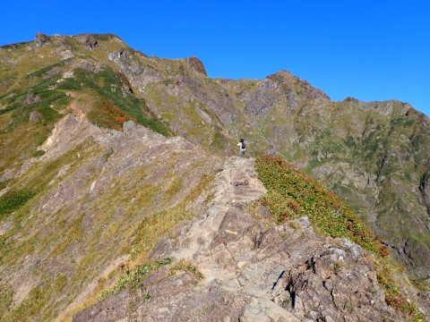
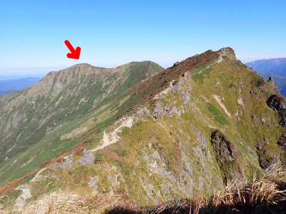
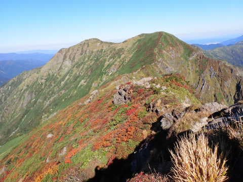
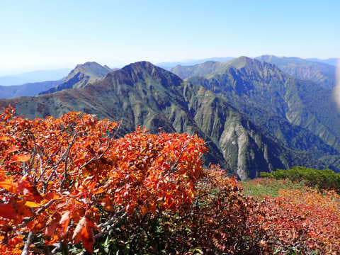
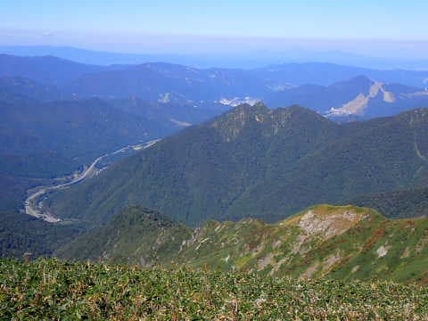
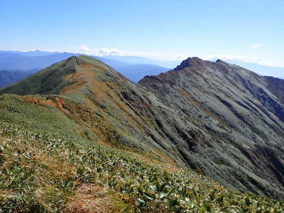
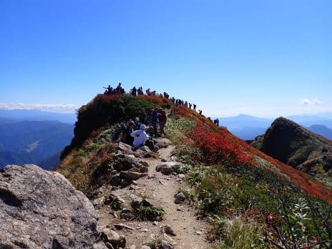
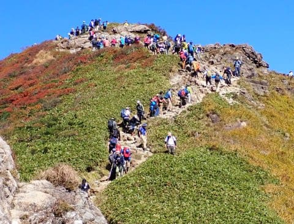
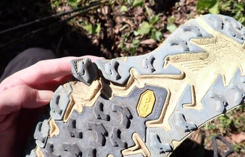
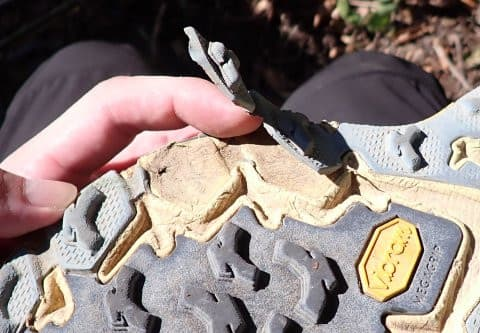

# 先週末，久しぶりに山を歩いてきたけど…なんて山に行ったでしょうか？そして悲しい出来事が（泣）

📅 投稿日時: 2022-10-04 03:35:29

ってなことで．

昨日は志賀高原のシーズン券情報が入ったので，

…自分でも忘れかけてたけど（ぼそ）

本来はスキーブログ

だった，このブログとしては．←なぜ過去形？

スキーネタをやらねば！！！

…と．久しぶりのスキーネタに行った

わけですが．

今日はまた，山のネタへ…

というか，昨日はこっちの記事を書く

予定だったのが，志賀高原リフト券情報で

一日後ろにずれました…

というわけで．

金曜夜の記事で予告してましたが．

先週土曜，予告どおり，実に久しぶりに

山を歩いてきました～！！

…いや．実に1か月半ぶりだよ…

この週末は，天気も良く．

絶好の山歩き日和でした！！

そこそこの急登を2時間ほど登って

いくと…

いや．

見事な景色！

この日は赤矢印の山まで行ってきました…

ちょうど紅葉がいい感じに始まった時期で．

赤と緑のコントラストが美しく．

…そして．最終目的地まで行くと．

行ったことのあるスキー場が

いっぱい見える…

帰り道も，景色も天気も最高！

こんなゴキゲンな稜線沿いを

歩いて行けます…

が．

昼ごろに某山頂を通過しようとすると…

なんだ？

この人だかりは！？？

うげーーー！！！

すごい．

山頂の記念撮影待ち？？

台風で週末がつぶれまくった後の

久しぶりの晴れだからか…

人の多いルートはめちゃくちゃ

混んでました．

ただ，私の歩いたルートは，人が多いところが

それほど多くなかったので良かったのですが…

ってなことで．

1か月半全く運動せず家に籠ってたから，

体力落ちてるだろうし．

「もしかしたら最終目的地の山まで行かず

　途中の山で折り返すかも…？」

とか心配してたけど．

結構ヘビーなコースを途中リタイヤすること

なく，いつも通りのペースで歩ききって，

昼過ぎに下山！！

…でも．

ほぼ下山しきって，ゴールは目の前，という

駐車場そばのアスファルトを歩いていると．

…なんだか，足裏に違和感が？？

なんだろう…と，車に到着してから

靴を脱いでみると

なんじゃこりゃーーー！！！

ソールが一部，見事にぺろりと剝がれてる

じゃないですか！！！！

そんなバカな…

[今年6月にデビュー](e8ed26550fe8244ab29595105f7fa0ea8.md)させてから，

まだ4か月使ってないのに！？？

それも9月は一度も山に行ってないよ？？

実質使ったの3か月だけだよ！？？？

なんてこった…っ！！

軽いし，グリップは強いし．

歩くのも走るのも軽快だし．

何にしろ，このクッション性は一度

履いたら病みつきになる，履き心地

最高のお気に入りの靴だったのに…（激涙）

どうやら．

私は，スキー板の劣化を加速させる

電磁波を身体から出しているということで

有名ですが（なんのこっちゃ）．

その電磁波．スキー板だけじゃなく，

山用の靴の劣化もかなり加速させる効果が

あるようです…（泣）

HOKA ONE ONE，結構いいお値段する

靴だったのに…（止まらない涙）

## 💬 コメント一覧

### 💬 コメント by (毎日読者K)
**タイトル**: Unknown
**投稿日**: 2022-10-04 06:49:57

ソールはゴム系の接着剤で補修すればなんとかなるレベルのめくれかと見受けられますが、Sさんの使用強度だと補修しても一回で再発してしまうかも。。。

さて足の変形でスキーブーツは超カスタムしているSさんですが、登山靴では当たって痛いとか無いですか？

### 💬 コメント by (副院長)
**タイトル**: Unknown
**投稿日**: 2022-10-04 09:50:34

山を歩くなんて僕にはできませんが、ロードバイクなら可能です。で、靴のソールですが、シューグー(Shoe Goo)はいかがでしょうか？山用のソールは無理かな？お試し下さい。靴以外にも、いろいろシール材として使えます。

### 💬 コメント by (metabo-joker)
**タイトル**: Unknown
**投稿日**: 2022-10-04 20:30:39

ホカはランニングシューズでもアウトソールの接着は弱かった気がします。他のメーカーでも、アウトレットで型落ち買ったりすると同じ事が起きます。

### 💬 コメント by (Skier_S)
**タイトル**: あらゆるものを劣化させる電磁波を身体から出している人
**投稿日**: 2022-10-05 06:13:12

＞毎日読者Kさま

毎日読んでいただいてありがとうございます～！！

ソールは接着しようかと思ってますが，また山行の途中で剝がれると致命的なので，

怖くて山歩きには使えないです…ハイキング用になりそうです

＞副院長さま

Shoe Gooってのがあるんですね…

山用の靴もいけそうです．ただ，今回きれいに剝がれたのではなく，

ソールラバーがくっつく下地のスポンジみたいなの（HOKAの靴はクッションソールなので…）が，

ボロボロになっちゃってるので，ちゃんとくっつかない可能性も…（涙）

>metabo-jokerさま

あら…HOKAは普通のランニングシューズでもソール接着弱いんですか…

うーん．

結構気に入ってたんだけど，次はHOKA以外がいいのかな…

### 💬 コメント by (Unknown)
**タイトル**: Unknown
**投稿日**: 2022-10-05 18:58:07

谷川岳、西黒尾根じゃないですか！？

あそこをなまえもわからずのぼるなんて

あり得ないですね

### 💬 コメント by (Skier_S)
**タイトル**: ＞Unknownさま
**投稿日**: 2022-10-06 05:19:48

正解です！

西黒尾根から谷川岳⇒一ノ倉⇒茂倉岳でした！

ちなみに下りは田尻尾根で降りました…

私もさすがに西黒尾根の名前を知らずに登る人はいないんじゃないかな？って思います（笑）．

