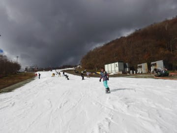
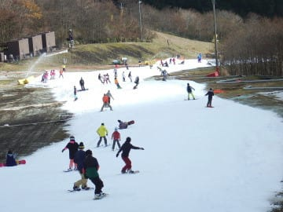

# 11月19日のYeti，超速報モード

📅 投稿日時: 2017-11-20 06:53:32

えー

本日朝5時半羽田着の飛行機で30時間近くかけて

帰国し．

そのままイエティで滑ってきて．

夜は倒れるように寝てしまいました…

だもんで．日曜のイエティ，

超速報モードにて…

天気は，晴れ

時々曇り．

コース幅は，結構広がりましたよ～！

ただ，リフトは結構混みました…

並行したブルーのペアリフトを

動かすほどじゃなかったけど，

平均的にこのくらい待ちました…

今シーズン一番の待ちだったですね～

今日はこれから仕事に行くので，

今晩詳細レポートします…

コメント回答もしばしお待ちを！
