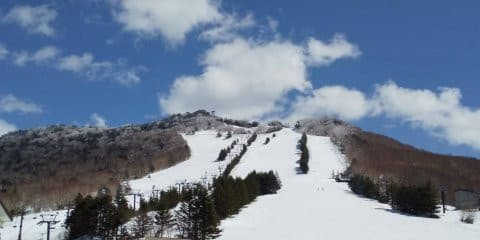
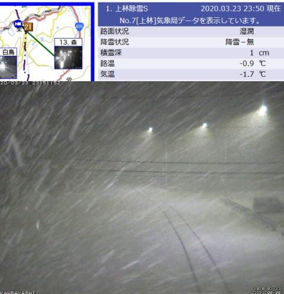
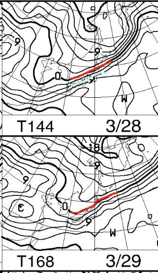
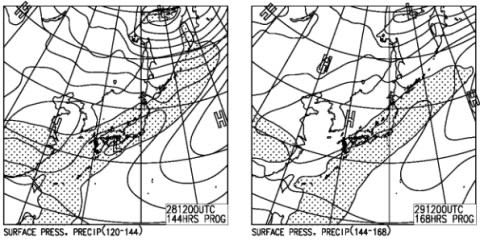
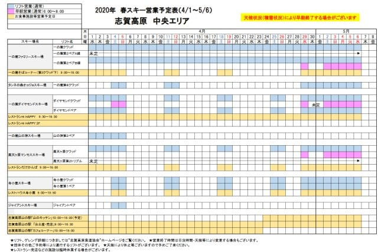
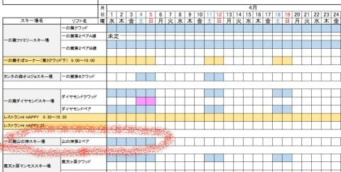
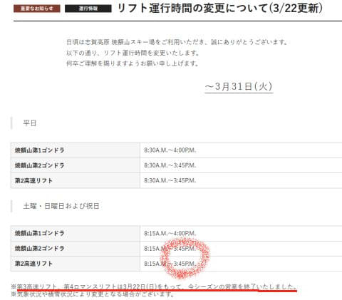
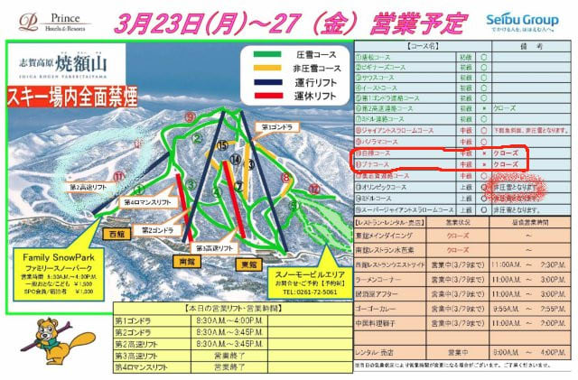
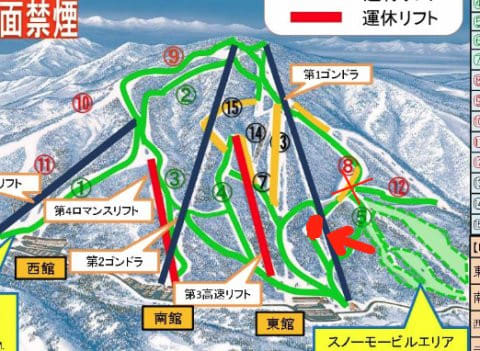
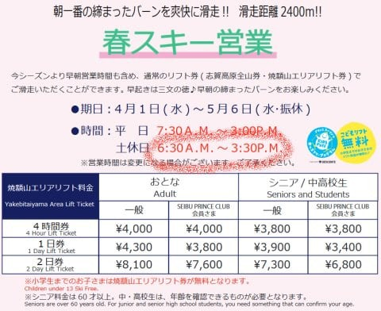

# 24日の志賀高原はパフパフパウダーデー！…でもこの週末は壊滅的天気？？…そして志賀の春営業情報は，山の神4/7で終了（涙）でも，焼額は4月以降も毎日営業！

📅 投稿日時: 2020-03-24 00:12:17

🏷️ カテゴリ: [日記](cc4b5682fb7b8b144980957a978653fb0.md)

えー．

本日の志賀高原ですが．

特派員情報によると，すっきり晴天の

一日で．

朝はそこそこ冷え込みながらも，

ガチガチになることは無く．

エッジがちゃんと食い込む感じの

快楽バーンだったようですね…

（某特派員の方より）

日当たりのよい焼額は，午後は日差しで

コース下部の雪が緩んでしまったようですが．

気温結構低めだったので，

西斜面で日当たりのよくない

一の瀬ファミリー正面バーンは，

終日アイスバーン気味だったようです…

（一部のアイスバーン愛好者が狂喜乱舞していたようですが)

…そして．

深夜0時現在の志賀高原．

降ってます．

麓の上林でも，かなりの勢いで

雪が積もってます！！

（[北信建設事務所道路気象情報情報ページ](http://hokushin.pref-nagano-roadcamera.jp/)より）

…これ，積もります．

明日24日(火)の朝までに，結構積もります！

20cm以上積もるかも…

昨日の記事で，

　でも，23日夜くらいから雪が降り始めそうで．

　24日朝には冷え冷え雪がわずかに

　積もりそう！

　24日は最高でも-5℃程度までしか気温が

　上がらない冷え冷えデーで，

　終日雪がぱらつきそうな感じ…

と書きましたが．

わずかどころか，かなり積もりそうです…！！

24日朝は，想定外の冷え冷えパフパフデーです！！

おそらく，24日朝は最高かと…

そして，24日は終日冷え冷えの雪降りデーで．

最高気温もマイナス5℃程度と，

「真冬か？」

と思う一日になりそう…！！

今シーズンラストの冷え冷えかも…

でも．

この冷え冷えも，やっぱり25日(水)までで終わり．

26日（木）以降は，激烈高温になって．

28，29日の週末は土日ともヤバそうな感じ…（激涙）

とりあえず，土日とも0℃線は志賀高原より北で，

土曜は+6℃線がかかるほどで．

降れば確実に液体の気温ですが…

地上天気図を見ると…

…

…降りますね．

このままだと．

土日とも．

それも，液体が…（涙）

…この予想が外れるためには，

とりあえず，狂ったように冷え冷え踊りを

踊っておく以外，できることは

なさそうです…（泣）

ってなことで．

そろそろ春の気配がひたひたと

近づいているような今日この頃ですが．

…とても信じられないことに．

というより，信じたくもないのですが…

早くも3月も終わりに近づいたようで（涙）．

春営業の案内が出る時期になってきました…

あぁ…春なんて，一生来なくてもいいのに…←ホントにそんなことになったら大変だから！！

ってことで．

志賀高原中央エリアの春営業情報を見てみますが…

中央エリアで4月以降も営業するのは，

一の瀬，タンネ，高天ヶ原，山の神，寺子屋のみ

ってのは，大体いつも通り．

一の瀬ファミリー以外は週末のみ営業ってのも

いつものパターンですね…

（[志賀高原中央エリアWeb](http://shigakogen.co.jp/wp-content/uploads/2020/03/2020-%E6%98%A5%E3%82%B9%E3%82%AD%E3%83%BC%E5%96%B6%E6%A5%AD%E4%BA%88%E5%AE%9A%E8%A1%A8.pdf)より）

が．

これを拡大して，よく見てみると…

なぬ～っ！？？？

山の神が，4月5日で終わり！？？？

…なんという事か…（激涙）

また，4月5日からGWまで，

中央エリアと焼額＆奥志賀の行き来をできなく

してしまうようです…（涙）

一昨年は4月第2週まで，

昨年は山の神をGWまで営業してくれたのに．

今年は4月第1週で終わっちゃうのね…（泣）

なぜ，せっかくの志賀高原のスケールメリットを

殺すようなことをするかなぁ…．

うーむ．

もったいない…

で．

わがホームゲレンデの焼額ですが←この日曜日，裏切ったばかりなのでは？

これから3月末までは，営業するのは

第1，第2ゴンドラと第2高速の3本のみ．

第3高速と第4ロマンスは，この週末で

営業が終了したようです（涙）

…そして，第2ゴンドラと第2高速は，3:45に

終わっちゃうようですね…（泣）

（[焼額山ホームページ](https://www.princehotels.co.jp/ski/shiga/informations/lift_open/)より）

まぁ，営業開始時間が8:15と，これまでより

15分早めてくれただけ，営業努力を

認めたいところ…←だから，なぜいつもそんなに上から目線？？

そして．

これからの営業予定マップですが．

何と．

白樺コースとブナコース，クローズです（涙）

可能な限りパノラマコースを持たせるために，

雪出しに使うようで…

そして，オリンピックコースは非圧雪です（泣）

（[焼額山Facebook](https://www.facebook.com/yakebitaiyama/photos/a.133097176785637/2788682707893724/?type=3&theater)より）

まぁ．

ここも，パノラマコースを何とか長持ちさせるために，

止む無し，というのは理解．

雪が薄くなっちゃったら，雪出し用に

使えませんから，雪がある今のうちに

クローズというのは，偉大な判断かと…←だから，どうしてそんなにすごい上から目線？？

だけど．

これで，焼額スタッフはパノラマコースを

GWまでもたせてくれるはずっ！←さりげなく焼額スタッフにプレッシャーをかけている

…でも．

この地図．

拡大すると…

GSコースの下部非圧雪の部分って，

この赤い×マークを付けたところじゃなくて，

矢印の先の赤い部分の，

ゴンドラをくぐるショートカットコース

なんじゃないかな～？

もしかすると，この地図間違ってませんか？＞焼額スタッフの方

…で．

4月以降の営業はというと．

今シーズンも毎日営業ですっ！

すばらしいっ！！

2シーズン前までは，4月は週末営業のみに

なってましたが．

昨シーズンに引き続き，今シーズンも

毎日営業です！！

（[焼額山ホームページ](https://www.princehotels.co.jp/file.jsp?id=311200)より）

そして．

赤く印したところにあるように．

土日は朝6:30からの営業です！！

早朝券はいりません！

一日券や日数券，シーズン券で早朝から

滑れます！！

さらに，平日も朝7:30からの営業とは…

すごい営業努力！！←だから，どうして上から目線…？？

…ただ．

当初，土日は4:00PMまで営業予定だったはずだけど…

やはりコロナウイルス騒ぎで短くなったのかな…（涙）

で．

コロナウイルス対策の，第1ゴンドラ4人，第2ゴンドラ3人という

ゴンドラ乗車定員制限は3月31日まで継続

のようです…

状況によってはさらに延長もありうるようですが．

うーむ．

これもやむをえないか…

とりあえず．

4月に入ると，雪がいい朝の時間帯勝負に

なってくるので．

早朝券無しで早朝から滑れるってのは

ありがたい限り…

ってな感じで．

気づいたら，アサマ2000詳細レポートの前フリの

つもりで書いていた文が，Blog記事2回分くらいの

異常な長さになってしまってました…

だもんで．

これから続けてアサマ2000の詳細レポートを

読まされたら，読者の方が疲れてしまうと思うので．

アサマ2000の詳細レポートは，また明日！

…試乗レポートはいつ書くんだ？？

## 💬 コメント一覧

### 💬 コメント by (かず)
**タイトル**: Unknown
**投稿日**: 2020-03-24 01:24:21

ゴンドラ制限まだあるとプラス平日したほうが良さそう…結構降ってますね！明日特派員の皆さんうらやましい  今週末の天気予報まちまちで日月冷えそうだったのですが一番信頼できるSさんの予言が雨か…

### 💬 コメント by (いちと)
**タイトル**: Unknown
**投稿日**: 2020-03-24 06:59:01

連休最終日は、修行のような一日でした

ジャイアントは雨なので寺子屋に行ったら、吹雪、霧、最後は雨、濃霧のダブルボンバー

Ｓ様も頑張っていると思い滑り続けましたが、まさかアサマ2000で回避とは！（笑）　→嘘です　3時前には切り上げました、、、

流石です🎉

### 💬 コメント by (炎の北海道民)
**タイトル**: Unknown
**投稿日**: 2020-03-24 08:54:04

早朝からやってるって凄いですね。北海道はそんなスキー場ないです。これは北海道のスキー場の意識が低いのか道民の意識が低いのかどちらだろうか。北海道出身で長野でデモされている人に聞いたところでは、関東の人の方がスキーに対する思い入れ？が強いそうです。

さて、ホームゲレンデのキロロも今日は相当いい雪が積もっている様ですね。

### 💬 コメント by (そとく)
**タイトル**: GWまで
**投稿日**: 2020-03-24 09:58:38

GSコースと一ノ瀬ファミリーと渋峠がGWまで持ってくれるのを祈ってます。

そしたら、西日本から家族で遠征します。

### 💬 コメント by (新米パパさん)
**タイトル**: Unknown
**投稿日**: 2020-03-24 18:30:19

日曜を見送り本日朝イチで志賀高原でした。

奥志賀スタート準備も、猛吹雪でリフトもゴンドラも停止。

こりゃ無駄足だったかと思いきや、焼額山は普通にやってました！！

最高のフカフカ雪でしたが、降り過ぎてチビには大変でした。

志賀高原って斜面向きや位置、風向きで休止してないゲレンデに逃げれるなんて、最高のスキー場じゃないですか！！

しかも、日々の天候予測から現地特派員レポまで無料で情報を得られるスキー場なんて、こんな素晴らしいスキー場がありますか！！

さらに、悪天候予測が出たら祈祷師の踊りをお布施無しで、、、

素晴らしすぎる！

### 💬 コメント by (Northfox)
**タイトル**: 週末は雨？ですか
**投稿日**: 2020-03-24 21:04:10

志賀高原に行く予定なのですが。。。。

う～～ん、来週にずらすか。

祈り踊るしかないのでしょうか。。。

### 💬 コメント by (レインボー)
**タイトル**: Unknown
**投稿日**: 2020-03-24 22:14:44

志賀高原情報

なし

ごめんなさい。90日目にして初めて、志賀を裏切りました。

私の四駆ポルシェ(うそ)が車検で休場なのに、志賀に大雪。二駆では不安なので、駐車場の標高が1000mも低い安全な野沢に行きました。

ゆ○りんによると、明日はオリンピックが夕方圧雪された上に、うっすら新雪が。こっそり行って来よっと。

### 💬 コメント by (Skier_S)
**タイトル**: 今日は最高のパフパフデーだったようですね…
**投稿日**: 2020-03-25 03:08:17

＞かずさま

日曜は朝が雪で，昼ごろには止む可能性もあります．

まだ，日曜の予想は確定していません．

雨か雪か，すごい微妙なところで，毎日予想図が変わってます…

とりあえず，日曜は雪になるよう，踊っておけば何とかなるかもしれません．

＞いちとさま

アサマ2000は，完全な雨にはならなかったです…

でも，ほとんど雨と変わらないびしょ濡れ具合でしたが（涙）

試乗会が強風でいったん中断するというおまけ付きで，

アサマもすごいコンディションが良かったわけではないです…（泣）

＞炎の北海道民さま

関東の人間は，スキーに行くのにすごい移動コストと時間がかかるので，

関東の人は根性が無いとスキーをやってられません．

我が家から志賀高原まで片道4時間，

高速道路代が往復8000円超えます（涙）

往復600kmのガソリン代を入れると…

お値段的にも時間的にも手軽に行けないので，

スキーをしようという人は

それなりの覚悟をもった人ばかりになります…

＞そとくさま

私も同じことを願ってます…（祈）

西日本からやって来れるようなコンディションであることを願うばかりです．

＞新米パパさんさま

いや．

今日滑ったのであれば，かなりラッキーだったかと…

今シーズンはトップシーズンでもそうそう出くわさなかった，

いい感じのパウダーだったかと．

ですから．

こんな時期に雪もいいし，いろんな斜面を選べるし，

天気予想から特派員レポートまであるし．

また志賀にやってきてください～！

＞Northfoxさま

今週は，土曜はヤバいです．確実にアウトっぽい．

日曜は，雨か雪がきわどいところ…

＞レインボーさま

今日は，野沢もそこそこ良かったのではないでしょうか…？

でも，志賀は最高だったようですね．

明日も午前中は最高だと思いますよ～！

