# 2025/1/3(木)の志賀高原焼額山スキー場の写真追加！…そして1月4日の志賀高原特派員によるゲレンデレポート

📅 投稿日時: 2025-01-05 06:53:53

🏷️ カテゴリ: [2025スキー滑走日記](cacd3fbf84d4a679ee61a5894c3f95e14.md)

ということで．

3が日はスキーをして，昨日の4日は

一日泣きながら仕事をしていたわけ

ですが…

4日の志賀高原も，特派員から写真が

送られてきました～！！

どうやら，4日は朝までに10～20cm

程度の積雪があったようですね～…

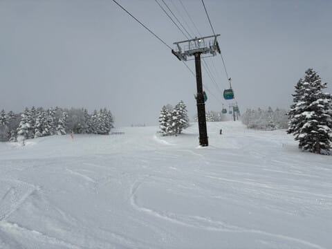

朝イチのゴンドラはそこそこの人が

待ってますが，正月休みと考えると

少なめかな．

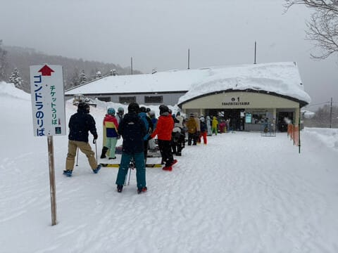

朝イチの気温は-11℃とまーまー冷えた

ようで…

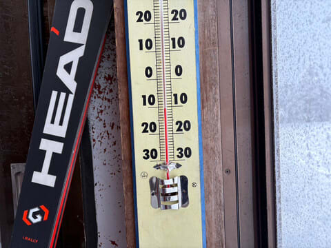

バーンは冷えた新雪が圧雪の上に乗った，

いいコンディションだったようです…！

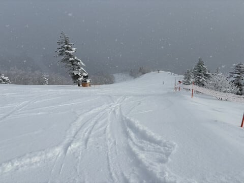

天気は曇り～小雪，ときどき薄日も射す

感じだったみたいですが．

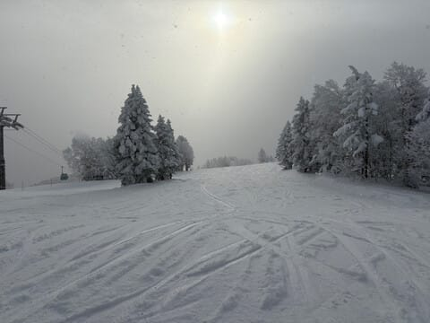

朝のうちは人が少なく，ゴンドラ待ちも

ほとんどなかったところ．

午前10時半くらいからは人も増え，

午後までゲレンデの人口密度は

高めだったようです…

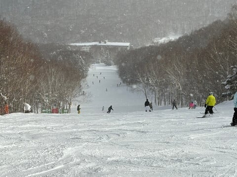

まぁ，3が日は終わったけど，正月

休みはまだ続いているので，思ったより

人が多かったみたいですね…

でも，雪がよさそうでうらやましい…

ということで．

仕事をせねばならないので，

余り長い記事は書いてられないのですが．

昨日…というか，もう一昨日ですね．

1月3日の志賀高原の写真を少し

追加しておきます～！

まず．

1月3日は，昼までは何にしろ天気が

いい一日でしたね～！

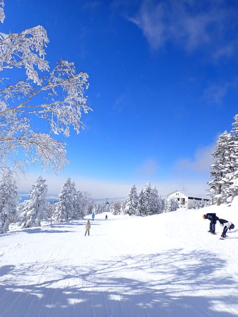

この正月休み，

12/30はすっきり晴れ

1/1は午後晴れ

1/3も昼まで晴れ…

と，思ったより晴れが多いのに，

29，31，2日とそこそこ雪が積もって，

冷え冷えのいい雪を日差しのもと

楽しめる日が多かった，いい正月

休みでした～！！

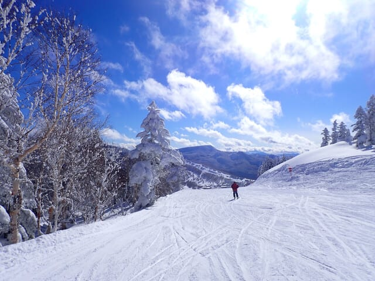

いや．

ホントにいい天気…

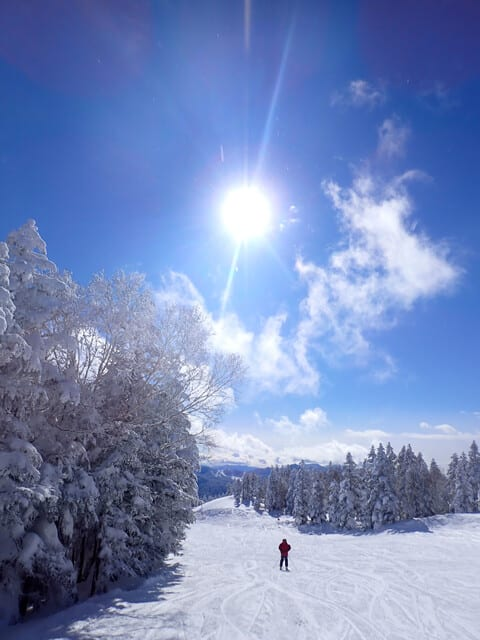

こんなに天気がいいのに，気温は昼間の

最高気温でも-6℃と十分低く．

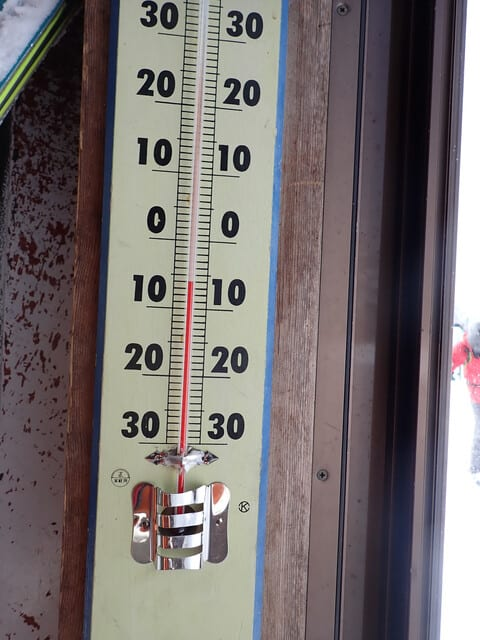

前日に積雪があったのにもかかわらず，

雪質はかなり締まった雪で，

いい感じで飛ばせる最高の雪質でした！！！

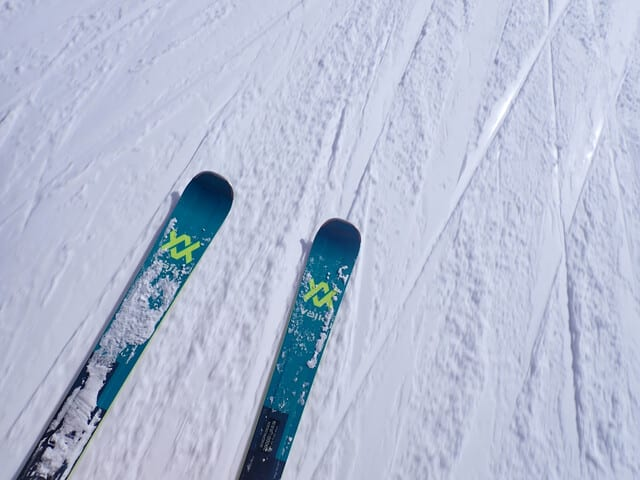

いやーーー．

こんないい雪質を，こんないい天気で

楽しめるなんて…

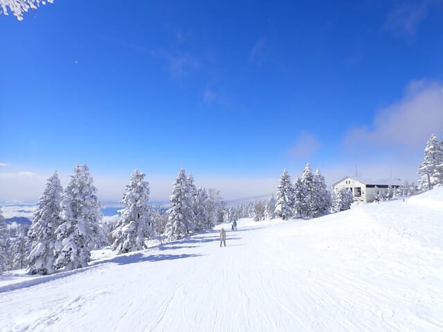

すごい恵まれた正月休みだな！！

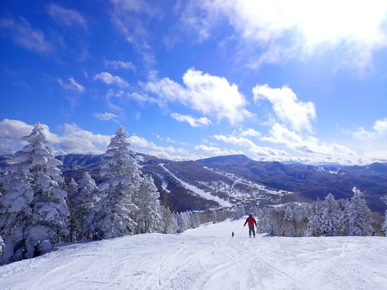

ゴンドラもそこまで混まなかったし．

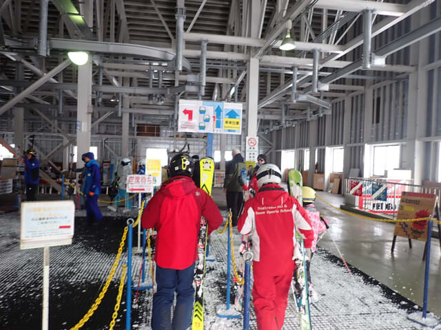

リフトもそこまで混まなかったけど…

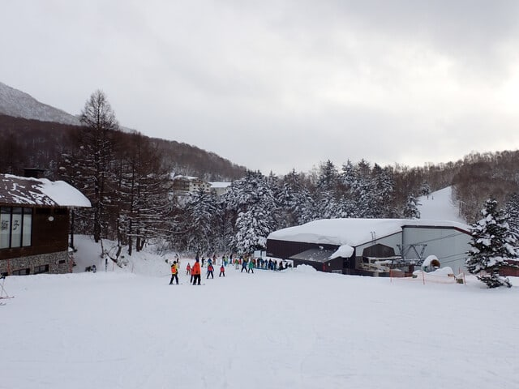

なぜか昼を過ぎると雲が増えて曇りだし…

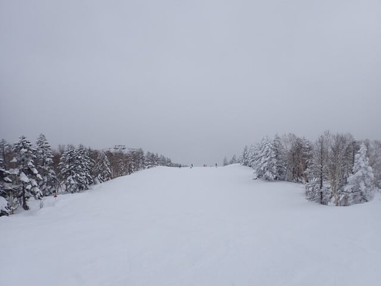

薄日が差すものの，曇り空になってしまった

のが惜しかった…

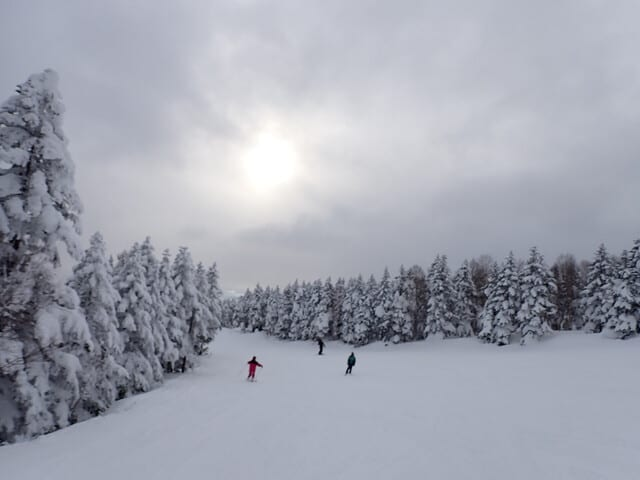

あと，昼前くらいからはやはりゲレンデの

人口密度がちょいと高めではあったけど．

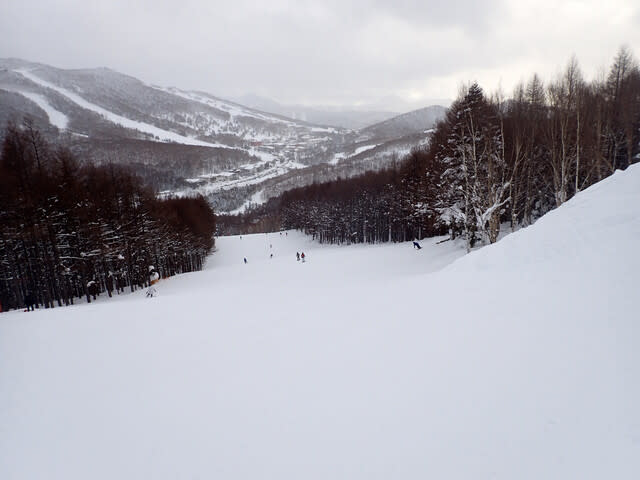

コースを選べば結構好きなラインで

大回りできる程度の混雑具合だったので，

十分楽しめましたよ～！！

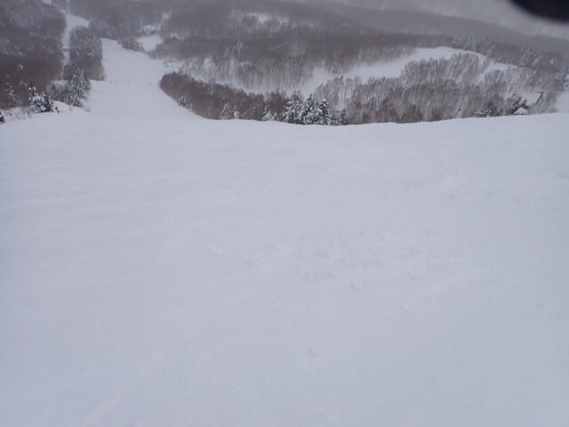

ってなことで．

6日間の天国の正月休みも終わり．

家で泣きながら仕事をしていた本日．

天国の正月休みの写真を振り返ってみて．

現実とのあまりにものギャップの深さに，

あの日々が夢だったのではないか…

と，思わざるを得ない，

Skier_Sだったのでした…

## 💬 コメント一覧

### 💬 コメント by (1kamakura)
**タイトル**: Unknown
**投稿日**: 2025-01-05 09:56:57

江戸の秋

先シーズンは悲惨なスキー場でしたが、今年はいい感じですね。

やっぱり晴れると雪が輝いてきれいですね。

### 💬 コメント by (Skier_S)
**タイトル**: ＞江戸の秋さま
**投稿日**: 2025-01-06 01:10:50

今シーズンは雪が多いですよ～！

昨シーズンとえらい違いです…

そしていい雪で晴れも多い！

このまま春も冷えてくれれば，いいシーズンになりそうです…

