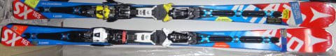
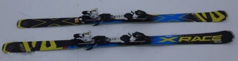
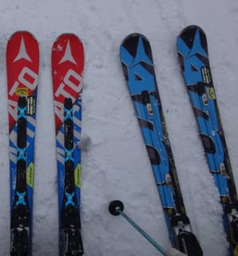
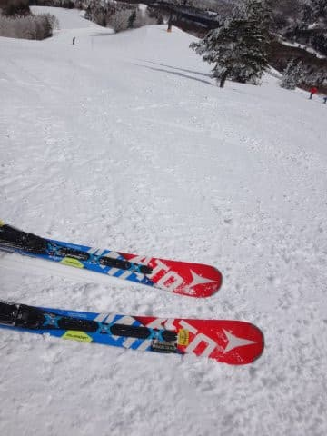

# 物欲選手権に完敗…2017シーズンモデル，ATOMIC Bluester DD3.0 SXを買ってしまった理由は…？

📅 投稿日時: 2017-03-15 01:00:20

🏷️ カテゴリ: [スキー雑談](c1f9d2cb7478308da16419928ea3945e9.md)

ということで．

先月開催の，[新・物欲選手権に見事完敗](eda7898d5cb5580b1871f3cbef83241ac.md)し．

…太板を買うはずのところが．

なぜかすでに所有している

ATOMIC Bluester SXを買い足す

という本人も全く予期しない結果になり…

…なぜかこんな感じで．

我が家には，'16SXと'17SXが並んでいるという，

常識人ならまずやらないであろう，

わけのわからない状況になってしまったわけですが．

なぜ，こんな状況になってしまったかというあたりを．

本日はちょっと説明してみましょうか…

で．

今シーズン，これも[予想外に購入](e7e02015f03823884a3522a56c651a398.md)した，←いや，予想外じゃないから．十分想定内だから…

朝イチ大回り用，'16 SALOMON X-RACE．

朝イチに，この新品X-RACEを履いた後．

SXを履いて滑ると…．

　　「うーむ．やはりX-RACEは強い板だ！

　　SXがまるで軽四みたいな，すごいお手軽板に感じる…」

と，[感じていたわけ](e002ed299a919364dabc9f2ca3b000167.md)ですが．

2月に入り，雨が降って下地が固くなってしまった時に．

　「いやーー．固い斜面だと，

　　SX，トップのグリップがすごい弱いなぁ…

　　スピード出すとこんなに怖い板だったんだ…」

と，感じてしまったのですが．

そのとき．

　「まさか…

　　まさか，このSX.

　　もう，ヘタってるってことは…

　　ありえないよね…」

という恐ろしい思いが，脳裏をかすめたわけで．

…このSX．

昨シーズンは雪不足で，

1月最終週にやっとデビューしたものの

4月に入るとゲレンデコンディション悪化のため，

また石ころを踏んでもいいような古い板に出動願う

状況だったので．

昨シーズンこの板に出動願ったのは，

実質2月，3月のわずか2か月

（'16SXと雪不足時に出動願う'14SX）

そして，今シーズンもまだ12，1月の2か月ちょいしか

履いてないわけだし．

…このSXは．

実質トータルまだ4か月ちょい．

50日も履いてないはず…

だのに…

4か月しか履いてない板が，もうヘタったというのか？

…まさか．

そんなこと，ありえない．

そんな恐ろしいこと，あるわけない．

そんなに早く，板がヘタるはずがないのだ…っ！！！

いや．

新品X-RACEからSXに板を履き替えた直後は

　「スピード出せないなぁ…」

と，思うけど．

でも，しばらく履いていると．

慣れてきて，十分小回りできるし．

軽快だし．

やっぱり，フレックスが異常に強いX-RACEから

履き替えるからそう思うだけだ．

…仮に．

あくまで仮に．

多少，心持ち微妙にわずかなマイルド化がかすかに

進んでいたとしても．

まだ滑れる．

わずかに劣化が進んでいる程度のはずだ…

…

…

きっと．

だから，

多少ヘタってても，このSXは来シーズンまでもつ！

そして，来シーズンの新しいATOMICの板が良ければ，

それを買うのだっ！

…と，思っていたわけだけど．

…雪が固くなってきた2月中旬から．

SXのエッジを凶器レベルにまで研いでも．

固い斜面だとX-RACEでの圧倒的なグリップ感と比べて，

トップのグリップがルーズに感じるようになり．

…

…SXって，こんな板なのか？

あるいは，かなりヘタっているのか…

と，どうしようもなく気になっていた時．

太い板を買おうかなぁ…と，通販サイトを巡っていた際に．

'17SXの値段が一気に安くなっているのを見て．

　とりあえず，買ってみよう．

　私が4か月履いたSX，新品と比べて

　どのくらいヘタっているのか．

　明らかにしてみようじゃないか…

と思って．

ついついポチってしまったのでした…

実は，SXはもとからこんな板で，

それほどヘタっているわけでは無く．

新品にしても，ほとんど変わらないなら…

その時はこの投資は無駄になるわけで．

はっきり言って，ある意味ギャンブルだった，

このATOMICの購入．

さて．

結果や，いかに…？

（続く）

## 💬 コメント一覧

### 💬 コメント by (いか)
**タイトル**: Unknown
**投稿日**: 2017-03-15 01:08:58

ほほー、そういう理由だったのですね。私の16SXも14AXと比べて硬い斜面のグリップが弱い感じです(まだ30日弱しか履いていない…)が、これはこういう仕様だと現実から目を背けています！

### 💬 コメント by (Skier_S)
**タイトル**: いかさま
**投稿日**: 2017-03-15 01:17:50

…現実から目をそらさず，しっかり

現実を見つめましょう！

…って．

果たして'16SXの固い斜面のグリップの

弱さは仕様なのか否か．

天気予想を一日はさんでの続編に

ご期待ください（笑）

### 💬 コメント by (Unknown)
**タイトル**: Unknown
**投稿日**: 2017-03-15 03:10:57

たとえ大きな差があったとしても「ランプテック」の有無という素晴らしい切り札（言い訳）がまだ残って・・・。

「シマシマ用の板で新雪を滑るとアッサリとヘタる。

繊細な板は新雪にはもったいないから大雑把な造りの太い板が必要」

とかいう次回物欲選手権に向けた壮大な仕込みでしょうか？

ちなみに、大回り用の板に乗っている時に狭い廊下やピッチの狭いコブ等で

うっかりショートターンを連発するとヘタるのでご注意下さい。

### 💬 コメント by (下手くそスキーヤーS)
**タイトル**: 太板なら
**投稿日**: 2017-03-15 20:28:58

まさかの展開。かなり期待して待ったんです。

実はセミファットあたりの板欲しーくて❤️

アトミックのバンテージかなって思ってたんですが〜

参考に買うならを教えてくださいな😘

### 💬 コメント by (Skier_S)
**タイトル**: 今週末は3連休！
**投稿日**: 2017-03-16 01:42:55

＞Unknownさま

いや…

昨シーズン試乗してみて，ランプテックの有り無しによる

違いは全く分からない…ということを知ってしまって

いるので，つらいところ（笑）．

確かに，大回り用の板でコブを滑ると一気に劣化しますが…

小回り連発でもヘタるんですね…

マズい．私のX-Race，結構小回りかましてます…

＞スキーヤーSさま

いや…これホントに，本人もまさかの展開でしたから（笑）

ATOMICのVantage90，かなりいい板で，物欲を刺激するんですが…

私はパウダー用を買うならセミファットではなく，本格ファットを狙ってます．

…ただ．

何を買えばいいのか，まだ決めかねてます．

というより，やっぱり太い板は良く分かりません（笑）

