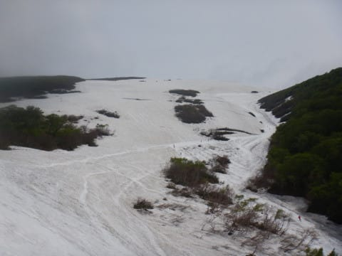

# 2022/6/11(土)の月山スキー場の状況，速報レポート…沢コースはまだ行ける！リフト乗り場は滑りこめて，降り場はゲレンデまで歩き

📅 投稿日時: 2022-06-12 03:12:41

🏷️ カテゴリ: [2022スキー滑走日記](cc9cb73e4320f6a97af6fccc37587a61a.md)

えー．

今週は平均睡眠時間5時間台だったというのに．

今日は2時間半睡眠で，

日帰り月山

という無謀なチャレンジを実行してきたわけですが…

深夜2時半に，睡眠2時間半で起きて，

月山まで運転して．

その後，朝8時半から午後4時半まで

昼休みも取らずに滑り，

そのまま一人で運転して深夜2時半に

帰宅するという，

睡眠時間2時間半の後にぶっ続け

24時間寝ずに行動し続ける

というのは，疲れるということが

分かりました．←言われるまでもなく誰もが分かるから

…でも．

こんな状況でも，来週はもうリフトが

滑れなくなっちゃってる可能性もあるので，

今週中に月山に行っておきたかったんです…

あ，ちなみに．

リフト係員の方曰く，おそらく来週末まで

沢コースは滑れるんじゃないか…という

見立てだったけど，やっぱりギリギリな

感じです．

とりあえず，今日の月山ですが．

皆さんご存知のように，クレバスの影響で

大斜面は立ち入り禁止．

沢コースしか滑れません…

あ，山頂のTバーはいつも通りやってます．

…が，コースの途中にクレバスがあり，

この写真の左側に見えるように，クレバスの

ところにネットが張られていて，

ここは滑り降りられません…

リフトですが．

リフト乗り場はまだ滑りこめます！

リフト小屋下からえっさかほいさと

歩いて上がる必要はありません！

…が．

リフトを降りてからは，ゲレンデに

滑りこめる通路はもうなくて．

この写真の向こうに見えるところまで

歩いて行かなきゃ滑れない状況です…

でも．

沢コースはまだ思った以上に雪があります！

うーん．

ギリギリ来週末までもってくれるかな…

ちなみに，今日の天気は曇り空ながら，

意外にも時々日が射す天気．

午後2時頃，一瞬だけ雨が降りましたが…

5分も降ってなかったかな．

思った以上に天気が良かったです～！

…ってなことで．

もう24時間以上起きていて死にそうなほど

眠いので．

これから寝ます…

いや．

関東からの月山日帰りはかなり厳しいけど．

大阪から志賀高原に来る人は，このくらいの

距離を走ってきてるんですよね…

大阪から志賀高原に来ている人はやっぱり

尊敬に値するかも…

明日詳細レポート書きますので，お楽しみに！

## 💬 コメント一覧

### 💬 コメント by (Northfox)
**タイトル**: Unknown
**投稿日**: 2022-06-12 21:51:57

お疲れ様です。

しかし....これは”日帰り”なのでしょうか？？

日付またいでますし（汗）

### 💬 コメント by (Skier_S)
**タイトル**: ＞Northfoxさま
**投稿日**: 2022-06-13 03:33:28

泊ってないので，日帰りだと思います…

活動時間24時間越えてますが(笑)

### 💬 コメント by (ぽんちゃん)
**タイトル**: 尊敬します
**投稿日**: 2022-06-13 11:24:36

月山へ日帰り！

心から尊敬します。。

高速料金もバカにならないはず。。

そのスキーへの情熱は表彰状ものです。。

### 💬 コメント by (Skier_S)
**タイトル**: ＞ぽんちゃんさま
**投稿日**: 2022-06-14 05:49:40

時間が無くて，仕事がタイトになればなるほどスキーに行かないと

ストレスで死んじゃうので…

高速は往復深夜割引で．

それも帰りは米沢北まで下道を使って（東北中央道の無料区間がここから)，

圏央道も途中で降りて下道をかなり走って，

そして必死のエコランで往復900km以上を無給油で走って安くあげました~！

### 💬 コメント by (ikkun)
**タイトル**: Unknown
**投稿日**: 2022-06-15 10:18:08

おはようございます❗えーご自愛くださいませ！

### 💬 コメント by (Skier_S)
**タイトル**: ＞ikkunさま
**投稿日**: 2022-06-16 00:47:25

私にとっては，どれだけ忙しくてもスキーに行くことが

自分の精神にとっていいので，自愛するというのはスキーに行くことになるのです…（笑）

