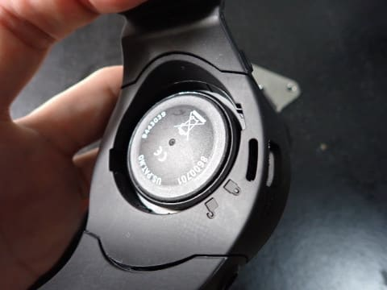

# Aqualungのダイビングコンピュータ，i300Cの電池を交換してみた

📅 投稿日時: 2023-10-27 01:37:19

🏷️ カテゴリ: [日記](cc4b5682fb7b8b144980957a978653fb0.md)

えー．

横手山が先週末あたりから人工降雪を

始めたって横手山Facebookに書かれて

たって昨日の記事に書きましたが…

本日横手山まで様子を見に行ったという，

志賀高原が大好きなんだろうなぁ…

と思わざるを得ない某特派員によると，

本日の横手山は…こんな感じだったようです！

…これは…

全く雪の影も形もありませんね（涙）

果たして，これで11月3日にオープン

できるのか？？

うーん．今後の気温を見ると，3日の

オープンは絶望的と言わざるを得ない

気が…（泣）

まぁ，元からアイスクラッシュじゃない，

人工降雪だけでの11月3日オープンは

無理だろうなぁ…とは思ってましたが…

果たしていつオープンできるのかな？？

ってなことで，本題へ．

そう…あれは，2019年のこと．

20年近く愛用していたダイコンが

電池切れとなってしまい．

ユーザーで電池交換ができないこのダイコンの

電池交換をメーカーでしてもらおうかと思ったけど，

メーカーのサポート期間も終わったモデルで

メーカーでは電池交換できなくなっていて（涙）

やむなく，格安ダイビングコンピュータ，

[Aqualung i300C を急遽手に入れた](e9c798a0452aefde4440cdeb9704b4eae.md)のが

4年前．

…しかし．

それからコロナの夏が3シーズン続き．

せっかく買ったダイビングコンピュータは，

4年間一度も使われぬまま…（泣）

そして，

この新品のi300C．

一度も使ってないのに，電池切れ警告が

出て，電池切れ寸前となってました…（涙）

ということで．

一度も使ってないダイビングコンピュータの

電池交換をするという悲しい目にあって

しまいました…

とりあえず．

使う電池はCR2450．

なかなか売ってないサイズですが，

大きめの電気屋さんで190円

くらいで買ってきたので…

いざ，交換！

まずはダイコン付属の金属プレート．

こいつが電池ケースを外すキーに

なっているので，

こいつを電池抑えリングの穴に差し込み…

軽く右に回すと，電池抑えリングが

外れます．

電池抑えリングが外れても，電池蓋は

しっかりはまったままなので…

この電池蓋の横を，ドライバーとかで

軽くつついてやると…

蓋は簡単に外れます．

蓋を外すと．

電池と対面！

下側の，黒っぽい電池抑えバーは

ただ嵌っているだけなので，

こいつを外してやると…

電池が外せるようになります！

ただ，電池はしっかりはまっていて，

なかなか外れないので…

こいつもドライバーか何かでつついて

あげましょう．

ってな感じで．

無事，古い電池が外せました～！

あとは，新しい電池を代わりにはめ込んで…

そのあと，電池蓋の周囲を囲んでいる

Oリングを外して．

Oリングは軽くグリスアップして

おきましょうか．

グリスアップしたOリングを，

元の位置に置いたら…

外した電池抑えを，また元通りに

置いてやって．

そして，電池蓋をもとに戻します．

…が．

この電池蓋が簡単にはまらない．

中に空気が溜まるからか，ぐっと

押し込んでも押し返される感じで，

なかなか奥まで嵌ってくれません．

私は蓋をねじ込むようにクルクル

回しながら押し込んでいったら

上手く嵌りましたが…

単に上から押さえつけただけでは

蓋がはまらないので注意！

あとは電池抑えリングをはめて…

電池キーを抑えリングにはめて．

キュッと左に回すと，電池交換完了！

無事，新品電池で動き始めました～！！

…しかし．

4年前に買ったダイコンが，一度も使われず

電池切れになるとは思わなかった…

このダイコンを買ったときには

ゆめゆめ思わなかったなぁ…
