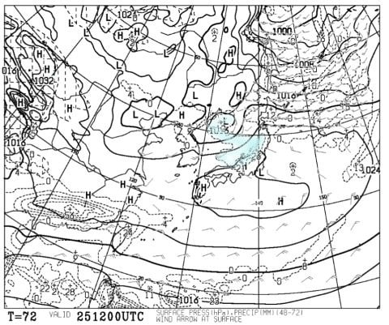

# え？明日はスキーに行けないの？？…そして今週土日のスキー場の天気を予想してみる

📅 投稿日時: 2017-11-23 00:35:27

🏷️ カテゴリ: [スキー天気予想](c6554f5c3c106093b511a8daae23757e8.md)

えー．

22日深夜…

というより，23日早朝かな？

朝4時ごろは，志賀高原の蓮池くらいまでは雨．

それ以上は雪っぽい感じになってるようです…

（[北信建設事務所道路気象状況ページ](http://www.q0.ws302.smilestart.ne.jp/index.htm)より）

こんな感じで，硯川は雪ですが．

蓮池は雨です…（涙）．

あー．

かぐらも雨ですね（涙）．

白馬山麓も雨ですか…

そして．

かぐらは，朝まで時折雨が強く降るかも…

うーむ．

かぐらのこの雨は，午前中には雪に変わると

思うのですが…

ってな感じで．

残念ながら23日の朝は天気があんまりよくなさそうですが．

…でも．

私は23日の祝日．

娘のイベントで，スキーに行けないんだな…（涙）

いいんだ．

天気が良くなさそうだから，いいんだ…（自分に言い聞かせる）

ってことで．

昨日は23日の天気予想をしたのですが．

今日は2日連続の天気予想．

この週末の土日の天気を予想してみようじゃないでしょうか…

えー．

土曜25日の850hpa予想図を見ると．

赤く示した0℃線．

志賀高原より南にあるので，

雨の心配はなさそうですね…

地上天気図は，こんな感じで．

かすかに日本海側に，水色で塗った降水域が

あるので．

まぁ，この日．日本海側は曇り～雪で．

太陽は拝めなさそうな感じかな…

志賀高原は，曇り時々晴れって感じでしょうか．

タイミングによっては雪もぱらつくかもしれませんが…

志賀は本格的な雪にはならない天気図ですね．

そして，日曜26日の850hpa予想図ですが…

おおっと．

久しぶりに，志賀高原より北側まで

赤い0℃線が上がってしまってますね…

うーむ．

この日は，標高の低いスキー場は

雨の危険性が…

地上天気図を見ると．

あぁ…

日本海側のスキー場は，網掛けの降水域がかかってますね．

志賀高原は，ギリギリかかってないかな？？

志賀高原はぎりぎり降らないけど，

かぐらは雨の危険性が…

だもんで．

まとめると．

土曜：かぐら方面は朝は雪がちらつくが，

　午後には雪がやむ．

　志賀高原は…あまり雪が降らなさそう．曇り～晴れかな．

　気温は低め．

　各スキー場とも，朝は冷え込んでいて，昨晩からの雪が

　積もっているので，結構いい雪で滑れるんじゃないかな．

日曜：かぐら，志賀とも朝は曇り空．

　朝イチは昨日の冷え込みが続くので，

　雪も良く楽しめるかな．

　ただ，かぐらは…昼過ぎくらいに降りそう．

　標高が低いエリアは降れば雨．標高が高いかぐら

　エリアは…運が良ければ雪．

　志賀は，曇り時々晴れ．日が射すと暖かく

　感じるくらいかも…おそらく降らない．

おまけ…Yeti

土曜，日曜とも晴れそうかな！

日曜はちょっと雲が出るかも…

でも，雨は降らない．

…って感じでしょうか．

まぁ．

日曜はちょっと微妙な感じですが．

冷え冷え土曜は天気が悪いながらも，

この時期としては良い雪で滑れそうかな！！

雪が全く積もらず，スキー場オープンが

軒並み遅れたおととし＆昨年の2年間と比べると．

涙がこぼれるほどの，恵まれた天国のような

シーズンインの気がします…

## 💬 コメント一覧

### 💬 コメント by (Goku)
**タイトル**: Unknown
**投稿日**: 2017-11-23 11:09:25

熊の湯は霧と雨でウェアがびしょびしょです(T_T)

そろそろ帰ろうかな…

### 💬 コメント by (いか)
**タイトル**: Unknown
**投稿日**: 2017-11-23 13:02:23

八方から転戦しまして、熊の湯にお邪魔させていただきました〜

ゲレンデはガスガスでしたが、広々していてシーズン初日の足慣らしにはよい感じでした！

Gokuさん、ステッカーありがとうございました！今日取りに行くS9i Proにはっつけて、八方でも宣伝しておきます〜

### 💬 コメント by (Skier_S)
**タイトル**: 今日はスキー行けず…
**投稿日**: 2017-11-23 21:26:14

＞Gokuさま

あら…

午前中は志賀も雨だったんですね．

運が良ければほとんど降らないと

思っていたのですが…

お疲れ様でした

＞いかさま

八方から志賀って…

私も以前やったことありますが，

2時間以上かかった気がします…

普通はやらないかと（笑）．

しかし，よくGokuさんを発見できましたね～

今シーズンはもう志賀にはいらっしゃらないの

ですか？

もし，志賀にいらっしゃるのなら私もお会いしたいです…

でも．S9i Pro．

うらやましいです…

### 💬 コメント by (いか)
**タイトル**: Unknown
**投稿日**: 2017-11-25 00:48:03

白馬を8時20分に出発しまして、10時に熊の湯で滑りはじめておりました…笑

今期は機動力が上がる予定？なので、ハイシーズンにもう1日ほど志賀高原にお邪魔できればと思ってます〜

### 💬 コメント by (Skier_S)
**タイトル**: いかさま
**投稿日**: 2017-11-25 22:56:06

あら？

白馬を滑って，8:20に出発できるんですね…

ぜひ，シーズン中に志賀へお越しください．

20000mクラブのそうそうたる面々が，

手ぐすね引いてお待ちしております（笑）

