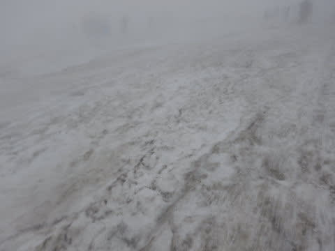

# 2019/6/29(土)の月山スキー場，速報モード…朝からガス（泣）．リフトを滑るのは無理，Tバーのみ．天気悪いのにTバーは結構混んだよ

📅 投稿日時: 2019-06-29 22:57:30

🏷️ カテゴリ: [2019スキー滑走日記](c3e4496fc0fb7f9c17ff21214a35b1ace.md)

ということで．

本日，月山で滑ってきて．

私にとっての，今シーズンラストの

スキーを終えてきました…

ってなわけで．

本日の月山，速報モードにて…

えー．

今朝，月山に来る道中ですが．

…すでに雨です（激涙）

駐車場に着くころには，降っているかどうか

分からないくらいの小雨になりましたが，

山頂方向は，濃いガスで覆われ，

全く見えません…（涙）

あ，ちなみに．

今日は，駐車場は無料になっており．

その代わり，一人当たり200円の入山料を

払うようになってました～！

いつも，駐車料から入山料への切り替えは，

7月1日だった気がするのですが…

てなことで．

リフト乗り場にやってきましたが．

やはり，沢コース，大斜面ともクローズで，

リフトは滑れず．

山頂のTバーしか滑れないという

悲しい状況（泣）

私「大斜面，多少藪漕ぎすれば滑れるとか，

　そういうレベルだったりしませんか？」

係員「…藪漕ぎしている途中で，遭難する感じです」

と言われたので．

リフトを滑るのはあきらめました（涙）

リフトに乗って，山頂にやってきましたが…

リフト山頂駅，視界は30mほど（激涙）

リフト山頂駅から，こんな感じの道を数分登って…

汗だくになりながら，ようやく

雪が残っている場所に出ますが．

Tバーは，ここからさらに標高差50m程度を

登らなきゃなりません（泣）

…しかし．

視界が悪い，真っ白な雪原が広がる

この状況．

おそらく月山を知らない人は，

どっちに歩いて行けば，Tバーがあるか

全く分からないでしょうね，これ…

ってな感じで．

スキーをかついて，さらに雪の上を数分間

登っていくと．

ようやくTバー乗り場へ到着！

…ここまで，駐車場からはるか1時間．

そして．

ここまで苦労してやってきたものの．

ゲレンデの視界は限りなくゼロなんですけど！！

何も見えないうえに．

Tバーの長さはせいぜい100mちょい．

すごい時間をかけてやってきて．

滑れるのはごくわずか．

距離的には，一の瀬ファミリークワッドを

降りてから正面バーンに着くまで

くらいの距離の感じ．

…でも．

いいのだ．

この時期に，雪の上を滑れるだけでも

ありがたいのだ！

…と，思っていた11時過ぎ．

Tバーの待ちも，なぜか10分近くに伸びてしまい．

10分待って，視界のないゲレンデを20秒滑る…

という感じになってきてしまいました（悲）．

ってなことで．

混んできたうえに，

なにぶん雨も降って来たし．

視界も悪いし…

さすがの私も，昼前に切り上げてしまいました…

まぁ，

2019シーズン終わりの儀式はできたので．

良しとしましょう…

ってなことで，詳細レポートはまた明日！

## 💬 コメント一覧

### 💬 コメント by (ほっぽ)
**タイトル**: お疲れ様でした
**投稿日**: 2019-06-30 07:46:49

Ｓさん

2019シーズン終了、お疲れ様でした。

この悪天候の中、月山まで行く気持ち、

正にスキーヤーの鏡です。(^^♪

そして、これからは車とダイビングネタ満載の

blogに模様替えですね。(^^;

私は昨日、地元スポーツショップのスキー展示会に行って、

買う予定の無いブーツを試着して、アビリーバの

AIR　HORNETが次期候補になりました。

### 💬 コメント by (若杉勲71)
**タイトル**: Unknown
**投稿日**: 2019-06-30 16:47:18

お久しぶり。こんな時期にも何人かが、いるんですねえ。あの中にはSさんよりももっとすごい、世にも稀有な、アブ・・・・な人が、何万分の一位の確率で存在するやも？？

潜水も楽しんでくださいね。

### 💬 コメント by (Goku)
**タイトル**: Unknown
**投稿日**: 2019-06-30 18:19:13

Ｓさん以外にも、こんなにも逝っちゃてる人がいるとは驚きです。

乗鞍で滑っている人もいるから、日本のスキーヤーは凄いのがいっぱいいますね。

### 💬 コメント by (yumi)
**タイトル**: Unknown
**投稿日**: 2019-06-30 21:45:26

Ｓさぁ～ん👽👾🤖

月山て ホント 修行の場ですよねぇ～😖

歩いて上がる❓️ありえへん😫

月山へ行く 妄想は 日々、繰り返してましたが･･･

私には 絶対ムリ😢🆖⤵️

タケノコの瓶詰めよりムリ😢🆖⤵️

### 💬 コメント by (Skier_S)
**タイトル**: シーズン終わりました（涙）
**投稿日**: 2019-07-01 04:17:00

＞ほっぽさま

シーズン，終わっちゃいました（泣）．

これから3か月ちょい，いつもの夏モードです．

で，来シーズン，ブーツ買い替えですか！？？

まだ新しいブーツだった気がするのですが…

…でも，ぜひここは物欲にまみれてください(笑)

＞若杉さま

お久しぶりです～！

いや，月山．

思った以上に人がいましたよ…！

とりあえず，無事に怪我なくシーズンが終えられました．

これから海のシーズンです～！

＞Gokuさま

いや…

ホントにこの時期の月山，逝っちゃってる人の溜まり場です…

すごいですよ．

ぜひ一度行ってみてください！

＞yumiさま

月山は，板を履いてリフトに乗り降りできるうちは

まだ楽しいのですが．

板を履いてリフトに乗り降りできなくなってからは，

だんだん修行の場と化していきます…

でも，海外に行かなくとも，週末にちょっとお出かけして，

7月まで滑れところがあるって，ありがたいことです！

