# 2月22，23日の週末の志賀高原スキー場の天気は…土日ともかなり冷え冷え雪，吹雪く可能性も高いけどパウダーねらい目

📅 投稿日時: 2025-02-20 03:02:52

🏷️ カテゴリ: [スキー天気予想](c6554f5c3c106093b511a8daae23757e8.md)

ということで．

月曜の午後から，ひたすら雪が降り続けて

いますが…

水曜の深夜の段階でも，かなりの勢いで

雪が降り続けていますね…

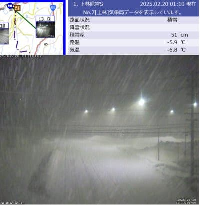

（[北信建設事務道路気象状況カメラ](http://hokushin.pref-nagano-roadcamera.jp/)より）

火曜夜から水曜朝までに50cmほど積もった

みたいですが．

水曜夜も，今までにすでに50cmほど積もって

いるみたいで…明日もパウダーデー確定

ですね…すごい…

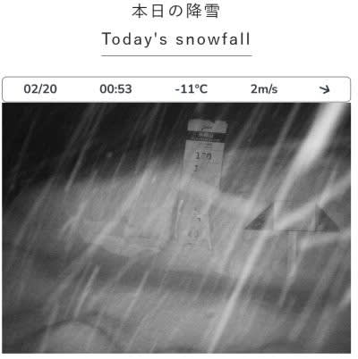

（[焼額山スキー場ライブカメラ](https://www.princehotels.co.jp/ski/shiga/livecamera/)より）

この雪は，これからまだしばらく降り続ける

わけですが…

果たしてこの週末の志賀高原天気やいかに？？

水曜深夜恒例の天気予想，行ってみましょう…！

まず．

20日(木)の850hPa気温を見ると．

志賀高原には水色の-9℃線がかかって

いるので．

朝は-10℃を余裕で下回る，冷え冷えの

一日ですね…！！

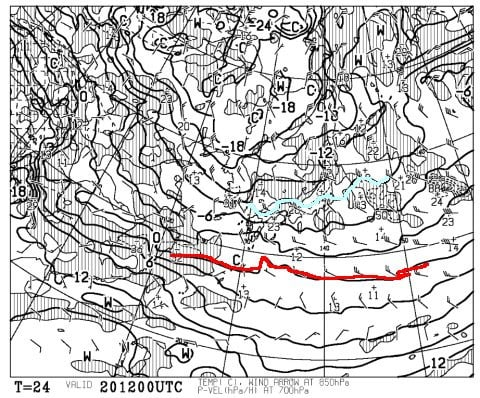

そして，この日の地上天気図を見ると，

見事なJPCZが伸びていて．

JPCZが能登半島より西に延びる風向きで，

割と北寄りなので…

この日も志賀高原は雪が降りますね．

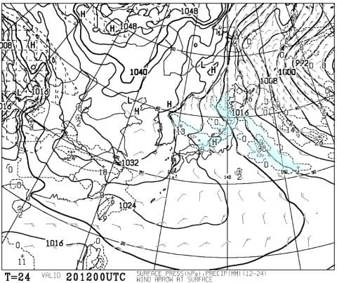

続いて，21日(金)の850hPa気温ですが．

この日は志賀高原に水色の-12℃線が

かかります…！

これはかなり冷え込みます！！

昼間も-10℃を下回るかもしれない

激冷えです…！！

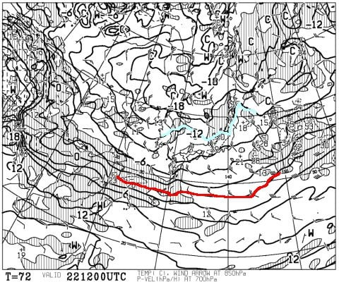

この日の地上天気図を見ると…

見事なJPCZが伸びていて，それもかなり

南向きにたなびいているので…

志賀は北風．雪が降るパターン．

…これ，志賀高原よりも，

JPCZが突き刺さっている山陰地方が

豪雪になるパターンですね…

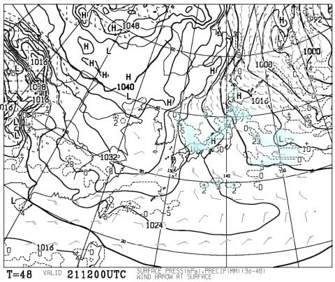

で．

肝心な週末，22日(土)の850hPa気温は．

この日も志賀にかかる水色の線は-12℃！！

激冷えです！！

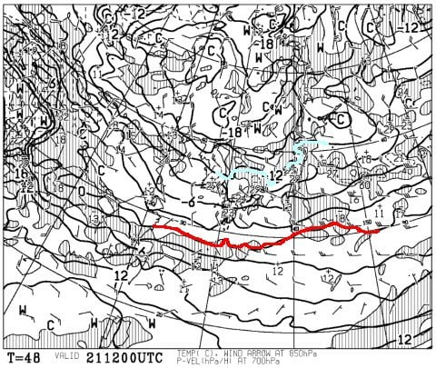

土曜の地上天気図は…これもみごとなJPCZが

ほぼ南に延びてます…！！

これは志賀は北風で，結構降るパターン！

…土曜も積もりそう…

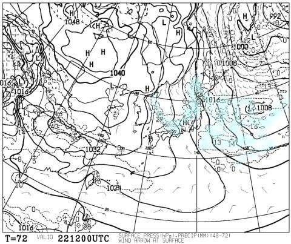

最後に，23日の日曜の850hPa気温ですが．

この日は志賀にかかるのは-9℃線．

金・土の激冷えからちょい冷えに

冷え込みグレードは弱まりますが…

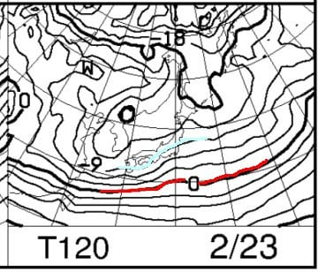

でも，この日も等圧線は縦じま．

土曜までに比べれば弱いかもしれませんが，

雪はこの日も降り続けそうな気配…

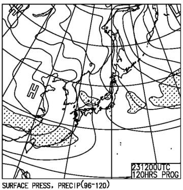

ってなことで，まとめると．

20日(木)：ひたすら雪降りの一日．

　朝イチの気温は-14℃くらい．

　朝までの積雪は50cm越え．

　朝イチは非圧雪コースは太もも，

　ところによっては腰パフ！

　圧雪バーンも10～20cmの新雪．

　この日は一日降り続ける終日パウダー

　デー．

　パウダー好きにはいいけど，

　昼間も-10℃程度と寒くて

　雪が降り続けるので，根性の無い

　スキーヤーにはつらい．

21日(金)：この日もずっと雪降りの一日．

　この日も朝イチの気温は-14℃くらい．

　朝までの積雪は20cm程度で，

　ブーツパフくらい．

　木曜よりは雪の降りは弱いが，

　終日降り続ける．

　昼間も-10℃を上回らなく寒い．

　午後はコースはモサモサになっていく．

22日(土)：引き続き一日雪降り．

　朝イチの気温は-15℃．

　風が強くなる可能性もあり，

　奥志賀ゴンドラはヤバいか…

　朝イチの積雪は20～30cmくらい．

　非圧雪コースは脛パフくらい行って

　くれるか？

　昼間の気温も-10℃を越えず寒い．

　圧雪コースも数㎝雪が乗る．

　昼間も雪が10～20cm積もり，

　コースはモサモサ荒れ荒れに

　なっていく．

23日(日)：雪時々曇り．

　朝イチの気温は-12℃くらい？

　朝までの積雪はまだよくわからないけど…

　非圧雪で10～15cmくらい，ブーツパフ

　からそのちょっと上くらいかな？

　運が悪いと風が強くなってくる．

　この日も昼間は-10℃を越えるか超えないか

　くらいまでしか気温が上がらず，

　寒い雪降りの日．

　この日も午後はバーンが荒れそう．

ってな感じでしょうか…

とりあえず，この雪降りの冷え込みは

24日(月)の午前中までは続くので，

22，23日の週末は雪降りパウダーデーが

続きそうです．

その後，25，26日は晴れそうなので．

天気がいい日に滑りたい人は，週末の22，23日

よりは，25，26日の方がよさそう…

で．そのあとで恐ろしいのが．

この低温冷え冷え祭りが27日ごろには

終了してしまい．

その後，28日以降はすごい高温期間

(赤矢印)になりそうという…

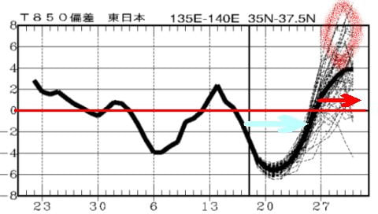

29日ごろは，赤く括った部分で，

最悪では気温が平年比+8度を越えそうで…

グラフの枠を突破しかねない勢いです(泣)

とりあえず，3月以降はこのグラフが外れて，

いい感じの冷え冷えの気候が続くことを，

スキーヤーの皆さんは祈りましょう…！

## 💬 コメント一覧

### 💬 コメント by (アリス)
**タイトル**: Unknown
**投稿日**: 2025-02-20 06:40:37

skier_s様

水曜日から志賀高原に参戦しています。

気温、積雪はsさん予想通りですね。

朝一のヤケビのパウダーが楽しいです。

驚きは、平日でもスキー客が多く比較的人口密度が高いです。

シニア層、修学旅行、外国人ですね。

### 💬 コメント by (Skier_S)
**タイトル**: ＞アリスさま
**投稿日**: 2025-02-21 03:02:13

木曜は予想を外して晴れ間も多かったみたいですが，

天気が良かったぶん，楽しめたのじゃないでしょうか．

でも，平日でも比較的人が多いんですね…

金曜もコンディションはよさそうですよ！

