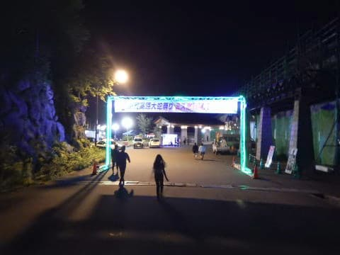

# 夏の志賀高原に行ってみた3…大蛇祭の夜

📅 投稿日時: 2017-09-02 00:41:32

なんだか…

2-3回で手短にまとめようとしたのに．

やはり5回モノくらいの連載になってしまいそうな，

夏の志賀高原レポート．←いつも文章長すぎだっての

今回はその3．

大蛇祭の夜です…

---

ということで．

小布施でゆっくりしていると，もう夕方．

志賀高原へ戻り，98会館前の大蛇祭り会場へ

向かいます…

会場には，屋台なんかが出ていて，

そこそこの人出ですね．

でも．

この夜の狙いは，このお祭りスペースではなく．

夜7:30から98会館ホールで開催される，

カレッジコンサート．

今回初めて，このコンサートに来たのですが…

なんと．

志賀高原の98会館の中に，こんな本格的

ホールがあったとは…っ！！！

このカレッジコンサート．

夏の志賀高原で，大学の吹奏楽団がいくつか

練習しているので．

その発表の場として開催されるものらしく．

無料で楽しめます…

夏の間に，大学持ち回りで何回か

開催されるのですが．

大蛇祭当日の夜は，早稲田吹奏楽団の回．

せいぜい30分程度かな…と思っていたら，

1時間越えの，しっかり楽しめる

コンサートでした…

で．

このコンサートが終わると．

時間はもう9時近く．

9時になると，ホールを出たすぐの

お祭り会場の照明が消されて．

会場横のすぐそばから，花火が打ちあがります…！

むちゃくちゃ近い．

これだけ近くで花火を見れる機会は，そうそうないなぁ…

時間的には，20分ほどですが．

かなり大きな玉も上がり，火の粉が降ってくるのでは？？

というくらいの近くで満喫できる，花火大会．

これだけ楽しめれば，十分でしょう～！！

そして．

花火が終わってからも．

まだ続く，お楽しみ．

会場から車で10分ほど．

日本一標高が高いところに発生する，天然記念物の

[石の湯のゲンジボタル](http://ishinoyu.com/firefly)を見に行きます…

ピークは7月らしいく，ちょっとピークを過ぎているので

それほど多くは無かったですが．

チラチラと蛍が舞飛んでいるのがみれました…

＃暗すぎて写らなかったので，写真は無しです…

時間も遅いので，他のお客さんが全くおらず，

貸し切り状態で見れましたが．

乱舞ってほどでなく，ポツリ・ポツリと

数匹が飛んでた…ってくらいだったので．

蛍はやはりピークの7月に見に来るのがいいのかな…

ということで．

朝のトレッキングから，野猿公苑，小布施，

コンサート，花火，蛍見物と．

超盛りだくさんの一日でしたが．

この日は志賀高原で泊まり．

明日は，朝から志賀高原で，大蛇祭の数々の

イベントを堪能予定です…

## 💬 コメント一覧

### 💬 コメント by (しんちゃん)
**タイトル**: おこみん、かわいい
**投稿日**: 2017-09-03 23:57:30

おこみんが登場している(*^-^*)

かわいい。。。

### 💬 コメント by (Skier_S)
**タイトル**: しんちゃんさま
**投稿日**: 2017-09-05 00:18:24

大蛇祭，おこみんがずっと会場にいて，

娘はおこみんと触れ合いまくって喜んでました…

今日の記事で，ゆるキャラがいっぱい出てきますが．

やっぱりおこみんがかわいらしさで群を抜いてますね～！

