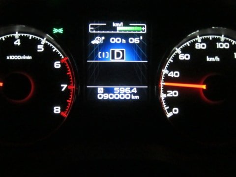

# BRレガシィ君，90000km突破…ちょっとペース落ちたかな

📅 投稿日時: 2016-04-15 02:15:35

えー．

やはり，今週末，日曜の志賀高原．

朝から雨になりそうな感じの今日この頃．

皆様いかがお過ごしでしょうか．

ってか．

風も強くて，奥志賀ゴンドラは動かなさそうな天気なんですが…

…まぁ，そんなにザーザー降りにはならなさそうな

感じなのが，せめてもの救いか…

＃奥志賀のゴンドラ側ダウンヒルコースはシーズン終了しちゃったので，

＃ゴンドラは単なる連絡用ですが…

ってことで，本題へ．

次の6月で，ついに初めての車検を迎えるわがBRレガシィ君．

先日，90000kmを突破しました～！

うーむ．

ちょっとペースが落ちてきたかな？

3年目の車検の時には，確実に10万km超えるなぁ…

って思っていたけど．

このペースだと，車検の時はぎりぎり10万km超えなさそう…

…しかし．

10万kmを超える前に，車を買い替えようかな～，

とか思っていたけど．

引っ越しで散財したので．

ちと車を買い替えるのは無理っぽい感じ…（泣）．

ってことで．

[プロジェクトX](eb1b0e385b422753c3e3aad5a58c12234.md)の続編を期待していた方もいらっしゃるかもしれませんが．

残念ながら，プロジェクトX PartIIはしばらくお預けです～．

＃でも…来年あたりには実行かな？

## 💬 コメント一覧

### 💬 コメント by (ぴよ＠太田市)
**タイトル**: ＢＳ9アプライドＣ
**投稿日**: 2016-04-15 08:58:51

ディーラーに立ち寄って、ＢＳ9アプライドＣ型の話を

ちょいとすれば、勝手に下取り査定してくれて

サクサクゥ〜っと話はすぐに進みますよ。

アイサイト3.0は逆光に強く、下り坂の速度調整では新た

にブレーキプラス

前方車が右左折しても、解除にならないよ〜

な〜に、同じ色にすれば嫁にはバレないって！(^^)/

### 💬 コメント by (Skier_S)
**タイトル**: ぴよ＠太田市さま
**投稿日**: 2016-04-15 23:08:27

嫁さんに聞かれたら，

「あれ？ちょっとダイエット失敗して，車が太ったのかな？」

…とでも言うのでしょうか（笑）

BRからBSへの変化に気づかないって…

よっぽどかと（＾＾；

