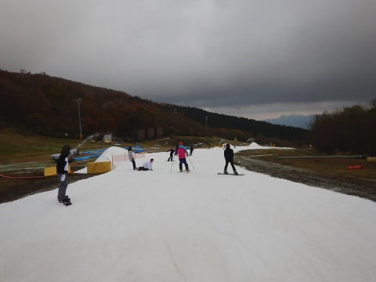

# 11月5日（日）3連休最終日のイエティ，速報＆動画…結構寒い曇り空．今シーズン一番の混雑！？？

📅 投稿日時: 2017-11-06 01:26:05

えー．

ということで．

3連休最終日の本日．

行ってきましたよ．

今シーズン5回目のイエティへ…

予想では，すっきり晴天で．

3連休最終日だから，中日ほど混まないはずっ！

という読みがありましたが…

残念ながら，この読み．

どちらも外れました（涙）．

天気は，朝は一瞬晴れたものの，そのあとは

曇り空．

そして…今シーズン一番の混雑でした（泣）．

中日の土曜はそれほど混まなかったらしいのに．

なぜか最終日はかなりの混雑（涙）

とりあえず．

今日も帰宅が遅めなので，

いつもの速報モードにてレポートすると…

まず．

朝はすっきり晴れ！

そして…

気温も低めで．

コース幅も広くなった感じ！

だけど…

開始後1時間も経たずに曇り空になり．

富士山も隠れてしまい…

この日は結局，終日曇り空．

まぁ，曇っていた方が．

雪が緩まずいいコンディションが続くので，

イイかな，と思っていたけど…

10時を過ぎると．

うむ？

コース上の人が増えてきて…

そして，リフト待ちも，午前10時には

もうこんな感じで…

今シーズンはあまりリフト待ちがなかったので，

良かったけど…

そろそろ混み始める時期になってきましたか…

午後のピーク時はこんな感じに（泣）

まぁ，並行したペアリフトが動くほどでは

無かったので．

これでも，例年より待ち時間は短いのかな…

で．

定番の，午後2時ごろのコース状況の動画をば．

リフトを降りてすぐから，リフト乗り場までです．

人が多いものの，

コース幅が多少広がった感じが分かりますかね～．

とりあえず．

明日，詳細レポートやります～！←これで十分詳細だというツッコミが…

## 💬 コメント一覧

### 💬 コメント by (yama)
**タイトル**: イエティ
**投稿日**: 2017-11-06 20:41:35

昨日はお世話になりました。なぜかSさんとイエティに行くと雲行きが悪い気がします。でもそのおかげで雪は溶けないでよかったです。また、来週もお願いします。

### 💬 コメント by (Skier_S)
**タイトル**: yamaさま
**投稿日**: 2017-11-07 00:54:54

日曜はすっかりお世話になりました～！

おかげで楽しかったです．

また今週末，よろしくおねがいします！

