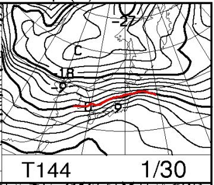
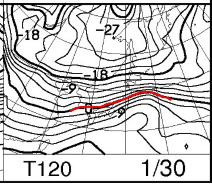
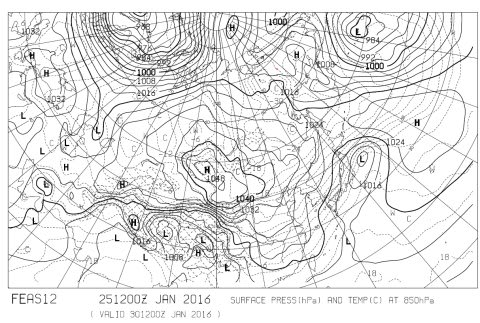
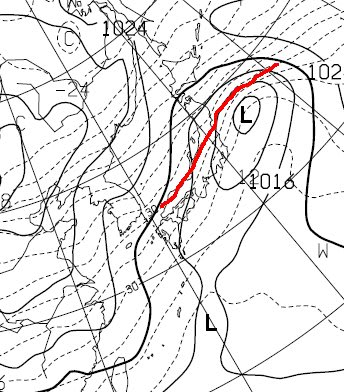
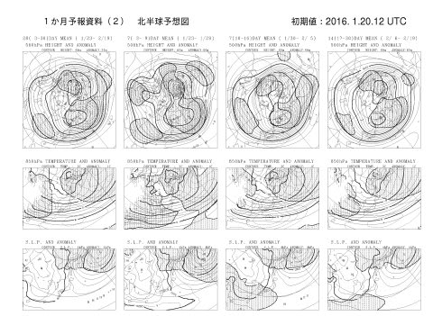
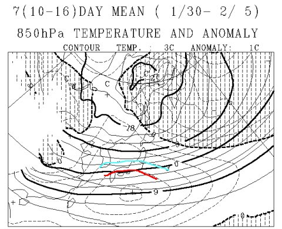
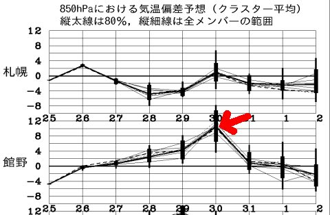
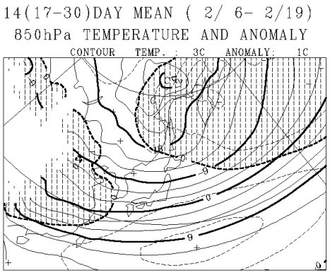
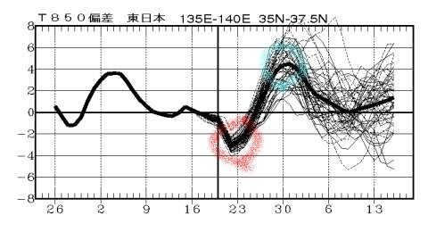
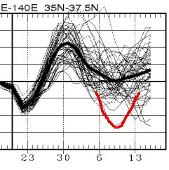

# 先週の冷え冷えは一過性？これからも暖冬，雪不足のゲレンデになるのか…一か月の天気を見てみる

📅 投稿日時: 2016-01-27 02:39:42

えー．

なんだか，ここしばらく．

スキー場レポート以外は，天気予想しかしてない気が

するんですが…

…だって．

雪不足の今年．

気になりますよね～．

週末までに積雪があるかどうか…

ってことで．

今日も天気ネタに行くわけですが．

まず，今週土曜日，30日の予想ですが…

昨日の段階の，850hpa気温予想図は．

こんな感じで+6℃線が志賀高原にかかっていましたが…

今日の段階の，850hpa気温予想図は．

…微妙な差ですが．

赤くマークした0℃線が，昨日の予想よりわずかに南に下がり．

昨日の予想より，ちょいと気温が下がりそうな感じに！！

…これは．

私を含め，一部の信心深い方々が，

気温が冷える踊りを踊り続けていたからに違いありませんっ！！←違いありまくりだから

FXXN519から切り出したこの図では，

イマイチ細かいところが見えないので，

いつもはあまりここに載せない，FEAS12という天気図を

見てみましょうか…

これの日本付近を拡大すると…

赤くマークしたところが，30日の0℃線の位置．

…これは．

…あとわずか．

あとほんのわずかに0℃線が下がってくれれば．

志賀高原に0℃線がかかって，昼間でも雪になりそう！

うーーむ．

すーーーーんごいきわどいところ．

もう少し．

もう少し，0℃線が下がってくれるだけで，

30日の土曜の志賀高原に，平和が訪れます！！

みなさん，踊るのだっ！！

みんなで，気温が冷える踊りを踊り続けるのだっ！！！←どんな踊りだ…

…ちなみに．

今のままで行けば．

30日の昼間は標高が低いところは雨．高いところはみぞれっぽい感じ．

30日の夕方から31日の日曜にかけては，小雪が舞う感じかな～．

で．

それで，だ．

スキーヤーとして気になるのは．

30日の高温が過ぎ去ったあと．

先週の冷え冷えが戻るのか？

それとも…

…また，異常な暖冬に戻るのか？

そのあたりが強烈に気になるところ．

いや．

事実を知ってしまったら，絶望に打ちひしがれるのかも…

という一抹の不安を抱きつつ．

一か月長期予想図を見てみますか…

一か月予報アンサンブル平均図，FCVX12を見てみると．

ふむ？？

この，右から2列目の図．

拡大してみると…

なんだ，こりゃ．

1月30日～2月5日の，一週間の850hpaの平均気温．

水色で示した平年比3℃高いエリアが志賀高原にかかっているどころか…

赤く示した平年比4℃高いエリアが近づいてます！

…これは，30日前後の異常高温が効いてますね…

うーむ．30日，冷え冷えになって，この予想は

裏切られてほしいところ…

まぁ，850hpaの気温グラフを見ると…

異常高温なのは，30日だけで．

30日以降，数日間はそんなに異常に気温が上がらなさそうかな．

で．

FCVX12の一番右．

2月6日～19日の図を見てみると．

ふーむ．

日本は，網掛けがない，平年比より気温が高いエリアに

覆われてますが．

まぁ，気温は平年より1℃も高くならない感じで．

ほぼ平年並みと言えるのかな…

激烈な冷えではないけど，暖冬というほどではなさそう．

で．

FCVX14，1ヵ月予報各種時系列図を見てみると…

ふむ．赤くマークした冷え冷え祭りの1月24日付近の低温のあと．

青くマークした，1月30日近辺の異常高温が予想されてますが…

…そのあとは，大体平年並みか，それよりわずかに高い程度の

日が続きそう．

まぁ，異常な暖冬，という感じではなさそうで，一安心．

しかし，この図を拡大すると…

予想パターンの中に，なんだか平年より5度くらい

低くなる日があるものが含まれてますね～．

うーむ．

こういうパターンになれば，激冷え大雪になりそうだけど…

そんな可能性は，残念ながら低いでしょう．

＃逆に，上に突き抜けてるパターンになってしまわないよう，祈らねば…

…ってことで．

今後の予想は．

30日の高温のあとは．

概ね平年並みの気温が続いてくれそうで．

どうしようもない暖冬…ということはなさそうです．

まぁ，一安心かなっ！！！

…という感じで．

とりあえず．

今週末の異常高温を乗り切れば何とかなりそうなので．

これから今週末にかけて．

みんなで気温が冷える踊りを踊り続け，

この週末を乗り越えるのだっ！！←だから，どんな踊りだ…
