# 2023/11/3(祝)，3連休初日のイエティの詳細レポート！…ゲレンデ幅は広がったし思ったより混まなかった，暑いほどの晴天の一日

📅 投稿日時: 2023-11-05 06:21:30

🏷️ カテゴリ: [2024スキー滑走日記](c453f687e8a0f05679e95831d0a02cd0c.md)

ってなことで．

本日は，祭日の金曜日にイエティに行ってきた

詳細レポートです！

まず…

今日もあさイチから滑れるよう，

朝9時の営業開始前の8時40分過ぎに

イエティに到着して，入場待ちの

ゲート列に並びますが…

あさイチのゲート待ちは，先週土曜より

少ない感じ．

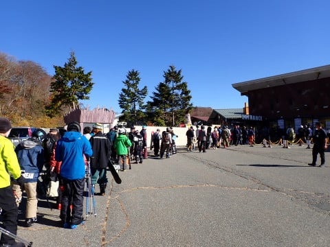

やはり祭日は，普通の土日よりは人が少ない

みたいですね～．

今日はそんなに混まないかな？？

ただ，9時にゲートはオープンしたものの．

高温でゲレンデが荒れていて，ゲレンデ整備に

時間がかかっているということで…

ゲートがオープンした後も，ゲレンデは

クローズしており，ゲレンデ前でちょっと

だけ待たされましたが．

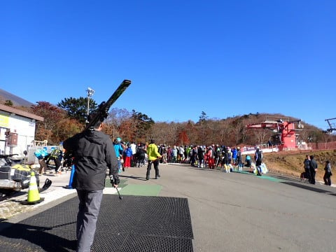

でも…

9時5分過ぎにはゲレンデオープン！！

シマシマ！

あさイチシマシマです！！

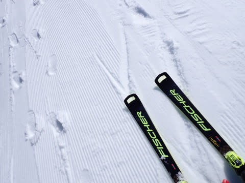

気温が高めでちょいと柔らかめだったものの．

あさイチは滑走性もよく，

人が少なめのバーンを快適に飛ばせます…

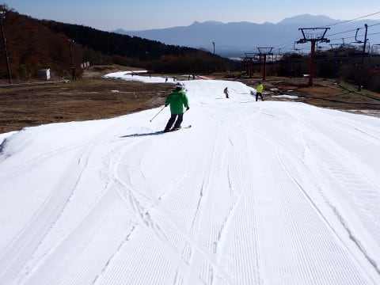

いや…

コース幅も結構広がって．

あさイチは思いのほか快適…っ！！

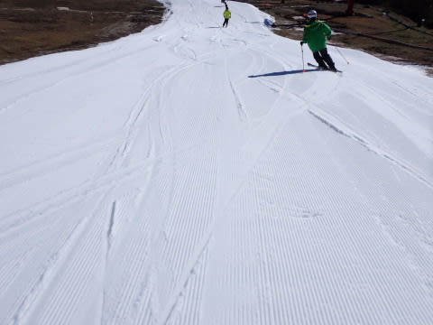

ただ…

天気がいい．

いや，天気がいいのは悪くないけど，

ちょっと天気が良すぎる．

気温が11月と思えないほど高く，日差しも

強いので…

雪が荒れそう…

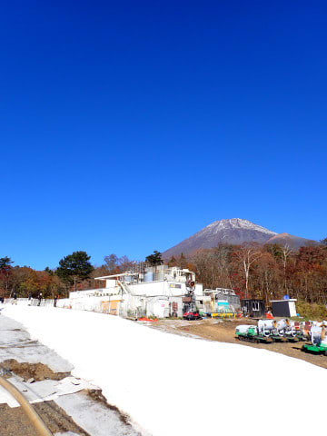

とはいえ．

朝のうちは人も少なく．

コース幅も広がったこともあり．

スタートから数本は，結構気持ちよく

滑れました～！

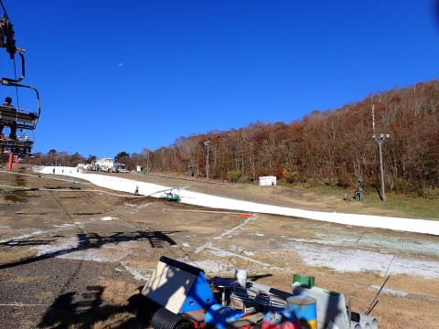

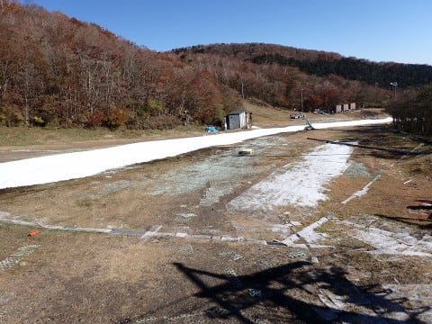

ただ…5本ほど滑った9時40分ごろになると．

だんだんリフト待ちの列ができてきて…

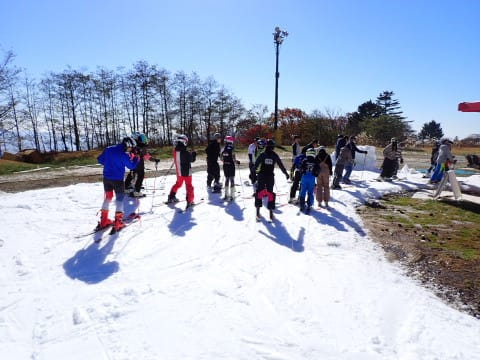

10時ごろには待ち時間が5分近くまで

伸びてきました…（泣）

ただ，今日のリフト待ちは，一日中

平均でこのくらいが続き．

5分待ち程度だったので許せるかな…

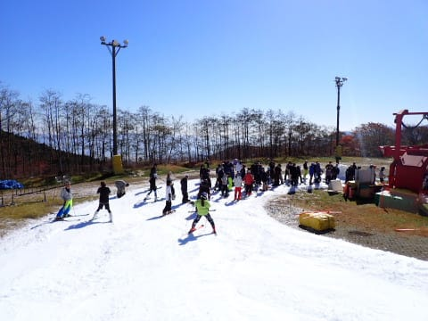

人がそこまで多くなかったからか，

今日もクワッドと並行でかかるペアリフトが

動きませんでしたが…

ただ，なぜかペアの降り場に雪山が作られて

いるんですが…？

ペアリフトから降りるときに邪魔になる

こんな場所に雪山を作るって…

今シーズン，まさかBコースがオープン

するまで，ペアリフトを動かす予定が

ないとかじゃないよね…？？

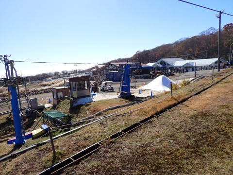

ちなみに，午後3時ごろまでのピークの

リフト待ちはこの程度．

最大が10分待ちでしたね～．

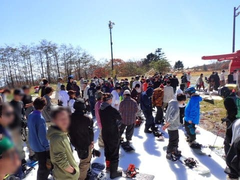

12時過ぎから1時ごろの昼休みタイムは，

この程度までリフト待ちが短くなることも

あって，祝日としてはそこまでひどい

混雑ではなくて，よかった…！

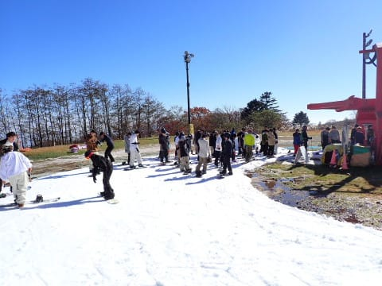

で．

終日晴天だった本日．

最高気温は20℃近くまで上がり…

とても11月とは思えないんですけど？？？

今日って，11月3日じゃなく，8月94日とか

でしたっけ？

標高1400mで20℃超えって，8月並み

ですが…（涙）

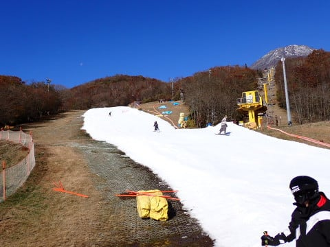

そのせいで，午前中から雪は緩み気味で，

板が張り付いて滑りが悪い雪になりかけて

ましたが…

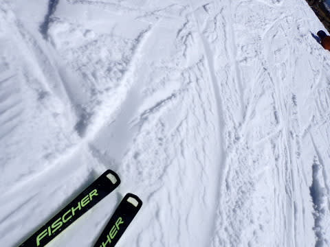

コース上にところどころ硫安も撒いてくれて，

壊滅的に全面張り付き雪になることもなく．

コース幅も広かったので，気温が高かった

わりには，終日まぁまぁ快適に滑れたかも…

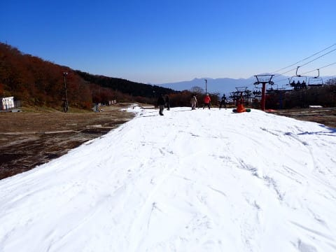

動いているリフトがクワッド1本だったし．

幅が広がったこともあり，コース上の

人口密度は高めながらも，狂気の混雑に

なることもなかったし…

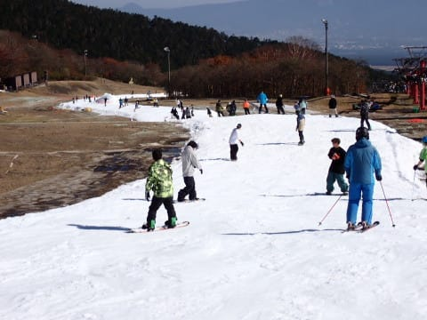

人口密度が高いタイミングがあったり

したものの，割と今日は快適に滑れた一日

だったかな…

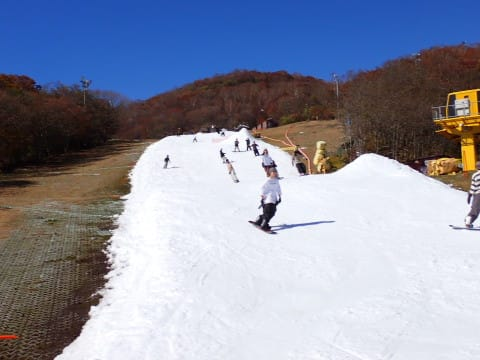

ただ．

午後3時を過ぎる頃になって，人がちょいと

増えてきて．

午後3時過ぎが，昼間では一番リフト待ちが

長かったですね～…

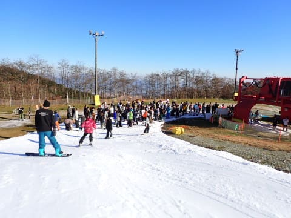

でも，昼間の営業が終わる，コース整備直前の

16時になっても，硫安が効いていたからか

気温が高かったわりにコースもそこまで

ひどく荒れなかったし．

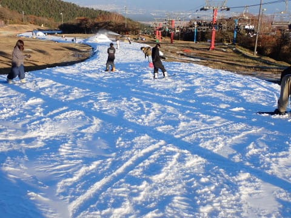

3連休ということで激込みを覚悟していた

けど，予想よりはずっといいコンディション

でした～！

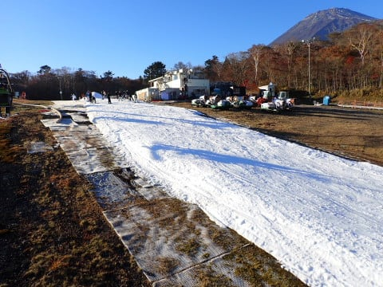

ってなことで．

16時にコース整備のため，いったんコース

クローズとなりますが…

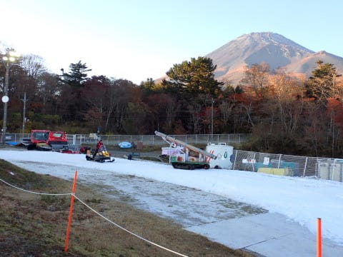

当然，17時からのナイターも参戦！

コースオープンを待ちますが，

今日は圧雪車の調子が悪かったらしく，

コース整備に時間がかかり，コースオープンが

予定より20分ほど遅れ．

お詫びにオープンを待っている人に，

無料ドリンク券が配られてました…

うん．

何もなしに20分待たされるよりは

こういう心遣いしてくれるのはうれしいところ．

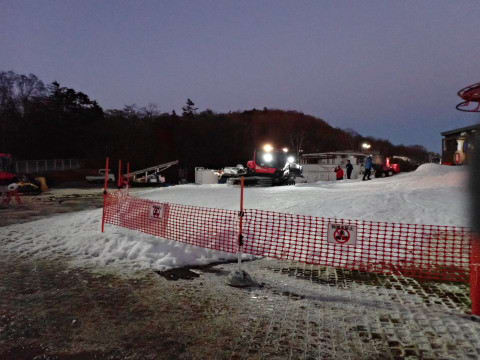

ってなことで．

ちょいと待たされましたが…

予定から20分遅れ，17時20分にはコース

オープン！

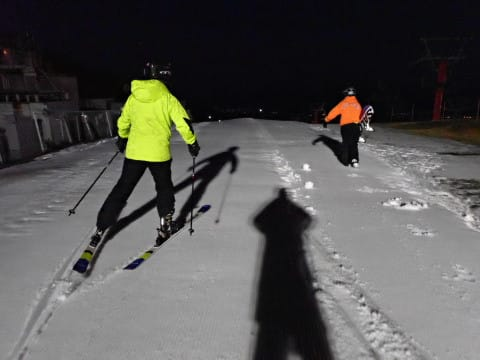

うはははははは！！

シマシマ！

今日2度目のピカピカのシマシマ

バーンです！

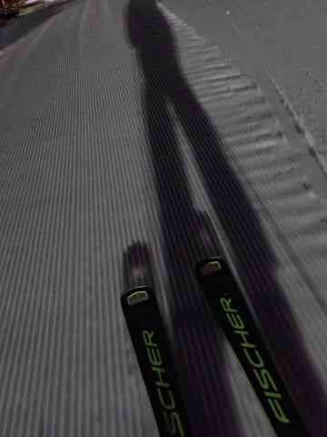

そして．

気温が冷えた夜は，昼間と違って

滑走性もいいし…

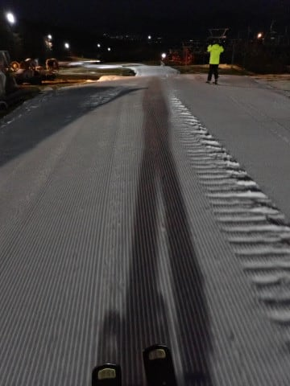

ナイター開始後の1本は，シマシマの

よく滑る雪を，コース幅いっぱい

好きなラインで滑れるシアワセ…

1日券でナイターまで滑れるので，

このナイター1本目だけでも滑る

価値はある…！

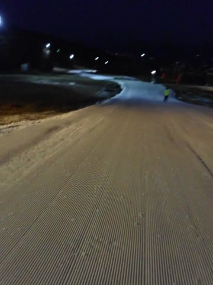

でも，ナイターがこんなガラガラ状態で

気持ちよく滑れたのも2本だけ…

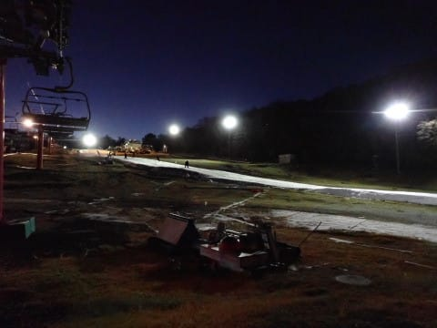

明日が土曜日の本日は，ナイターのほうが

人が多く…

3本目からは，昼間よりもゲレンデの人も

増えていきました（涙）

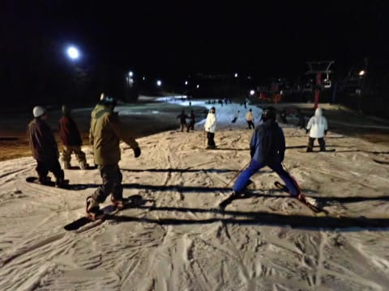

そして，開始30分でリフト待ちは10分近くに

まで伸び…

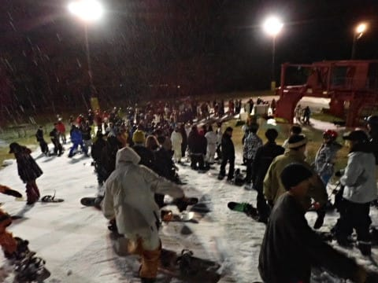

ナイター開始1時間も経つ頃には．

リフト待ちが余裕で10分を越えてすごい

ことに…（泣）

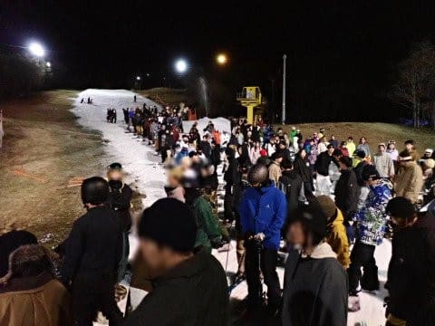

コース上の人口密度も，昼間より高くて

薄暗い中，これだけの狭さのこれだけの

人口密度のコースを滑るのは，ちょいと

怖い感じ…

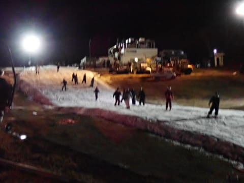

ってこともあり．

今日もナイター開始1時間後，

10分を余裕で越えるリフト待ちに耐え

きれず，18時ごろには撤退しました…

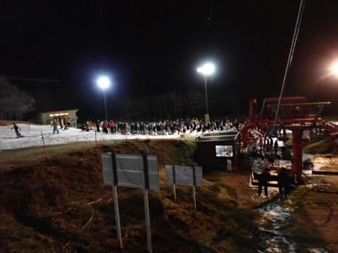

とはいえ．

昼間は思ったより混まず快適だったし．

天気も良いなか，朝9時から18時まで

滑れれば上出来…！

十分楽しめたイエティだったのでした…

ただ．

来週は6日月曜から7日火曜にかけて，

激荒れのかなりの雨になりそうだし．

10日も雨になりそうなので…

11日，ゲレンデコンディションはちょいと

悪化するかも．

でも，11日の土曜からはかなり冷えそうな

予感…

ちょっと期待！！

## 💬 コメント一覧

### 💬 コメント by (ねも)
**タイトル**: Unknown
**投稿日**: 2023-11-07 20:00:42

Ｓさん　お久しぶりです。

早シーズンインとはさすが！　私も20年前には11月に初滑りしたいと思いましたが、このごろは12月半ばに滑れたら御の字という感じです。

この日は、丹沢の鍋割山に登ってました。晴れて晩夏か初秋くらいの陽気💦　夏日(じゃなかった？)にスキーなんて稀有な経験されたのでは？(笑)

### 💬 コメント by (Skier_S)
**タイトル**: ＞ねもさま
**投稿日**: 2023-11-08 03:34:13

せっかくシーズンインしたけど，イエティがクローズしちゃいました（涙）

今週末，滑れるのかなぁ…

鍋割山登ってきましたか．気温高かったですよね…

イエティもとても11月の標高1500m近いとは思えない気温でした．

この冬，暖冬にならないことを願うばかり…

