# 2018年8月，モアルボアルで小5の娘をダイバー化！その18…ついに念願の，娘と一緒にファンダイブ！！！

📅 投稿日時: 2019-08-03 01:24:01

夏モードに入ったこのBlog．

ダイビング旅行記の連載が続いている

わけですが．

…本来，ダイビングBlogではない，

このスキーヤーBlog上で，ダイビング

旅行記を3日以上続けると．

どうやら読者のみなさんが

飽きるようなので…

実は，3日以上連続でダイビング旅行記が

続かないようにしていたのですが．

（車関係の記事なら，3日以上続いても

　アクセス数は減らない…というより，

　むしろアクセスが増えるんだけど…

　それも，スキーヤーBlogとしてどうよ，

　という気もする）

今日は残念なことに，記事を書く時間が

ちょっと取れなかったので．

ここしばらく守っていた法則を崩して，

書きためておいたダイビング旅行記です～！

では，どうぞ～！

ーー

という感じで．

本日の1本目の，イワシポイントへ

エントリーしましたが…

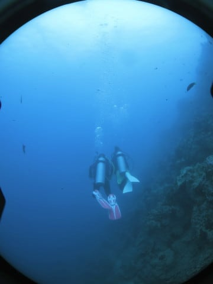

これが，娘にとっての初ファンダイブ！！

…そして．

わが家族にとって．

夢にまで見た，家族3人での

ファンダイブですっ！！！

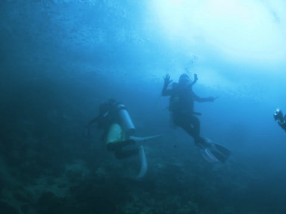

あぁ…

娘が生まれてから10年．

ついに．

ついに娘と一緒に

ファンダイブができるように

なったよ！！（感動の涙）

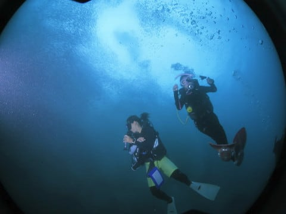

小さい子供を連れて

ダイビングに行くようになってから．

「いつの日か，子供と一緒に

　潜れるようになったらいいなぁ…」

と思ってましたが．

今日，ついにその日がやってきました！！

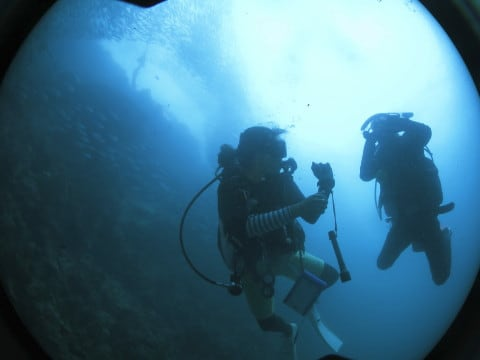

…長いようで．

意外と早かったかも…

小学生でダイビングは難しいかな？

と，心配したけど．

全く問題なく実習も終わったし．

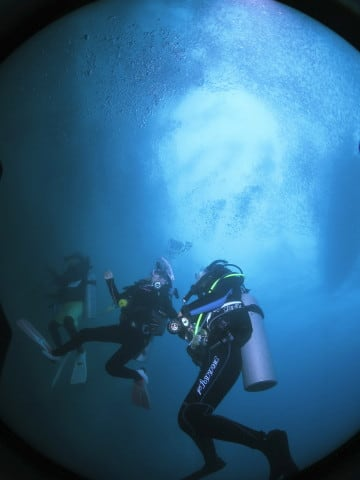

それどころか．

これがファンダイブ1本目か？？？

と，信じられないほど安定して

潜ってるし．

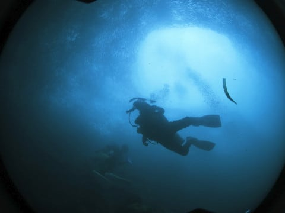

あぁ…

夢の家族3人でのダイビングが，

今ここに！！

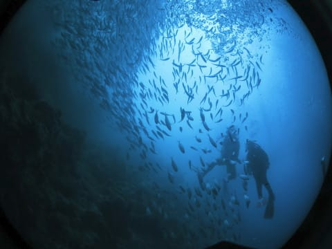

それも．

こんなすごいイワシの群れを

眺めながらのダイビングが，

家族3人そろっての初ダイビングとは…

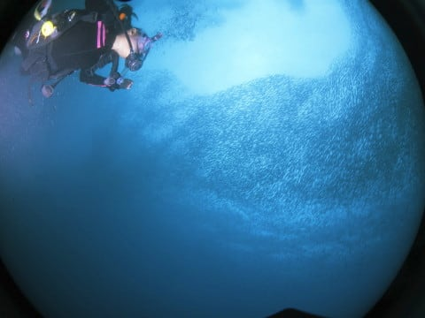

…ゼイタクだ．

なんて素晴らしい！！！

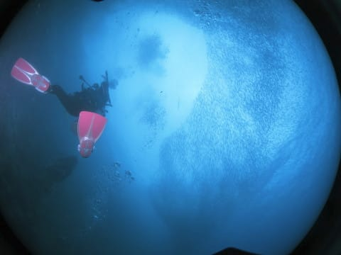

いや．

しかし．

わが娘．

ホントにこれがファンダイブ1本目と

思えないくらい，

中層でバッチリ中性浮力を

取ってるんですけど…！？？

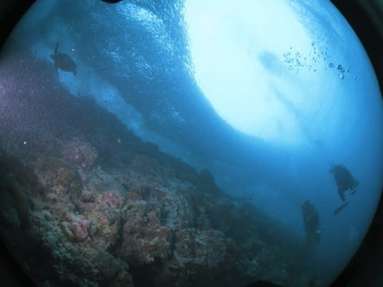

（イワシだけじゃなく，ウミガメさんも登場！）

そして．

見事に中性浮力を取りながら．

周りのイワシの群れを堪能しています…

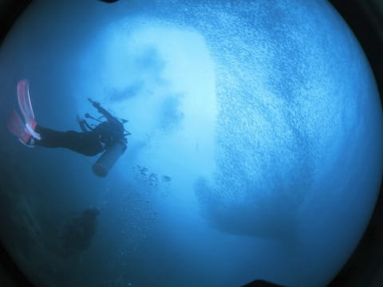

もう．

でも．

イワシもすごかったけど．

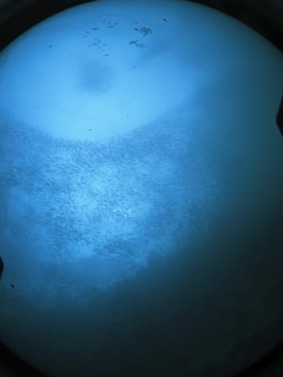

この1本は，もう．

10年越しの念願だった，

家族3人でのファンダイブが

出来たことに対する感動が

大きすぎて…

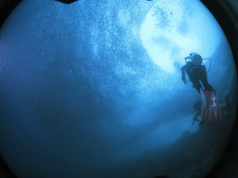

イワシの群れじゃなく，

娘ばっかり見てました．

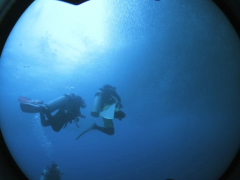

で．

海に慣れてるからか．

小学生で身体が小さいからか．

普通なら，慣れない初心者のうちは，

無駄な動きや呼吸が多くなって，

エアの消費が早くなるものだけど．

わが娘．

経験本数400本～500本クラスの

両親よりも，エアの消費がむしろ

遅かったという…

ってなことで．

エアはまだまだ残ってますが．

予定のダイブタイム50分が来て

しまったので，浮上！

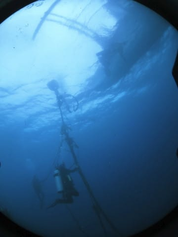

10年越しの夢が叶った，

記念すべき，家族3人での初ダイブが

終わったのでした…
