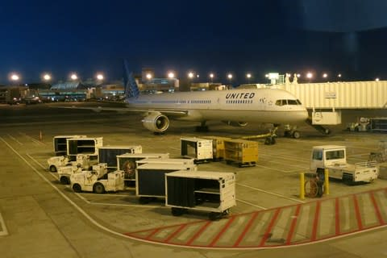
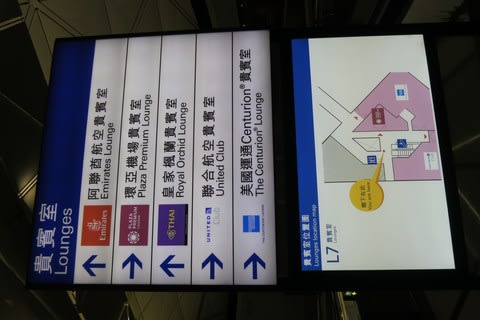
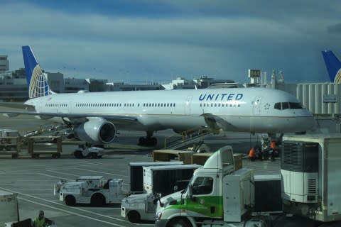
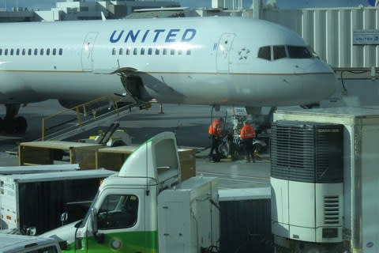
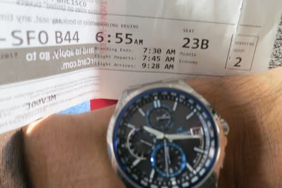
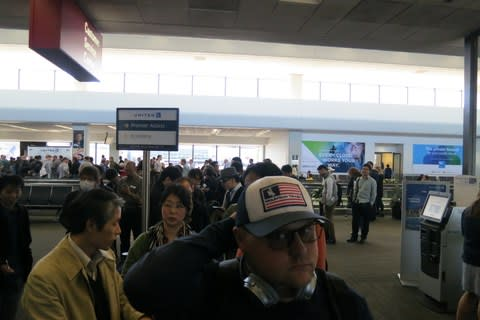
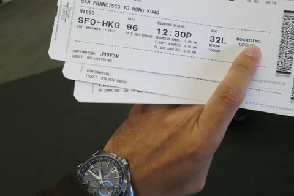
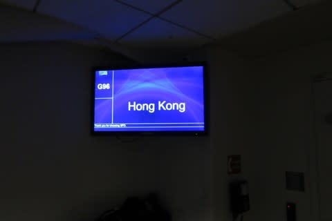
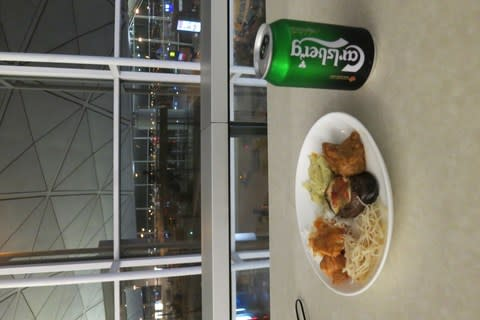

# 土曜午後に帰国予定だったのだけど…今，なぜか香港にいたりする

📅 投稿日時: 2017-11-19 00:51:31

🏷️ カテゴリ: [登山・旅行](c1d637a11a25b457ac978d197adbdafc5.md)

えー．

米国時間（米どころ新潟が独自に採用している時間ではない），

金曜の早朝4時半．

ホテルを出て，暗いうちに空港について，

サンフランシスコ行きに乗り．

そこからは，金曜昼のサンフランシスコー東京の飛行機で，

土曜午後に羽田到着．

土曜の夜は日本食をゆっくり食べて．

日曜は朝からYetiだ！！

…という，黄金計画を立てていたのですが．

わざわざ，金曜の仕事予定を木曜に切り上げてまで，

金曜早朝発，土曜夜帰国として，

日曜にスキーにいけるようにしたというのに．

…なぜか土曜深夜の今，香港にいます

なぜ？？？

どうして香港に？？

と．お思いでしょうが．

それは自分が聞きたいくらいです…(涙)

いや．

サンフランシスコ行きの，国内線は定刻通り

搭乗完了し，ゲートを離れたのですが．

滑走路までのタクシーの途中で．

「ノーズギア（前車輪）の調子を確認するのに，一旦ゲートへ戻ります」

との放送が…

うむ．

サンフランシスコでの乗り継ぎ，1時間しかないんだけど．

ただでさえちょっときわどい乗り継ぎなんだけど…

そして．

ゲートに戻ると

「ノーズギアのタイヤに不具合があるので確認するね～．

搭乗のまま待っててね」

って感じの放送があり…

その後．

「ノーズギアのホイール，ストラットの確認中．15分待ってね」

さらに…

「タイヤ交換するから，まだ乗ったまま，another 15minutes

待ってね！」

という放送が…

まずい．

サンフランシスコからの乗り継ぎ，間に合わなさそう…

そして．

15分後．

「ノーズギアのタイヤを1本変えたけど，2本目も変えるね．

　我々の優秀なスタッフが『30分で終わる』って言ったから，

　Prciselyに30分で終わるからね！」

…これを聞いた乗客の全員が「ウソつけ！！」

と思ったに違いなく…

この時点ですでに1時間遅れ．

もう，絶対日本行きの乗り継ぎに間に合わない…（涙）

と，思ったら．

その5分後に

「隣の42番ゲートの飛行機に乗ってください～！」

って案内が…

ちょいと待て．ここまで我慢して，このタイミングで

乗り換えるの？？

預入荷物のコンテナなどの積み替えがいるから，

飛行機変えると今後30分以内じゃ出発できんぞ(涙）

とりあえず，飛行機を降りて，地上スタッフに

「間違いなくConnecting　をMissするんだけど，

　なんとかならんか？？」

と聞いたけど．

「SFOに着いてから，向こうのスタッフに聞いて（はぁと）」

という感じの対応…（涙）

で．

乗り換えの際に，降りた飛行機を見ると…

確かに，前輪のタイヤ外してますね…

てなドタバタで．

7:45出発の飛行機が10:15発…

もう，10:45サンフランシスコ発の東京行きに

絶対間に合うわけがないという状態で，

SFOに向けて飛び立ちました…

で．

サンフランシスコ到着，12時（涙）

遅延便のほぼ全乗客が並ぶ，ものすごい列で

Customer Serviceカウンターでの

受付を待つこと30分．

係員「今日の日本行は全部終わったから，明日の便を予約するか？

　明後日（日曜）の夜には日本に着くよ」

私「LAX（ロス）経由でも，シアトル経由でも何でもいいから，

　なるべく早くに日本に帰りたいんだけど？？」

係員「…香港経由なら日曜の朝には着くけど」

私「それでいい！香港経由でいい！！」

係員「じゃ，13:15発の香港行き，30分ディレイで1:45発のやつ

　抑えたから，すぐゲートへ！！隣のターミナルからだから！」

…って，今13時なんですけど…？

全力でゲートに走り，飛び乗りました…

手荷物のみで，機内預入荷物がなかったから

できた芸当です…

昼ご飯用に$20のCompensationクーポンもらったけど．

使う暇がないよ…

ってことで．

いま，香港にいます．

現在，香港の空港のラウンジでこれ書いてます…

深夜0:40発で，

明日朝に東京着の予定です．

もう，ホテルを出て24時間超えてる気が…（涙）

しかし．

SFO-HKGって．

飛行時間14時間20分もかかるのね（涙）

自分の飛行機搭乗時間の最長記録です(泣）

これからまた，東京まで4時間飛ぶのか…

感覚的に．沖縄から東京に帰るのに，

北海道経由で帰るようなノリですね（涙）

とりあえず．

明日の昼には帰宅できると思うので．

日曜は，ナイターでイエティ参戦予定

です～！！←それでも滑るのか

## 💬 コメント一覧

### 💬 コメント by (ほっぽ)
**タイトル**: 移動にビックリ
**投稿日**: 2017-11-19 01:31:06

Ｓさん

出張帰りに飛行機のトラブル、大変お疲れ様でした。

私も大昔一度だけ出張で米国に行きましたが、往復の飛行機だけで疲れてしまい、とても帰宅してからナイターなんて、考える余裕すら無かったです。当時３０歳そこそこで若かったのに。

私も明日、麓のサーキットの任務が終わったらナイターに寄ろうと思っていました。

来られるようなら頑張ってたどり着いて探してみます。

ご無事での帰国を祈っています。

### 💬 コメント by (olaf2125)
**タイトル**: お疲れさまです
**投稿日**: 2017-11-19 08:17:28

もう20年も前、所用でサンタバーバラってとこに行った帰り、LAまでのバスが途中で故障してあたふたしたことを思い出しました (^^;)

さすがに香港経由にはならなかったですが (^o^)

### 💬 コメント by (Skier_S)
**タイトル**: なぜか今イエティにいます
**投稿日**: 2017-11-19 10:32:53

>ほっぽさま

朝8時過ぎに帰宅できたので、ナイターじゃなく昼間のイエティに来ちゃいました(笑)

ちょっと込んでます…

16時には帰る予定なので、今日は残念ながらナイターご一緒できなさそうです…

すみません。

>olaf2125さま

海外でのトラブル、焦りますよね…

しかし、SFOから直行なら10時間のところ、

香港経由なら乗り継ぎ合わせ22時間…

もう36時間横になって寝てないのに、

なぜか今イエティで滑ってます(笑)

### 💬 コメント by (ほっぽ)
**タイトル**: Unknown
**投稿日**: 2017-11-19 21:51:36

Ｓさん

帰国してそのままイエティ、その行動力、気力、体力が羨ましいです。

結局、１８時前に本日の任務終了しましたが、かなりの疲労感があって直帰してしまいました。

しかも、たった５０ｋｍの距離で激しい眠気に襲われ、途中３０分ほど仮眠する体たらく。

私は年末まではイエティナイター通いが続きますので、当分お会いできませんが、これからの志賀高原シーズンを楽しんで下さい。

### 💬 コメント by (Goku)
**タイトル**: 超人です
**投稿日**: 2017-11-19 22:31:07

出張大変でしたね。

それにしても、帰っていきなりイエティーって・・・

恐ろしいほどの体力、気力、精神力です。

私は本日熊の湯でシーズンインしました～♪

土曜の夜降ったおかげで最高のコンディションでしたよ。

さくらちゃんとも一緒になりました。

来週はアサマ２０００ですか？

それとも志賀・・・

待ってます（笑）

### 💬 コメント by (しんちゃん)
**タイトル**: 超人現る
**投稿日**: 2017-11-20 23:08:39

出張お疲れ様でした。

海外出張終了後、即イエティとは。超人、まさに人の技を超えていますね。本当は人の形をまとったサイボーグなんじゃないでしょうか(笑)

凡人なら疲れてぐったりし、家で横になって、家族に見守られながら休養してそうなものです。それを富士の麓での大自然に触れながらいやすとは。。。

超人、神ってますね(*^^*)

### 💬 コメント by (はなげ親分)
**タイトル**: やっぱり・・・・・
**投稿日**: 2017-11-21 00:08:50

なんとなく・・・

うっすらと・・・

感じてはいました・・・

S様って、スキーが好きだったんですね（爆）

お見事ですっ！

焼額のホームページの営業期間の表示が、4月8日から変更されないのが不安です。

寂しいニュースが多いなか焼額のゴールデンウィークまでの復活営業は、ガッツポーズが出るほどうれしかったのですが・・・

### 💬 コメント by (Skier_S)
**タイトル**: スキー好きですから
**投稿日**: 2017-11-21 02:49:33

＞ほっぽさま

あら．Yetiには参戦されなかったのですね…

で．次の志賀高原は年末ですか！

私は今回でYetiラストですので，

次は志賀高原でお会いすることになるかと…

年末に焼額でお会いしましょう！

＞Gokuさま

出張もかなり大変で…

1週間で3キロ近く痩せてました（涙）．

かなりのストレスだったので，

これは帰ってからYetiに行かないと死ぬ，と．

ホントに，スキー行かない方が死んじゃうんで．

熊の湯，良かったようですね…

日曜のコンディションは，道路は積雪，

曇り時々雪もちらつき，雲の切れ間から

日が射すこともある…という，大体私の

予想通りだった感じでしょうか？

すでにさくらちゃんともご一緒されたんですね．

いいなぁ～．

今週末は，アサマ2000＆かぐらの予定です！

＞しんちゃんさま

出張…疲れました．

いや，精神的に．

疲れたからこそ，スキー場でリフレッシュしないと！

私にとっては，この状況でスキーに行かないで

我慢できる人の方が神です（笑）

＞はなげ親分さま

いや…

これまで，ご存知なかったのですね（笑）

私がスキーが好きだということを…

しかし，私もヤケビのホームページは

気になってます．

ホントにGWまでやってくれるのかな～

