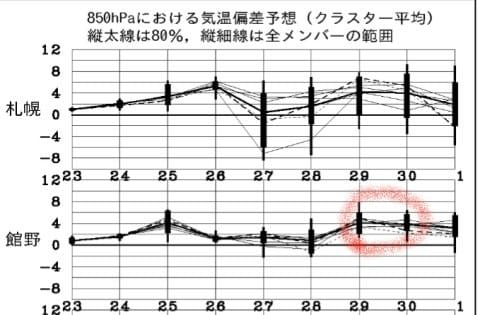
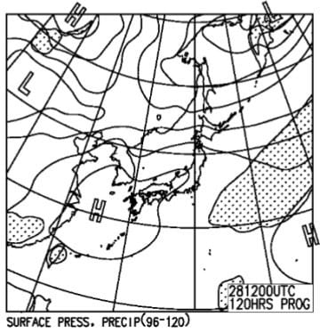
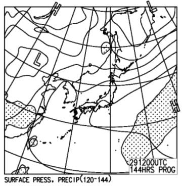
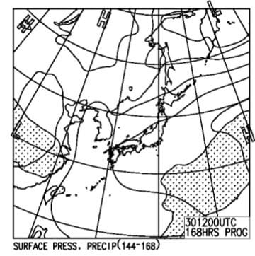
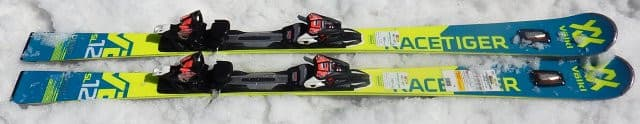
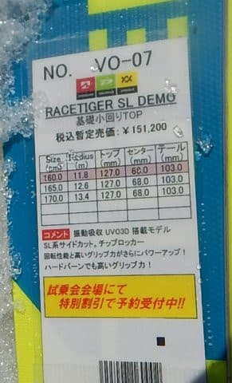
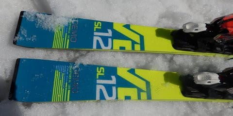
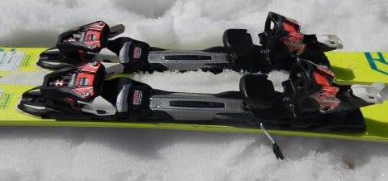

# 2019シーズンのスキー板，試乗レポート第7回…VOLKL編その1

📅 投稿日時: 2018-04-25 01:04:54

あー．

雨ですね．

志賀高原，今日の昼間は降らずにいてくれましたが．

夜になってから，ついに雨が降り始めました…

それも，かなり高温の雨です（涙）．

この雨．

明日の昼過ぎまで降りそうで．

24日夜～25日昼までの積算降水量は30mm位に

なりそう…

うーーーーむ．

かなりの雨ですね…

ゲレンデの雪，もってくれるように

祈るばかり…

で．

GW前半3連休は．

28日はいいけど．

なんだか，29，30日は赤丸で囲ったように，

平年比2～6℃高い気温になりそうで．

…奇跡の冷え込みにはならなさそうな感じです…（泣）．

あぁ…

今年は，ダメだ…

まぁ，地上天気図はこんな感じなので．

　

　

3連休，3日とも晴れそう．

…まぁ，雨よりはいいけど．

強い日差しと高温で，雪がまた解けて

いきそうです…（涙）

あぁ…

何か強烈激烈な奇跡が起きて．

このGW．

冷え冷えパフパフの激軽腰パフパウダーに

なってくれないかなぁ…←ありえないから．GWにそうなったら，それはもう天変地異だから

とりあえず．

気を取り直して．

まだ続く2019シーズンモデルのスキー板試乗レポート．

本日はフォルクル編．

小回り用の基礎トップモデルです．

では，どうぞ～！

---

○VOLKL RACETIGER SL DEMO 160cm

基礎小回り用

今シーズンのPlatinum SDの後継機に当たるのかな？

Volklは，PlatinumシリーズがRacetiger DEMOという

モデルになりましたが．

そのうちの小回り用トップモデルのSL DEMOです．

ビンディングは，去年のPlatinum SDと同じかな…？

今回は，私にとってはちょっと短めの160cmを

履いてみましたが…

これ，めっちゃいい感じ．

軽い．

履いた感じがむちゃくちゃ軽い．

でも，軽くてキョロキョロすることはなく．

軽いのに安定感があります．

特にトップを抑えなくても，谷回りから板が

しっかり雪面を捉え，

山回りで板がギューンと切れていきます．

この，谷回りでのトップの抑えが全く

要らないところに，最近絶滅しつつある

ロッカー板のテイストを感じますが…

…って，トップロッカーなんですね．この板．

山回りでは板にしっかり圧が溜まり，かなり

いい感じのばね感で圧が返ってきます．

昨年のSDは，フレックスが結構強くて，反動が

ものすごく早くビョンと返ってくる，

反復横飛び系の小回り板でしたが．

この板は，しっかりたわんで，たわみに沿って

きれいに深い弧で回っていき，

テールの張りが強いので，最後にたまった圧が

テールからすっと抜けていく…というか，

走っていく返りがある…

という，結構SXに近い感じを受ける

小回り板．

高速安定感も十分．

スピード耐性は強く，かなりのスピードでも

板がたわみきってしまうような窒息感はなく．

160cmなのに，こんなに安定感があるのか！？

と驚くレベル．

谷回りの弧の自由度も高く，

狙った弧を作っていきやすいですし．

これ…いいかも．

小回り板としては，結構麻薬感を感じる

刺激的な板でした．
