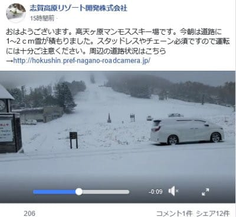
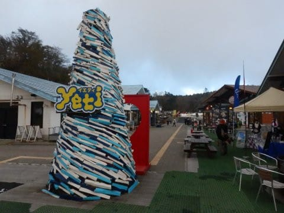
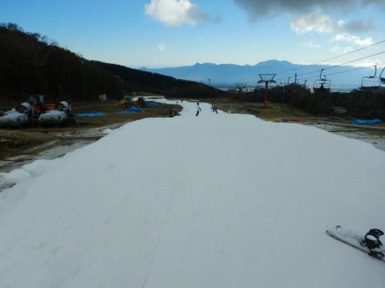
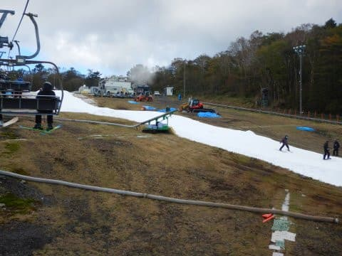
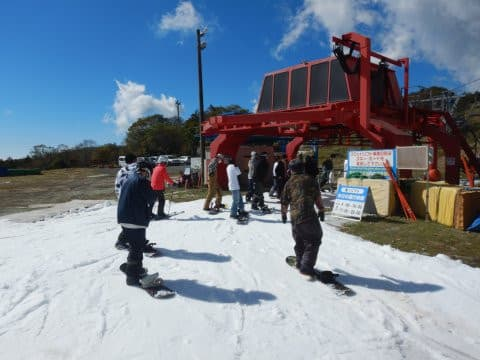
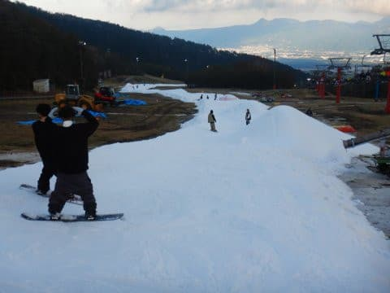
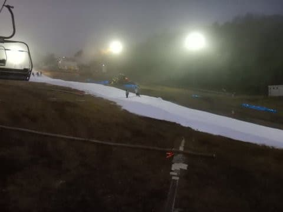
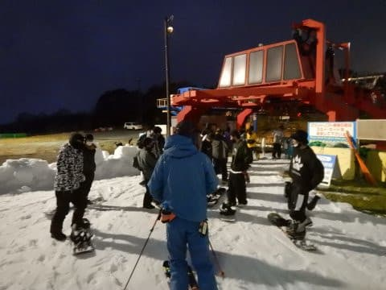

# 2021/10/23(土)，オープン翌日のイエティ滑走レポート…ゲレンデ状況は廊下状態．リフト待ち少なくガラガラ！

📅 投稿日時: 2021-10-24 01:41:41

🏷️ カテゴリ: [2022スキー滑走日記](cc9cb73e4320f6a97af6fccc37587a61a.md)

なんだか．

志賀高原は吹雪になって，

雪が積もってるようですね…

（[志賀高原リゾート開発Facebook](https://www.facebook.com/ShigaKogen.Ski/videos/901422284136188/?__xts__[0]=68.ARBosZRyrpbecYSefySb2Vk7E0x1zeTBZuurOSloys_HTRx3A91cuLSu7b0j-_HZgroHlPIHNyKnIFAKwBSxDEK4pInXKOdvhBc8wP6bupjUZlDmqeg8VdR0LyRr111rcOhp4CfAz8rGoa_aq6VA_fae8U8VUYFThjvYmKDoH5cQ-VsbiFEEGQEPVPL8G9A3isexVp9TX-cqfMp6hLuJ1hmNf_1nYnFTeV5W-yDoEZGi0Budtdtv4Pi1ymH8N1t4_8_fRYHaEOJYFLEYbcHz8G-H6z7fXUdS-P3a2K2N4hPQCxTGI9-5kK5q5UAB1LCXUw&__tn__=-R)より）

でも．

繰り返しになりますが．

もう少し後，オープン直前くらいに

降るのがベストなんだけどなぁ．

横手オープンまで2週間，熊の湯オープン

まで3週間ある今，降ってもちょっと

早いんだけど…

降るのは今じゃない

と言いたい…

ってな感じで．

吹雪の志賀では，スキーシーズンが

近づきつつありますが．

…こちらはすでにオープンしたイエティで，

2022シーズン初滑りに行ってきました～！！！！

いやーーー．

ついに始まりましたよ！

2022シーズンが…っ！！！

で．

ガッツリ初滑りの感動レポートを書きたい

ところですが…

今日は睡眠時間3時間で家を出て，

今シーズン初滑りというのに．

営業開始の9時からナイターの7時半ごろまで，

計9時間半も滑ってしまい．

帰宅が深夜になってしまったので．

今日は速報モードにて…

えー．

本日の天気は晴れ時々曇り．

気温は日が当たると暑さを感じるほどだけど，

日が陰るとジャケットがあった方が

いいかな？という冷え込み．

コースは…

まぁ，この時期だから，いつもの廊下ですね．

でも．滑れるだけいいのだ！！

意外なことに，今日はガラガラで，

朝10時ごろまではリフト待ちほとんど

無し！！

そして，昼間のピークでもリフト待ちは

このくらいで…

ほとんど待ちなく乗れるという，

この時期のYetiとしてはありえない

混んでなさ！！

一体何があったんだ…？

夕方になると，ゲレンデに数か所穴が

開いたところはあったものの．

人が少なかったからか，ひどい土が出た

ところは無かったです…

…ナイターは雪も冷えて，板が

走ってかなり良かったけど．

なぜか，昼間より混んでたのが残念…

でも，リフト待ちがこの程度なので，

まだ全然許容範囲！！

いや．

これだけ空いてると，いい！

やっぱりスキーは楽しい！

まだまだ滑りたい…っ！！！

…という感じでしたが．

日曜にちょっと仕事があるので，泣く泣く

ナイターを7時半に切り上げて帰りました…

…

でも．今回．

一緒に滑りに来た人が

「大丈夫？明日仕事あるから帰った方が

　いいんじゃないの？」

というブレーキをかけてくれて無ければ．

ナイター終了の10時まで滑っていた

可能性が…

でも，ホントに例年に比べればすいていて

楽しかったので，まだまだ滑りたかった…

ってなことで．

また明日，詳細レポートします～！

そして．

イエティで滑った日恒例，ゲレンデ状況＆

混雑具合が分かる動画を乗せておきます…

## 💬 コメント一覧

### 💬 コメント by (ikkun)
**タイトル**: Unknown
**投稿日**: 2021-10-25 14:45:09

初滑りおめでとうございます🎉   絵文字(笑)

はい 最初は遠慮がちが善いかと(笑)  こちらは……雪に向け少し屋根にペンキぬりぬりの午前でした   また……アカカンのseasonticket   「入金確認しました、発送の準備に入ります」と発売元から頂きましたです

### 💬 コメント by (Skier_S)
**タイトル**: ＞ikkunさま
**投稿日**: 2021-10-26 00:13:18

無事初滑り終えました～！！

そちらは初滑りいつ頃ですか？

もうすぐシーズンですよ～！

