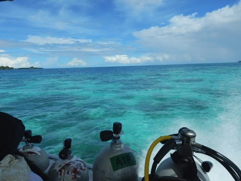

# 2017年8月，小学生の子連れでパラオ再訪！その16…そして，ダイビング3日目スタート！

📅 投稿日時: 2018-10-07 05:18:36

どうやら．

やはり，このBlogは自動車ブログと認識されているようで．

[前回のLEVORGの記事](e5fbd680ccacf3ff30993d27d66a2e05a.md)には，普段の4倍以上の

1日1万IP近いアクセスがあったという，

スキーヤーブログとしての存在意義を脅かされる事態に陥り．

もう，徒然ドライバー日記に改名した方が良いのでは

と思う今日この頃．

皆様いかがお過ごしでしょうか．

とりあえず．

私はホイールやら何やらもすべて純正のまま

乗る人間で，いろいろ車をカスタマイズしたり，

オプションパーツを着けたりもしませんし．

距離はかなり走りますが，真の車好きの人のように，

「ただ車で走る！」ということは全くせず，

スキー場往復で距離が延びるだけであり．

決して自動車が趣味ではないのですが…

ってなわけで．

何度も何度も繰り返しますが．

このBlogはスキーヤーブログですから～っ！！

という主張をしたところで．

本日もいつものダイビング日記へ，Go！←相変わらず主張の一貫性を欠いている

---

てなわけで．

明けて，ダイビング3日目．

旅行4日目となりますが．

今回，5泊6日の旅程で，

帰りの日は6日目というより，5日目の深夜に出発．

…だもんで．

明日の5日目は，潜水病防止のための

飛行機搭乗前のダイビング禁止時間を

考えると，基本的に潜れません．

（オプションで早朝ダイブだけ潜れますが…）

ということは．

通常のダイビングは本日が最終日．

…最終日…

早い…

早すぎる…（涙）

ってなことで．

いつも通り，朝8時にホテルのロビーに

ダイビングショップのお迎えがやってくるので…

お迎えの車に乗って，ダイビングショップへ

向かいますが．

うむ．

今日は天気が良さそうですね～！

ダイビング器材をセットしたら…

いざ，しゅっぱ～つ！！

南国の日差しの中，ボートは

一路ダイビングポイントへ向かいます…

…そして．

いつも通り，娘はなんだか偉そうにしています．

パラオらしい，きれいな海を通って…

まず本日1本目のポイントは…

ブルーホールに向かうようです．

ってことで．

ポイント到着後．

ダイビング前のブリーフィングが

始まりましたが…

私はそれほどブルーホールに潜りたいという

思いは無いので．

「久々のブルーホール，潜ってみたいかな…」

という妻に1本目を潜ってもらうことに．

…ってことで．

私は潜りに行かず，また娘と留守番です…

ダイバーがエントリーし終わったあと，

次は自分の番！

とばかりに飛び込む娘．

…そして．

遠ざかっていくダイバーを見送ると…

また，後はひたすらライフジャケットに任せて

パラオの海を漂い続けるという．

ある意味，究極に贅沢な時間を過ごしたのでした…

うーん．

パラオのブルーホールのそばで．

こんな風に泳いだことある小学生，

世の中，そんなにいないと思うぞ…

