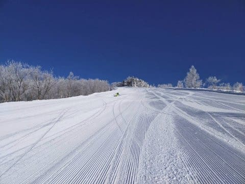

# ついに緊急事態宣言…！なんということか！スキーはしばし中止（泣）＆1月9,10,11日，成人の日3連休の志賀高原の天気は？

📅 投稿日時: 2021-01-08 08:07:16

えー．

水曜夜に，更新が無かったので．

「また，Skier_Sは床で寝ていたのか…」

とお思いでしょうが．

当たりです．

仕事がいろいろクリティカルヒットな状況で，

深夜1時前に帰宅し，そのまま死んでました．

自分の誕生日にも，帰宅が日付変更線を超えてしまい，

家族に祝ってもらえない寂しい誕生日を

過ごすとは…（泣）

そして，木曜の昨日もいろいろあったのですが…

それよりも，ついに緊急事態宣言が出てしまい．

さすがにこの状況ではスキーに行くのを

控えざるを得ず．

あまりものショックでBlog更新パワーも切れて

寝てしまいました…

あぁ…スキーをせずに，このストレスフルな仕事を

乗り切る自信が無い…←普通はこの仕事状況なら，睡眠を削ってスキーに行く方が死ぬんだけど

ということで．

本日は朝の更新になったわけですが．

とりあえず，自分はスキーに行けずとも，

地元の方で志賀高原に行く方がいるはずなので．

一応週末，3連休の天気予想を…

今日はスキーに行けなくなったショックで，

細かな解説を書く元気が無いので，

予想内容のみ書くと，

9日（土）：朝は-15℃程度の冷え冷え！

　朝までの積雪は20~30cm程度か？

　脛パフ，運がよければ膝~太ももパフ．

　昼間も-10℃を下回り続け，終日雪が降る．

　時折強く降り，昼間も10cmほど

　新雪がつもるか…

　風はそんなに強くないので，吹雪という

　ほどではないと思うけど，終日激冷え

　パウダーデー．

10日（日）：朝は-12℃か13℃くらい．

　この日も冷え冷え！

　日本海側は雪がいっぱい積もるが，

　西風なので志賀はそんなに積もらないか…

　ただ，かなりの冷え込みなので，

　根性がある雪雲は北アルプスを越えて

　来るものがあるので，志賀は積雪20cm程度かな？

　この日も終日雪がぱらつく天気．一瞬晴れ間も．

　昼間も気温は-7℃程度までしか上がらず，

　終日冷え冷え最高雪．

　ただ，午後はゲレンデがちょっと荒れ気味か…

11日（月・祝）：朝は-10℃程度．

　この日は曇り~雪がぱらつく天気．

　朝までに10cmほど積もるか？

　圧雪バーンは圧雪にうっすら冷え冷え

　新雪がのった，気持ちよいバーン．

　昼間は-4℃程度と，前の2日間に

　比べると気温が上がるものの冷え冷えで

　終日最高のいい雪が楽しめる一日！

…と．

すっきり晴れる日はなさそうですが．

3日とも冷え冷えいい雪で．

9，10日は新雪も楽しめそうな，いい3連休に

なりそうです！！

…なのに．

なのに，スキーに行けないとは…っ！！！

憎い．

コロナが憎い…

水曜，6日の志賀高原．

特派員から送られてきた写真を見ると…

…激烈な晴天，最高シマシマだったようです…

この上に，またいい雪が積もっているというのに．

さらに3連休も，冷え冷えいい雪になりそうなのに．

スキーに行けないとは…

あぁ…

この3連休，このBlogの更新が無かったら．

Skier_Sは精神的に死んでいると思ってください…

PS.ショックでコメント回答するパワーが無いので，

　コメント回答は今晩までお待ちください

## 💬 コメント一覧

### 💬 コメント by (お気の毒様です)
**タイトル**: Unknown
**投稿日**: 2021-01-08 11:43:26

金曜日の志賀高原情報

朝一のオリンピックは、極さらさら新雪40。夢見心地で頂きました。ＧＳは整地されてたけど、ＧＳ下非圧雪は底付きも気にならず、最高級レベルで初完走頂きました。

ＳＧＳもさらさら満喫。

ダイヤがよかった。空いてるのでサラ場ばかり。延々と順番に削らせて頂きました。エス様、ごめんなさいね。こんなの夢の世界だと思って読んでくださいね。

ダイヤの良さをご存知ない方が多いので、こっそり公開しますが、ダイヤの上から見て右側は、いつも新雪が残るんです。でも、皆様、来なくていいですよ。（もう手遅れか？）

今はチウホテルの美味しいビーフシチューですが、残念ながらgo to eat 対象外でした。

### 💬 コメント by (かず)
**タイトル**: Unknown
**投稿日**: 2021-01-08 12:44:35

いいなあ！この連休は毎年恒例全仕事！来週4日間ほど予定してます  パウダーハズレそうですけど…ビーフシチュー気になりマス

### 💬 コメント by (レインボー73)
**タイトル**: Unknown
**投稿日**: 2021-01-08 14:18:15

金曜日の志賀高原情報

昼からタカマ非圧雪。ふかふかなので老人にも安全です。東館ぱふぱふだけど、私にはあんまり。

最高だったのは西館さん。50cmのパウダーが時を忘れさせてくれます。明日はパルスゴンドラスタートにしようかなあ。

あ、今日もやめられず、禁をおかしています。

### 💬 コメント by (レインボー73)
**タイトル**: Unknown
**投稿日**: 2021-01-08 15:47:20

金曜日の志賀高原情報

残業してヤケビに戻ってみたら、人が少ないせいか、またまたパウダー15cm。やめられなくてやめられなくて、また残業に精を出してしまいました。

### 💬 コメント by (レインボー73)
**タイトル**: Unknown
**投稿日**: 2021-01-08 19:10:29

金曜日の志賀高原情報

夜の7時、まだヤケビはしんしんと降り続いているようです。

今日の帰路、前の軽ワゴンが、スリップして横に半回転。後ろ向きに無事着地。よかった。

皆様、下りはスピードを控えましょう。

志賀で一番危ないのが、下りの最後、道路の支柱の辺りです。毎年、事故車を目にします。日が当たらないので、そこだけ凍っているんです。

つぎに危ないのが、トンネルです。

志賀は急坂なので、危険が伴います。皆様、お気をつけてお越しください。

### 💬 コメント by (Skier_S)
**タイトル**: 皆さん，レポートお願いします
**投稿日**: 2021-01-09 05:07:01

＞レインボー73さま

うはーーー！！

今日は良かったんですね…

というか，今日「も」良かったんですね…

冷え冷えパウダー，滑りたい…っ！！

私の分も代わりに滑ってきてください（リフトストップまで滑ることが義務となります（笑））

＞かずさま

あら．3連休は滑れないんですね…

私と同じく，指をくわえて9日，10日のパウダーの

レポートを眺めていましょう…

