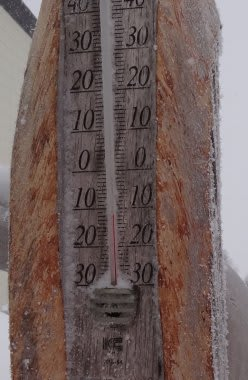

# 2月26日 日曜日の志賀高原焼額山スキー場の状況は…

📅 投稿日時: 2012-02-27 00:00:12

🏷️ カテゴリ: [2012スキー滑走日記](cca3a0e9524e0203150f790b1fc3c71ad.md)

ということで．

明けて日曜日の速報．

えーっと．

最近の[天気予想](e0808d9a51b4a1025a631b11d8c74292b.md)，かなり精度が上がってきてますね．

朝イチはカリカリに固まったバーンの上にうっすら積雪くらいの感じかな．

で．

この日は志賀にも結構雪雲が入り込みそう．

視界が悪く，雪が降るでしょう．

下地のアイスバーンが隠れればいいけど…

ゲレンデ状況はアイスバーンと降り積もる雪が吹き溜まった部分が

入り乱れる，難しいコンディションになるでしょう．

…という，まさにその通りの状況．

夜の間は降らなかったけど，朝からかなりの降雪．

前が見難くなるようなガスも時々出て，

なかなか滑りにくい…

それで，だ．

昨晩からずっとこのペースで降雪があれば嬉しいのに．

雪が降り始めたのは朝からだったんで，ゲレンデの雪も10cm程度．

うーむ．おそろしいほどの精度で天気を当ててますね．

＃こんな天気だったら，当たってくれなくてもいいのに…

残念ながら，この程度の雪ではアイスバーンは隠れず．

…どうせなら．

どうせなら，夜のうちにどかっと降って，朝は晴れて欲しいのに．

完全な逆パターンじゃないか…（涙)．

まぁ，降雪のおかげで緩斜面のアイスバーンはそこそこ隠れてくれてはいるんですけど．

やっぱり人が多く滑っているところは，上の雪も蹴散らされているので，

ところどころエッジングでがりがり言います．

で．

急斜面は．

かなりの部分でアイスバーンがコンニチハしてますね…(泣)．

で，アイスバーンだ～…と思って滑ると．

降った雪が溜まっているところに突っ込みつんのめる，という．

なかなかバランス感覚を鍛えられるバーンでした．

さらに．

午前中はそこそこ人も多かった気がする…

ゴンドラ待ちもぼちぼちありましたね．

でも，今日新しく降った雪は．

朝の気温がマイナス13度と低かったので，かなり良い雪質だったし．

午後は人も減ってきたし．

難しいバーンコンディションで，バランスのトレーニングもできたし．

まぁ，良かったとしておこう．

…という，ポジティブシンキングで締めくくってみる(自分へのごまかし)

＃どーでもいいのだが．

＃この雪でゲレンデ状況が改善するか…と思いきや．

＃また，3月1日に超破壊的な雨が降るのだ(激泣）．

## 💬 コメント一覧

### 💬 コメント by (雪上の翁)
**タイトル**: Unknown
**投稿日**: 2012-02-27 19:32:20

こんにちは(^^)

今回も志賀のゲレンデを思い浮かべながら読ませていただきました～。

が、

最後にあった3/1の破壊的な雨予報にプチショックをうけております（笑）

### 💬 コメント by (Skier_S)
**タイトル**: 雪上の翁さま
**投稿日**: 2012-02-28 01:34:27

29～1日が微妙な天気だったんですが．

本日の予想では，南岸低気圧が微妙に南よりのコースに

変わってきたので，気温はすごい上がるものの，

もしかすると信州北部はぎりぎり降水がないまま

過ぎるかもしれません…

しかし．これ以降しばらくは気温が高い日々が続きます．

今のままの予想では，1日を乗り切ったとしても，

4日～5日にかけて雨かも…

うーん．この3月，気温が高くなりそうです．

