# ４月25日の志賀高原は…晴天ぴかぴか．暖かいけど，まだ雪はいっぱいあるよ！！

📅 投稿日時: 2015-04-25 20:14:19

🏷️ カテゴリ: [2015スキー滑走日記](c09ea645cfc085f86dfcd80f49599dd89.md)

って感じで．

 今日も来てます，志賀高原．

 …それも．

 気のせいでなければ．

 昨日，仕事からK奈川県の自宅に帰宅したのが11時半のはずなのに．

 なぜか，6時半の早朝には，ゲレンデに立っていたという…

 Oh! It's magic!!←いや，寝てないだけでしょ

 

 今日から，一の瀬・高天が原・熊の湯も早朝営業が始まったようですが．

 私は一途に，今日も焼額の早朝へ．

 

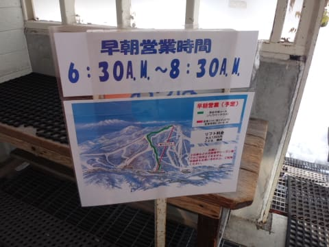

で．
やっぱり10時過ぎには，コース全面やわらかくなっちゃいました（悲）

 

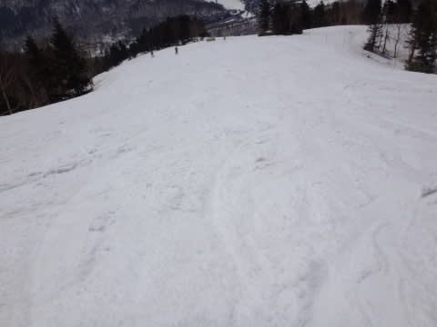

 そして…

 昼ごろには．

 気温もプラス10度近くまで上がり…

 

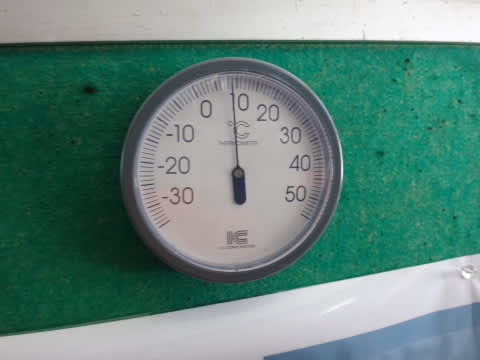

 雪も，だんだんねっとりとした感じに…

 

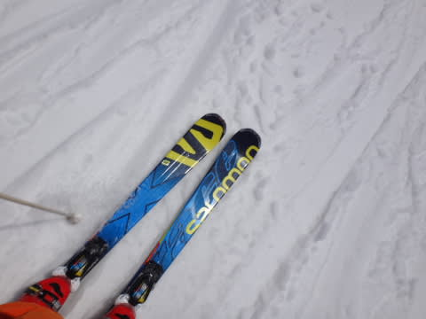

 でも，焼額は人が異常に少なく．

 ゴンドラ待ちもまったくないくらいだったので．

 コースはそれほど荒れず．

 昼くらいまでは，結構大回り可能なコンディション！

 

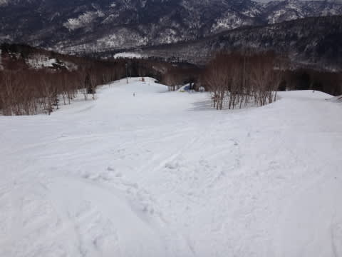

 

 午後は，奥志賀に行ってみましたが．
…まだ，雪はたっぷりありますね～！！

 

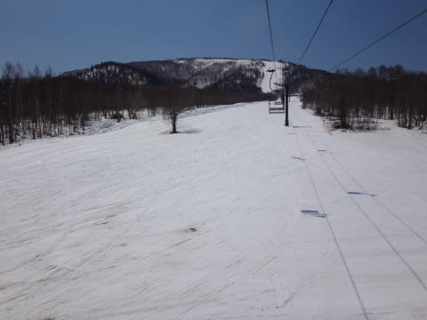

 …ここは，結構すごい…
全面コブコブの荒れ荒れです…

 

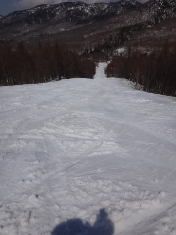

 うーむ．

 ボーダーがいなくて，スキーヤーだけで．

 こんなにやわらかい雪だと，荒れるのが早いな～

 

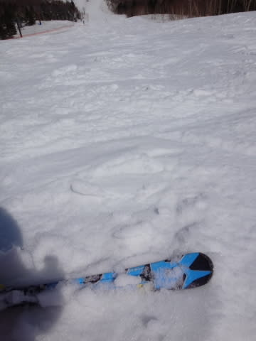

 でも，きれいなコブラインもできてるし．

 

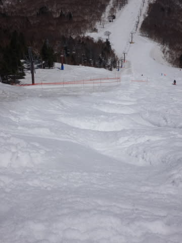

コブトレにはもってこいかな．

 

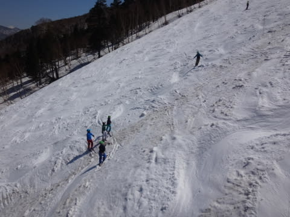

 

 とりあえず，快晴のぽかぽか陽気の中．

 マッタリとした春スキー日和です…

 

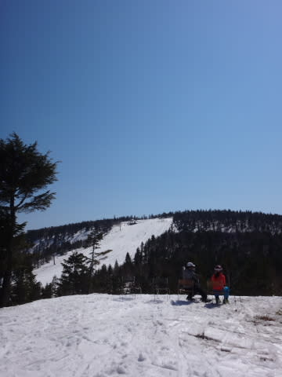

 奥志賀ゴンドラも，まったく待ちがなく…

 というより，人がまったくいないくらいの状態で．

 

 なんだか，のんびりした感じ…

 

 奥志賀は，最後のほうは，全面すごいコブになってましたが…

 

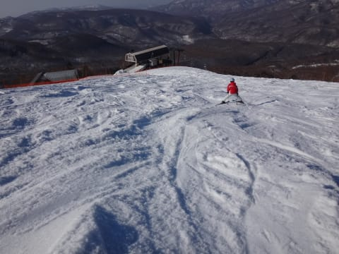

 いや．これ．

 コブトレにはもってこいかもしれませんが．

 

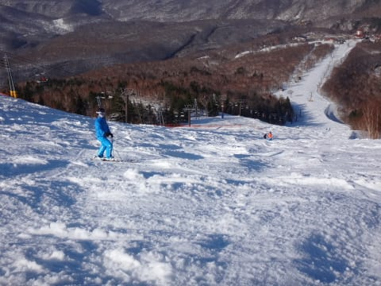

 ちょいと疲れるよ…

 

 でも，焼額は，人も少なかったからなのかなんなのか．

 

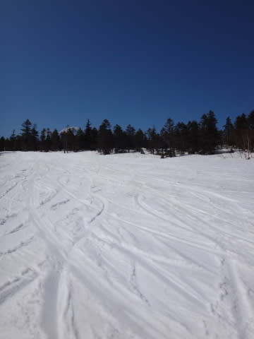

 夕方まで，かなりフラットなままでしたね～．

 

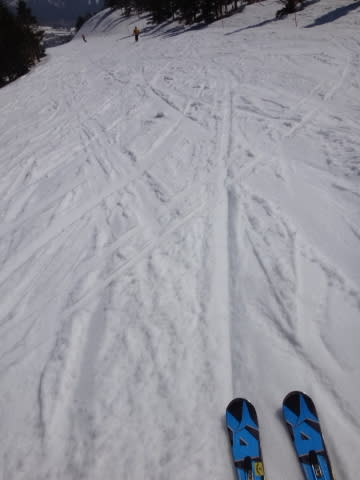

 

 って感じで．

 今日は人も少なく．

 雪も粘ついたりストップスノーになったりすることなく，

 のんびりと春スキーを楽しめた一日でした～．

 

 で．

 今年は雪が多い年だったので，

 雪はまだたっぷりあります．

 焼額は，ゴンドラコースはコース幅いっぱい，まったく問題なし．

 

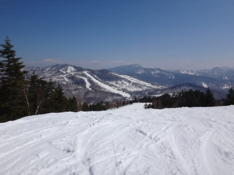

 

 ただ，人工降雪をつけていない南斜面．

 4月の高温続きで，溶けるのが異常に早い気が…

 焼額の白樺コース．一箇所ちょっと土が出てきちゃいました…

 

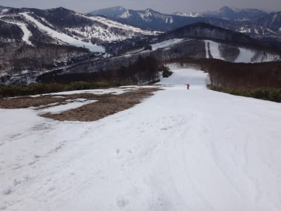

 で．ぶなコースは，明日あたりが限度かも，

 ってくらい細くなってました．

 

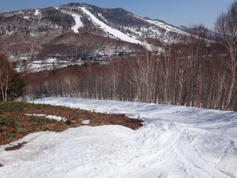

 焼額，この2箇所以外は雪がたっぷりなんですけどね～．

 

 奥志賀は，まだまだぜんぜんコース幅いっぱい

 滑れます．

 

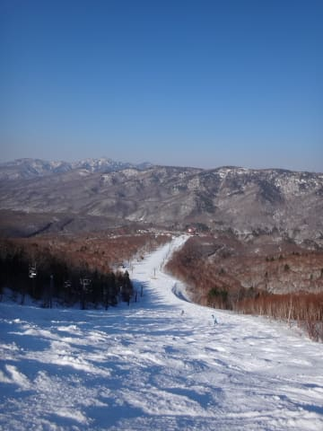

 

 高天が原は…

あら．上にかなり土が出ちゃって来てますね．

まぁ，ここは雪解けが早いので．これでも例年よりは遅いかな～．

 

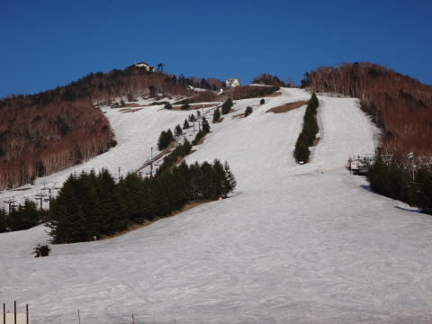

 モーグルバーンのコブ溝も，もうそろそろ

 土が出てくるところがあるかも…

 

 まぁ．

 一の瀬ファミリーはまだまだぜんぜんOKだし．

 ＃パーフェクターを除く．

 ダイヤも例年より雪が多く，まだまだ全面OKだし．

とりあえず，このゴールデンウィークの志賀高原．
大体コース幅いっぱい滑れそうかな．

 廊下みたいな細いところしか滑れない…

 という事態はなさそうで．

 結構楽しめそうかな！！

## 💬 コメント一覧

### 💬 コメント by (Goku)
**タイトル**: いいな
**投稿日**: 2015-04-26 09:11:55

私もゴルフより、そっちが良かった。

### 💬 コメント by (Skier_S)
**タイトル**: Gokuさま
**投稿日**: 2015-04-27 00:24:50

やっぱり，ゴルフよりスキーの方が

楽しいですって（笑）←ゴルフをやったことのない人の発言

