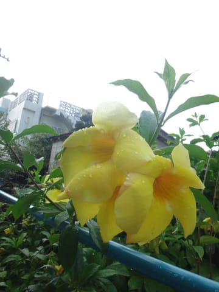
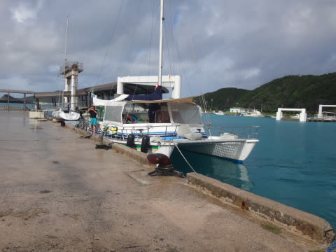
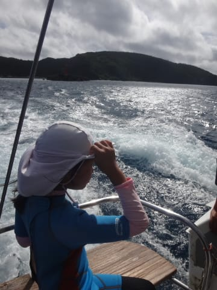
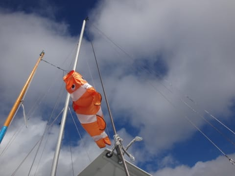
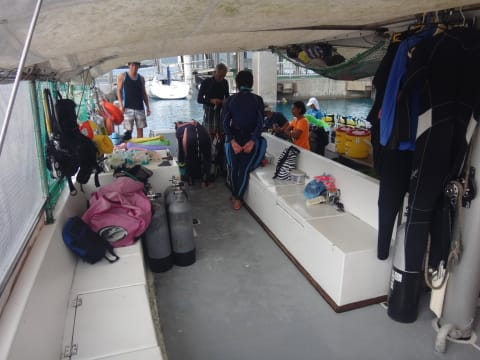
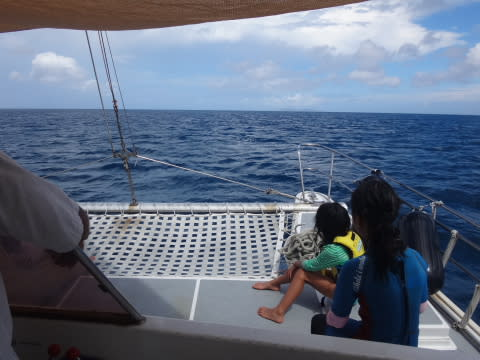
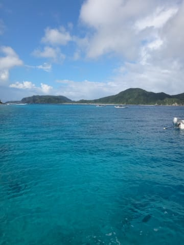
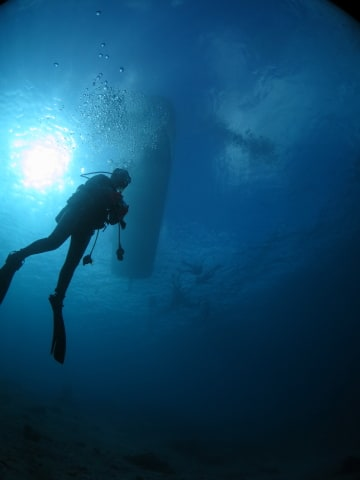

# 2016年8月　子連れ座間味ダイビング旅行記　その10…3日目スタート

📅 投稿日時: 2017-07-19 02:15:56

ということで．

3日目の朝がやってきましたが…

うむ．

朝7時ごろに起きると．

雨ですね…（涙）．

前日の，[ダイビング初日も朝から雨](e688b6e680a45167458fe90b99bda0450.md)だったのに…

今日も雨ですか（泣）．

…日ごろの行いが悪いのかなぁ…

ただ．

朝食を食べ終わって．

朝9時にダイビングの港に向かう時には．

をを！

雨も止んできたよ！

青空も覗くように…！

よーーーし．よしよし．

やはり，日ごろの行いが良い人間は救われるのだな！

…と，思ったその時．

ダイビングショップのオーナーから，

驚きの情報が…っ！

オーナー　「今日，午後から海が荒れて，高速船は欠航するかもよ」

…え？

ええええええ～っ！？？？？？？

今のところ，海は完全穏やかに見えるんですが！？？？

オーナー　「今のところ大丈夫そうに見えるけど，

　午後はちょっと波が出るかもしれないから…

　そうするとすぐ欠航になっちゃうよ」

…えーっと．

本来なら，今日午後5時の高速船で那覇に帰る

予定だったのですが？

オーナー「うーん．フェリーは欠航しないから，高速船が

　出ない可能性を考えると，午後5時の高速船は

　あきらめて，午後4時のフェリーで帰ることを

　考えた方がいいねぇ」

…うーむ．

本来計画より1時間早く，島を出ないといけないのか…

…となると．

午後3時半には港で乗船手続きしなくちゃならないから．

器材を干したり荷物を片づけたりする時間を考えると…

遅くとも1時半くらいには宿に戻っておかないと．

オーナー「今日のダイビングは，午前2本だけにした方がいいよ」　

がががーーん．

なんてこった．

今日は3本潜れると思っていたのに…

午前中の2本だけかっ！

朝1便の高速船は無事出たらしいのに…

なんということだ！

自分たちの帰る，この日の午後を狙ったように，

天気が荒れるとは…

やっぱり，日ごろの行いが悪かったのか…（しくしく）

だとすると，港にいる今のうちに，すぐそこにある

チケット売り場で高速船チケットを払い戻して

もらって，フェリーの予約をした方がいいのかな？

オーナー「フェリーは予約なしでも乗れるよ．

　まだ高速船の欠航が確定したわけじゃないから，

　高速船の払い戻しを今やると，手数料取られるよ．

　フェリー乗船時に手続した方がいいよ」

そうですか…

じゃ，このまま手続きせずに，港を出航しちゃいますか…

ってことで．

港を出航して，しばらく走っていると．

雲がだんだん減っていき．

こんないい天気になってきたのに…

なのに，高速船，欠航なの？？？

＃どうでもいいけど，このカクレクマノミ柄の吹き流しがキュート…

とりあえず．

気分を取りなおして．

ラストダイブとなる午前中の2本，楽しまねば…

で．

今日は，船には他の家族も乗っていて．

子連れに優しいこのショップですから．

他の家族のお子さんも乗ってますね～．

うちの娘と，ほぼ同じ年齢かな？？

…そこはやはり子供同士．

もう，うちの娘と仲良くなっているみたいです．

そして，船は1本目のポイントに到着しましたが…

そのころには，海も，沖縄っぽい

きれいな色に染まってきました．

こんな天気がいいのに．

こんなに海が穏やかなのに．

高速船，欠航になっちゃうのか…（涙）．

ホントに，よっぽど日ごろの行いが悪かったの

かなぁ…（激泣）．

で．

到着した1本目のポイントは…

「イジャカジャ」という，

砂地にぽつぽつと根が点在するポイント．

では．

ちょっと気分がすっきりしない何かはありますが．

とりあえず，

本日1本目のダイビングへ，行きますか…

