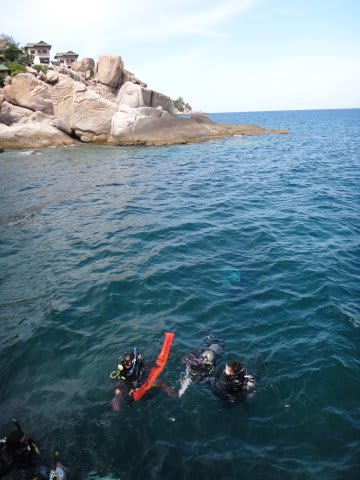
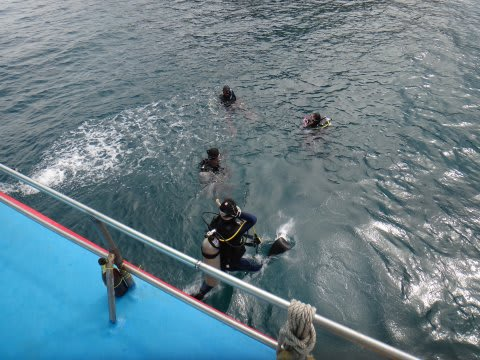
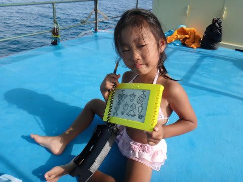
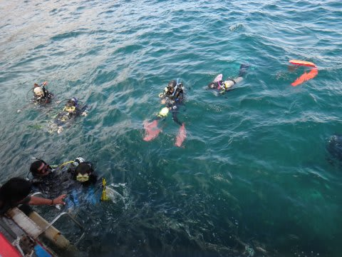
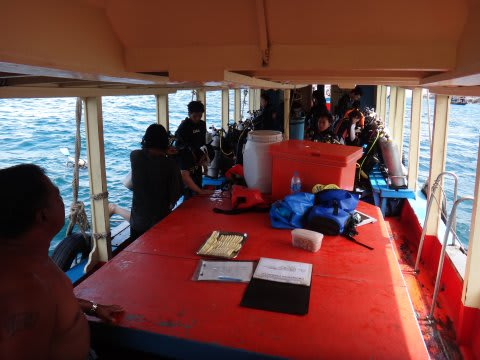
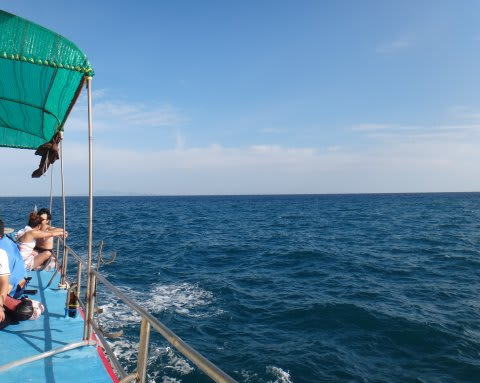
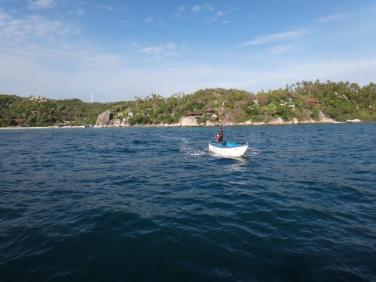
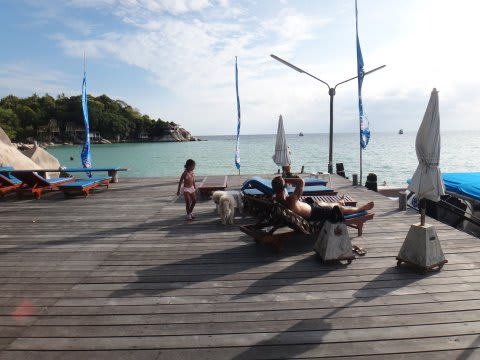

# 2013年9月　子連れタイ・タオ島ダイビング旅行記　その30…そしてタイのラストダイブ

📅 投稿日時: 2013-11-27 01:17:52

🏷️ カテゴリ: [ダイビング日記](ce3a7a8d424d112fce83ee85c81a0e344.md)

えー．

やっぱり昨日はかなりのスキー場で雨だったようですね…(泣）．

でも．

木曜の夕方～金曜にかけて，一級の寒気がやってきて積もりそうなので．

今週末に向けてのゲレンデコンディションの回復に期待…

と，冬の話題を書いたところで．

またまた季節感を狂わせる，南の海の話題へいくのだ…

----

ってことで．

1時間ほど泳いでいたので．

泳ぎ終わって船に上がった直後すぐ，ダイビングチームが浮上

してきました…

この後，午後の2本目があり．

妻はもう1本潜りに行きましたが

これが我々のラストダイブです…

娘はもうシュノーケリングは満足したらしく．

お絵かきをして1時間ほど過ごしていると…

妻が戻ってきました．

ダイビングデッキに下りて．

ダイビングを終えた妻に，きかずもがなのことを聞いてみる私．

私「ジンベエ，見れた？」

妻「………いるわけないでしょ」

まぁ，内海にいるわけがないことは分かっていますが…

…というわけで．

ジンベエに会いにやってきた，タオでのダイビング．

結局．

夫婦で10本ずつ，計20本潜ったけど．

ジンベエ遭遇なしっ！！！！

どうやらミッション失敗に終わったようです．

…今回．

あまりにも，天気に．

そして，海況に恵まれなさすぎた…(涙)．

我が夫婦の悲しさを乗せた船は，帰路につき…．

むなしくホテル前に戻ってきました．

下船して，桟橋へ戻ってきたとき．

ああ．．．．

むなしい5日間だった…

5日間も潜って．

ジンベエを見れなかったどころか．

外洋に潜れたのが，わずか1本だけってのは．

一体どういうこと？？

…という残念さがあふれてくるのを抑えられない，

Skier_S夫婦なのでした…(落涙)
