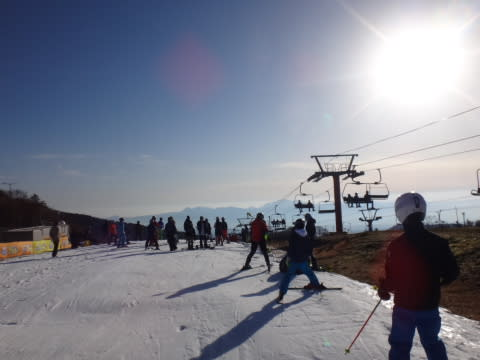
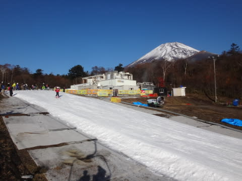
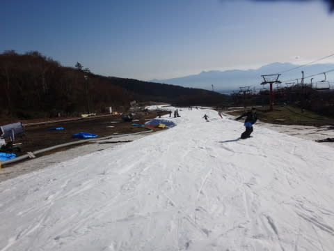
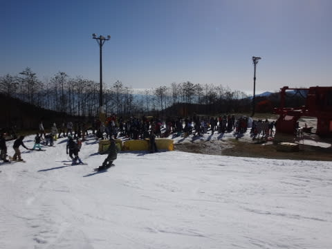
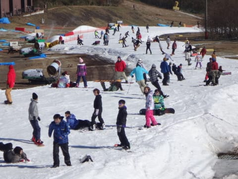
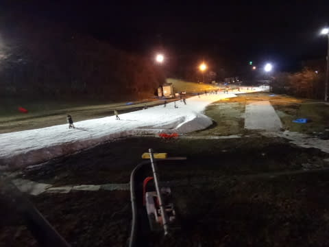

# 11月12日，日曜日のイエティのコース状況速報

📅 投稿日時: 2016-11-14 01:03:50

🏷️ カテゴリ: [2017スキー滑走日記](c7d777cecfc91bdf0fa464ad62c6d49ab.md)

とゆーことで．

昨日土曜はYetiに行けませんでしたが．

本日日曜は，無事に行ってきたのだ！！

…で．

今日はちょいと時間がないので．

日曜夜定番，速報モードにて…

まず，

本日朝イチ．

すっきり晴天から始まりました～！

朝イチはコース上も人が少なく．

リフトもがらがらで，良かったのですが…

いやー．

コースも広がったし，結構いいよね…

と，思っていたところ．

気温はそれほど高くなかったものの．

しっかりとした日差しで，雪が緩んで

板の滑りも良くなかったし．

さらに，昼頃になると．

例年より混雑は少なめとはいえ．

それでも，リフト待ちが3分程度にまで延び．

コース上の人も増えて．

午後は，気持ちよさがかなりダウン（涙）．

それでも．

今日もしっかり，朝イチからナイターまで滑りました…

日曜なのに，本日はナイターもしっかり人が多く．

リフト待ちも3分を超え，コース上も飛ばせなかったので．

ナイターは1時間ほどで切り上げました…

まぁ．

例年のこの時期に比べれば，

マシな混雑状況だったと思いますが．

でも，先週や祭日の11/3のシアワセ度合いに

比べると，ちょっと不満の残る一日だったかな～．

また明日，詳細レポートします～！

## 💬 コメント一覧

### 💬 コメント by (yama)
**タイトル**: 2日連続
**投稿日**: 2016-11-14 15:26:08

2日連続お疲れ様でした。次にお会いするのが志賀高原であってほしいと願っています。熊の湯の19日のシーズンインが星1つになっています。17日の寒波に期待しています。昨年のようにまたイエティとならないよう踊る必要があるのでしょうか。期待を込めてスタッドレスの準備をします。

### 💬 コメント by (Skier_S)
**タイトル**: yamaさま
**投稿日**: 2016-11-15 03:41:53

2日連続，お世話になりました～！

また今週もYeti…とならないよう，

必死に祈り続けてます．

16，17日が冷えそうな予想になったので，

何とかなるかも…

今のところ，19日のアサマオープン

確率は50％くらいでしょうか…

とりあえず，今シーズンは踊らずに

済ませたいと願ってます…

