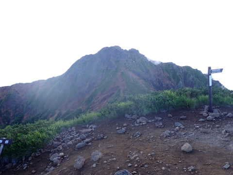
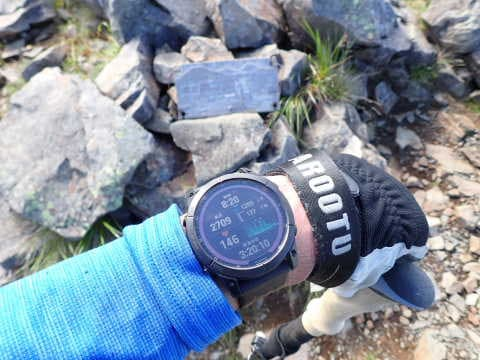
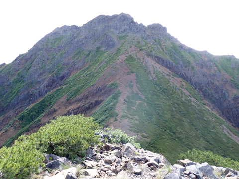

# 八ヶ岳の阿弥陀岳・赤岳ピストン登山！その5…阿弥陀岳から中岳を経て赤岳へ向かう！

📅 投稿日時: 2022-09-29 04:50:00

🏷️ カテゴリ: [登山・旅行](c1d637a11a25b457ac978d197adbdafc5.md)

（[前の記事](e71d91abd434d6c04a0c9d2492711c9c2.md)から続く）

うむ．

阿弥陀岳山頂に到着したけど…

今の時間が7:45．

阿弥陀岳山頂から，赤岳までの往復時間，

山頂での休憩を含めて3時間として…

ここに戻ってこれるのが10:45ごろ．

そこから，これまで2時間45分で登って来た

ルートを駐車場まで戻るのに，おそらく

2時間弱ってところなので…

12時半か，12:45には下山できるな．

（えらい楽観的な時間の読みだ）

で．

赤岳をあきらめてここからすぐ

下山しちゃうと，下山2時間．

阿弥陀岳ビストン4時間半くらいで，

9時半には下山しちゃうよね…

せっかくここまで来て，9時半に下山して

帰っちゃうのはもったいない←危ない発想だ

うん．

行こう．

赤岳まで行っても昼過ぎに下山できそうだし．

午後は崩れそうな雲行き＆予報だけど，

13時前に下山できれば何とかなるはず．

この，目の前の赤岳まで行こう…！

と．

朝出発する時はかなり眠くて，

「阿弥陀岳で帰ろうかな…」

と思っていた弱気はどこへやら．

阿弥陀岳山頂の休憩はわずか8分で，

7:49に赤岳へ向かって出発します．

赤岳を目の前に，かなりの急斜面を

下りますが…

写真では分からないけど，めっちゃ急です！

阿弥陀岳から先は滑り落ちそうな急斜面

と聞いたけど…

聞きしに勝る急斜面！

写真では分かりにくいけど，かなりの

急斜面が，結構な距離続きます…

これはペースが上げられない．

ゆっくりゆっくり，慎重に降りるしか

ないな…

岩場でもないのに，鎖を使わないと

降りにくいような急斜面もあり…

最後に梯子まである，ひたすら急斜面．

この梯子を降りきったところが，

中岳のコルです．

梯子を降りきってしばらく，

中岳のコルへ到着！

これで急斜面終了です！

中岳のコルへは8:10到着．

阿弥陀岳山頂から21分，ひたすら

急斜面を下り続けました…

ここまでくれば，阿弥陀岳と赤岳との間にある，

それほど高くない中岳まであと438m．

赤岳山頂までは1.1kmですか…

しかし．

改めて振り返って見ると…

いや．

この急坂を下りてきたのか…

…そして．

赤岳から戻ってきたとき．

今度はここをまた登らないといけないのね…（涙）

とりあえず．

次に向かうは中岳へ！

今度は阿弥陀岳の登り下りに比べれば

まだ緩く感じる登り坂を登って行けば…

中岳のコルから10分ほどで，中岳へ

到着！

到着時間は中岳のコルからちょうど10分後，

8:10ですね…

そして，ここからは．

北を見れば，横岳から硫黄岳につながる

稜線が見えるし．

南を見れば，権現山と編笠が見えるし．

振り返れば，さっき降りてきた阿弥陀岳が

見えますが…

いや．ここから見ても，あの急斜面，

良く登ったな…

まだ天気もいいし．

急いで目の前の赤岳に登りますか！

