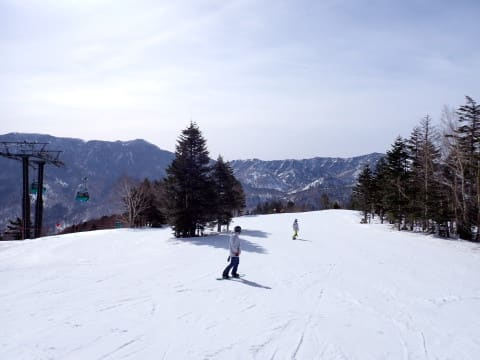
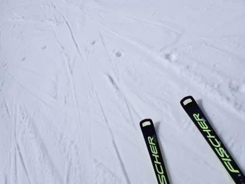
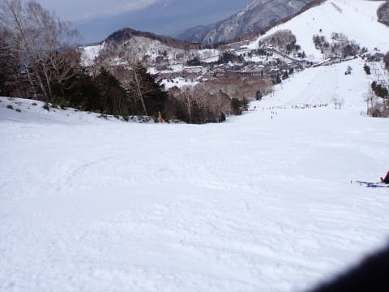
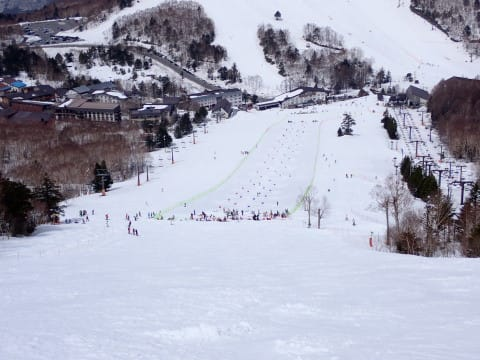
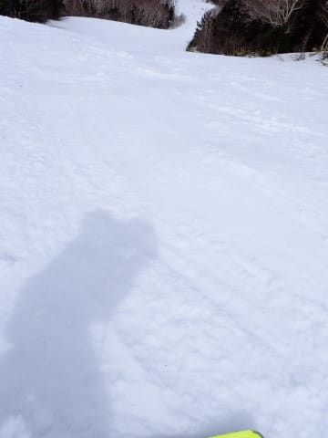
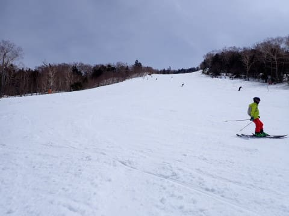
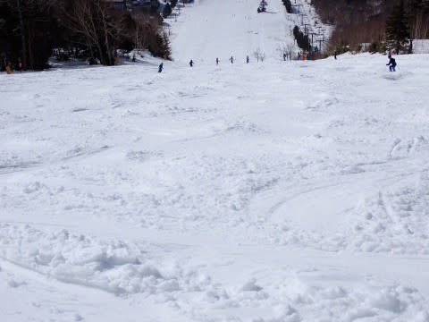
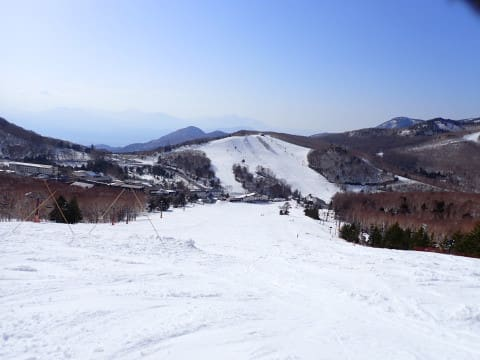
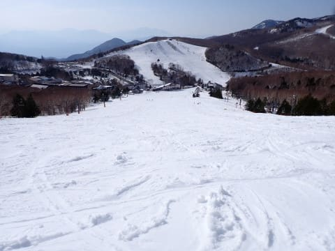
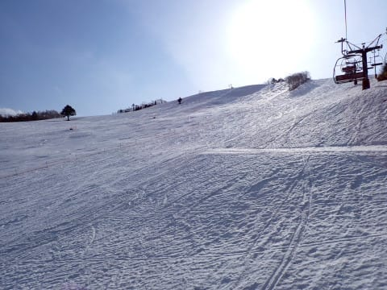

# 2024/4/7(日)の志賀高原スキー場，速報レポート！…終日晴れで激烈に暑い一日．でも，朝は雪は良かったしストップ雪にはならなかったよ！

📅 投稿日時: 2024-04-08 01:57:57

ってなことで．

今日は雪も悪くなったので，たまには

早く帰ろうか…とも思っていたけど．

リフトが動いていると帰れない

という逃れられない宿命により，

今日もラストリフトまでしっかり滑って

しまいました…

だもんで，いつも通り帰宅は深夜．

明日も朝早くから仕事なので，

帰宅日恒例の速報モードにて，

本日の志賀高原のレポートです！

えー．

まず．

…前日の土曜は，2時間睡眠だったにも

かかわらずその後丸一日滑るという

いつものご無体日程なのに…

その後，さらについつい夜遅くまで

宴会に参加してしまい，20時間連続で

起きていたということもあり．

さすがにその翌日，睡眠5時間で起きて

早朝に行く元気がなく．

早朝営業をあきらめて通常営業から

参戦したわけですが…

本日も朝から晴天！！

2時間の早朝営業が終わった後なので，

シマシマではありませんが…

でも，思ったほど雪は緩んでおらず，

朝8時でも割としっかりした，

いい感じで傾ける楽しいバーン

状況でスタート！！

焼額のGSコースも，朝9時過ぎまで

いい感じで滑れましたが…

本日もとあるミッションのため，

焼額を脱出し，一ノ瀬へ移動します…

一ノ瀬正面バーンは，朝10時近くに

なっても，エッジが効かない板では

ちょっとずり落ちちゃうような，

しっかり硬めの下地のバーンです！！

この時期としてはかなりいい感じ…！

ただ，一ノ瀬ファミリーの下部は

大会で中央部がクローズされてました…

そして，パーフェクターコースも

午前中は結構締まり気味の

フラットないいバーン！

さらに，今日はもう4月に入ったからか…

滑ってる人がすごい少ない！！

リフト待ちもほぼなかった感じ．

ただ…

バーンは昼を過ぎると荒れ始めてきて．

午後2時ごろにはボコボコに

なっていきました…(涙）

でも，ストップ雪になることはなく．

まだ板が滑る雪なので．

春のザブ雪が好きな人なら楽しめる

バーンです…！←それはかなり対象が限られるな

そして，午後3時ごろにはクローズ

されていた大会バーンが解放されたので，

フラットバーンが滑れる！！

と喜んで飛び込んだら…

意外とシュプールがいっぱいついてて，

結構ボコボコに飛ばされる感じの

バーンで，ちと残念…(涙)

ってな感じで．

午後はかなりのボコボコバーンを

滑る感じでしたが．

今日は早く帰ろう…と思いつつ，

やっぱり日が傾く16:20の一ノ瀬ラスト

リフトまで滑り続けてしまったのでした…

いやーー．

朝からかなり暑いくらいの気温だったけど．

まだまだ雪は解けずにたっぷりありますね．

この時期にまだパーフェクターが

滑れるんだから，やっぱり例年並みの

積雪に戻った感じ．

このままいつもの4月の気温が続けば

GWまでもってくれそうなんだけど．

…でも，4月はかなりの高温の予想なので

GWまでもってくれるかどうか…

とりあえず，月曜夜から火曜にかけて，

また雨になりそうです（涙）

…でも，火曜の夕方からは雪に

変わるかも…？？

火曜から水曜朝にかけて，ドサドサ

積もることに期待…っ！！

また明日，元気があれば

日曜の詳細レポートと火曜から水曜に

かけての天気予想します～！！

## 💬 コメント一覧

### 💬 コメント by (ねも)
**タイトル**: Unknown
**投稿日**: 2024-04-08 07:24:54

Ｓさん　変わらず絶好調ですね！

４月でも夕方までご滑走とは(ﾟ-ﾟ)

４月に滑ったのは数えるほどの私ですが、たしかに志賀高原で複数回。案外楽しかった記憶あります。

また、周りに下手な人はいない！　当然でしょうか!?

### 💬 コメント by (マコト)
**タイトル**: Unknown
**投稿日**: 2024-04-09 20:39:14

正面ゲレンデに私が写り込んでいる！

同じく試乗受注会に参加してました。

アイスランティックを試乗してた時の感じです。

### 💬 コメント by (Skier_S)
**タイトル**: コメント回答遅れました…
**投稿日**: 2024-04-10 01:35:05

＞ねもさま

絶好調というより，滑らないと死ぬので…

4月は確かにスキーが好きな人しか滑ってない感じですよね．

スキーしている人のレベルも高いというのもその通りかも(笑)．

＞マコトさま

あれ？アイスランティックの試乗板履いて写真に写っているということは…

もしかしたら，その直前にファミリークワッドリフトで私と乗り会ってるかもです(笑)

