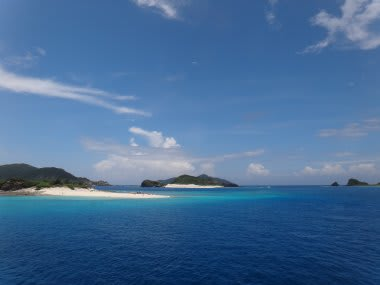
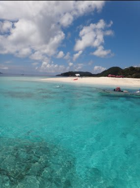
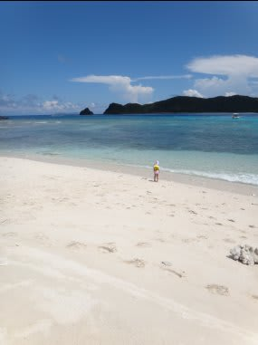

# 7月3連休は…またまた慶良間に行ってきた

📅 投稿日時: 2012-07-26 00:55:41

🏷️ カテゴリ: [ダイビング日記](ce3a7a8d424d112fce83ee85c81a0e344.md)

えーーー．

この7月の先週．

海の日で3連休があったわけですけど．

スキーシーズンが7月1日に終わってしまった私は．

当然，潜りに行ってくるわけですね．

ということで．

今回も沖縄に潜りに行ってきたわけです．

…それも，3連休に2日間の休みをくっつけて，5連休で…

＃飛行機を3連休の前後にずらした方が，3連休だけで旅行に行くより安い…

んで．

どこに行くかですが．

まず，目的地が沖縄ってのは確定．沖縄の何処に行くか．

…子供にも飛行機代がかかる今，那覇からさらに飛行機を

乗り継がなきゃならない石垣や宮古島はちょいと厳しいなぁ…

ってことで．

本島近辺に絞ります．

で，やっぱり子連れで潜りに行くので．

子連れで船に乗せてくれるところがベスト．

以前は

・宿とダイビングボートに乗る港がすぐそばで

・1本毎にダイビングボートが港に戻ってくる

って場所を選んで，夫婦のどちらかが残って，交互に子供の面倒を見てましたが．

[昨年，座間味](eba256f7390db95002c714fc760428d8f.md)で終日船に乗せてくれるショップを見つけ，

実際そこですごしてみると．

娘は走る船の上で楽しそうに景色見てるし．

ダイビングの合間，好きなときに娘と一緒に船から泳ぎにいけるし．

昼休みには無人島に遊びにいけるし．

潜っている途中は，ショップのおねーさんが娘と遊んでくれるし．

…これは，子連れダイビングに理想の形ではないかっ！

ってことで．

今回も子連れ乗船可能なショップがないか，いろいろと探してみたんだけど．

…どうせ去年と同じ，本島近辺に行くんだから．

いまさら冒険するよりも，去年行ったザマミセーリングでいいんじゃない？？

って感じで．

去年かなり楽しい思いをさせてもらった，ザマミセーリングさんの

リピーターになることに決定したのでした…

しかし今回．

旅行を決定し，エアからなにからすべて手配した後で．

「遊びで会社休むなんて許されるのかボンバーっ！」

やら，

「日程変更不可の仕事投げ込まれアターック！」

やら，

「これだけ大量な仕事割り当てたら，休んでたら終わらないだろうチョーップ！」

などの．

会社からのいろいろな妨害工作はあったものの．

とりあえず，得意の

「仕事より遊びが大事大事大事！不良社員アピールっ！」

という必殺技で乗り切り．

無事，出発当日を迎えられたのでした…

＃数日前まで，旅行いけないかも…と本気で心配だった(涙）

## 💬 コメント一覧

### 💬 コメント by (miki.miki)
**タイトル**: はじめまして
**投稿日**: 2012-07-26 09:52:45

こんにちは～

こちらのブログに初めて遊びに来ました。

私も冬はスキー　夏はダイビングとアウトドア派です。

慶良間（座間味）の写真を見て感動しました。

男岸に行った記憶があります。

良かったら遊びに来てくださね

### 💬 コメント by (Skier_S)
**タイトル**: miki.mikiさま
**投稿日**: 2012-07-27 02:01:16

ようこそ．マニアックなブログへ．

慶良間の海は綺麗で好きです～．

ブログ見せてもらいましたが，海の楽しみの

メインはヨット＆スノーケリングですか？？

うちは海はひたすらダイビングです…

今後も懲りずに読んでやってください．

