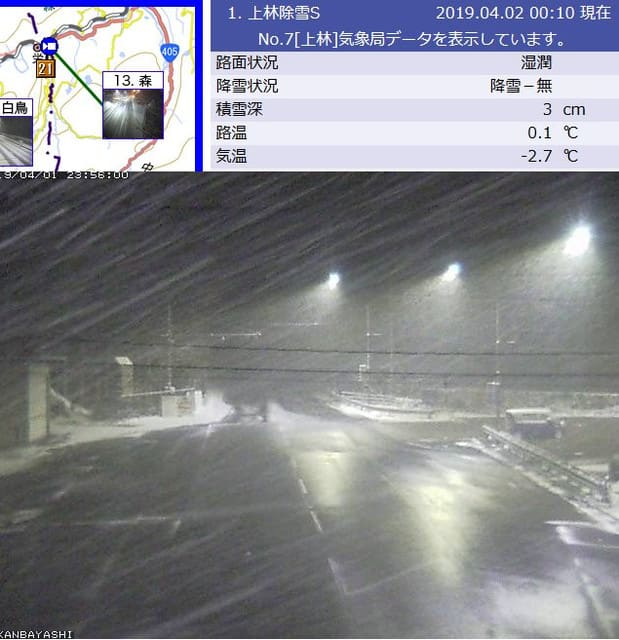

# 今週の志賀高原スキー場は，木曜までいいコンディション！金曜は気温が上がるけど，雨は降らなさそうな天気…

📅 投稿日時: 2019-04-02 06:54:22

えー．

昨日，また帰宅したまま倒れたように

寝てしまいました…

だもんで．

すみません．

日曜志賀の詳細レポートは，また明日…

で．

志賀高原ですが．

昨晩，また雪が降ったようです…！

（[北信建設事務所HP](http://hokushin-camera.org/)より）

麓の上林でこの降りですから．

志賀の山の上はかなりの降りだった

思います…

気温はかなり冷え冷えなので．

朝まで，冷え冷えのいい雪が

10～20cmほど積もってそうです！

…そして，火曜は昼間も冷えて．

終日雪が降ったりやんだりで，

時折昼間も強く降りそう…

さらに，水曜まで冷え冷え雪が降り続け．

木曜もそこそこ冷えるので．

4月上旬としては，最高のコンディションが

木曜まで続きますよ～！

で．

最新の予想では．金曜も降らなさそうな

予想になってきたので．

ちょっと気温は上がり，冷え冷えとは言えないけど．

この週末，まだ比較的いい感じで滑れるかも…

ってなことで．

日曜の志賀高原，詳細レポートは，また明日！

## 💬 コメント一覧

### 💬 コメント by (さち)
**タイトル**: Unknown
**投稿日**: 2019-04-02 11:24:09

うちの夜警ボーダーが「さ、寒い……」と言って帰ってきました。

というくらい冷えております。

午前中より寒くなってます。

そして今盛大に降っています。

どうなってんすかね？(笑)

### 💬 コメント by (かっぱ)
**タイトル**: Unknown
**投稿日**: 2019-04-02 17:15:40

このブログの天気予報を見て、滑りにきました。

今日は奥志賀にいましたが、昼過ぎから大雪となり全斜面ブーツパフになりました。最高でした。

ありがとうございました。

### 💬 コメント by (naoちゃんねる)
**タイトル**: Unknown
**投稿日**: 2019-04-02 19:20:10

早朝の更新、お疲れさまです😅

いやー 朝イチでblogを更新したり、週末はフルで滑り続ける体力・気力にホント尊敬します😲

てなわけで今日まで３日連続で滑りに行きましたが、今日の朝イチはイチゴン山頂駅で－11℃・積雪20㎝とSさんの予想的中！

嬉しいボーナスで10時位までは晴れてました～

その後チラチラ雪が降り始め、12時にはイイ降りになってきました。その時の山頂温度計は－8℃でした。

相方のいない娘はこれにてギブアップしました～(笑)

この予想通り、週末までこの最高のゲレンデが持ちますように！！！

### 💬 コメント by (地元民)
**タイトル**: Unknown
**投稿日**: 2019-04-02 20:36:19

午後から里もすごい降りでした。ただ、上空は冷えてるけど、そこは４月。下層はさほど冷えていないので、標高350mの里では、降るそばから融けていきました。

夜になって３センチくらいの積雪になってます。

### 💬 コメント by (musi)
**タイトル**: Unknown
**投稿日**: 2019-04-03 00:30:24

今さっき奥志賀に到着しました。

上林の辺りまでは、濡れててマイナス1度程度でしたが、直ぐに真っ白で、除雪もされてない積雪路。久しぶりの冬景色です。

車の温度計は、マイナス10度。さらさらの雪が積もってて、宿の急なアプローチはなんとか登ったものの、軽くスタックしてしまいました。タイヤ空回りしてるので、電子制御を外すボタン長押ししたら、なんと、ボタンが奥に外れました。今日も、滑らずに、上がって来れた、D5は愛着のある頼もしい相棒なのですが、これが三菱品質！！？

Sさんの四駆制御の話を思い出しながら、

エンブレ時にリアの駆動切るなんて、詐欺みたいな、制御もあるんだな、D5はどうなんだろうなんて、考えながら、上がって来ただけに、なんか切ない感じでした。制御どころか、ボタンどこ行ったんだろう……。

### 💬 コメント by (Skier_S)
**タイトル**: 明日も最高コンデション
**投稿日**: 2019-04-03 01:04:27

＞さちさま

今日も最高だったみたいですね…

明日はもっと冷えますよ！

そして，明日朝は新雪ですよ！

うーーーん．

滑りに行きたい～っ！！！

＞かっぱさま

天気予想，参考になったようで良かったです…

午後は大雪だったんですね！

いやー．

この4月もいい感じのコンディションが続きますね～…

今後もご愛読よろしくお願いします～！

＞naoちゃんねるさま

いや…

この3日連続で滑ったってのは，ベストなタイミング

だったと思います…

今シーズン，これ以上は無いという最高の3日間

### 💬 コメント by (Rikoriko)
**タイトル**: Unknown
**投稿日**: 2019-04-03 19:49:02

こんばんは〜。今日もパウダー三昧！！

月・火・水と３日連続で貸切状態の熊の湯のパウダーを食べまくってきました〜。

ただ、今朝の道中はかなり厳しい状況で路肩がどこか見えないぐらい吹雪いていて、ホワイトアウト状態。

蓮池交差点から熊の湯への道では『わー、左に寄り過ぎ〜。あー右に寄ってる〜。あっ反対車線走ってるかも。』って助手席でわーわー叫びながらナビしてました。

来週の月・火は雨かもしれませんが、それまではまあまあ良さそうな予報なので、老体に鞭打って、休み無しで滑り続けるつもりですが、ぎっくり腰にならないよう気をつけなければ・・・。

Sさんも毎週末休み無しでお疲れの出ませんように。

### 💬 コメント by (Skier_S)
**タイトル**: Rikorikoさま
**投稿日**: 2019-04-04 01:39:43

今日もパウダー楽しんできたんですね…

うらやましすぎます…

とても4月とは思えないコンディションだったようですね！

帰り道は怖かったようですが…．

来週の月・火は雪になりそうですよ！

来週も，週明けにいいコンディションになりそうですよ～！

