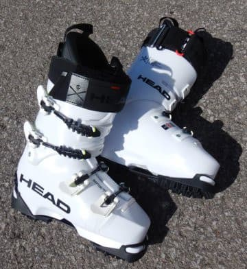
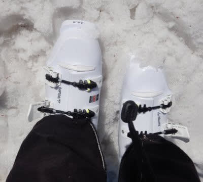
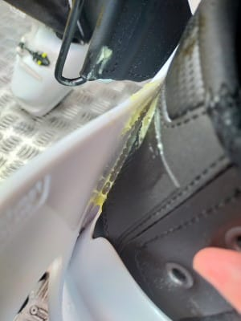
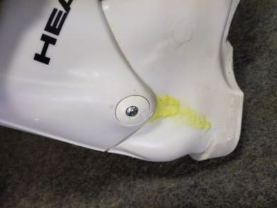
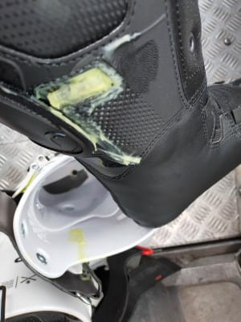
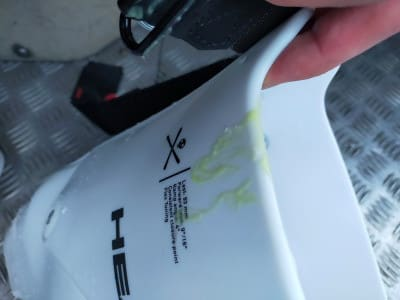
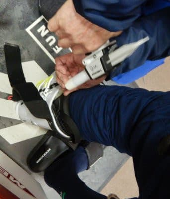

# 物欲選手権で敗れたHEAD RAPTOR WCR3を履いてみた

📅 投稿日時: 2021-08-05 00:33:51

ということで．

長岡のエキップさんで開催された

[物欲選手権](ed9f378aafcc4eb8620e941a8c06dd4a7.md)に敗れ，エキップさんブーツの

2足目，

HEAD RAPTOR WCR3

を購入し，[加工してもらった](ed0acec3bab3e64301a3d026ae392f5bd.md)わけですが．

GWの5日間ほど履いてみたので，

その簡単なインプレッションを…

まず．

足入れすると．

今シーズン買ったばかりのREXXAM，

まだ45日ほどしか履いてないけど，

インナーがつぶれてたんだな…

というのが分かる，足を柔らかく包み込む，

インナーの当たりの柔らかさ！

だのに，Liquid FITのおかげか，

かかと・足首付近のフィット感が

高い！

で．

滑ってみたところ…

Flex140という強さにもかかわらず，

BOOSTERストラップと同じゴム製の

弾力があるバンドだからか，

足首が思った以上に動かせる！

そして，足首を動かしたあとは，

返りの速い，強いばね感があります！

これも，BOOSTERストラップの

効果なんだろうなぁ…

ターンの横Gでつぶれたブーツの

切り替えに向かって圧を開放していくとき．

ポンと戻ってきてかなり素早い切り替えが

できる感じ．

板のばね感と相まって，返りが速くて

強い板を履くと，吹っ飛ぶかと思う

反応をもらえます．

滑り手が切り替えで仕掛けなくても，

ブーツが自動で切り替えてくれるような，

そんな感じ．

…そして．

ヤバい．

REXXAMで滑った時より，さらに板が

柔らかく感じる！

いつものSALOMON X-Race Master 182cm．

最近ではかなり柔らかく感じていたけど．

この強烈かつ返りの速いHEADブーツを履くと．

この軟弱な板じゃ，大回り無理だよ…

って思ってしまうほどの，小回り専用機に

感じます．

恐ろしいほど板が踏めます．

すごく板をたわませられます．

ただ，ブーツが強いだけに．

柔らかい雪より，硬い雪でその真価を

発揮しそうですえ．

GWの昼間のザブ雪では，REXXAMの

フレックス130くらいでもいいかな？

と思う時もありましたが．

でも，別にフレックス140でも

持て余すほどのブーツではないですね．

普通の130を履ける人なら問題なく

履けます．

140という数字で覚悟するよりは，

楽に足首が動かせます．

意外と柔らかく感じます．

ただ，足首を戻すとき．

返りの速さと強さが，普通の130の

ブーツよりもずっと強い感じです…

…しかし．

どうやら私のブーツ，初期不良品だったのか．

履いて3日目．

バンドを締めようとした時．

何かちょっとぬるぬるするな…と思ったら．

えええ！！？

Liquid FIT（足首付近のホールドを高めるために

注入したグリース状の液体）

が漏れてる！？？

どうやら．インナーブーツの

Liquid FIT注入口の逆止弁不良らしく．

液が逆流してきちゃったようです…（涙）

エキップさんではかなりの数の

HEADブーツの作業をしたけど．

Liquid FITの液漏れは私の一例だけ

みたいで，滅多にないことみたいですが．

こんなところでも，

私の何かの引きの強さ

を発揮してますね（涙）

結局，

インナーブーツの初期不良ということで

無償交換対象となり．

オプションで別料金がかかるLiquid FITの

カートリッジも無償補償の対象で．

タダでインナーがまた新品になりました！

だもんで，GW明けに長岡のエキップさん

まで行って．

再びLiquid FITの液体を注入してきて

来てもらいました~！

ってなことで．

思わぬ初期不良で，まだ5日ほどしか履けてない

ですが．

このブーツのポテンシャルの高さはすごく

感じました…

とりあえず，トップシーズンの硬い雪で，

物欲選手権で手に入れた，189cmの選手用

GS板を履いてみたくなっている今日この頃．

来シーズンが楽しみ…！

## 💬 コメント一覧

### 💬 コメント by (ほっぽ)
**タイトル**: Unknown
**投稿日**: 2021-08-05 11:20:26

Sさん

このブーツでは、ますます板の劣化が加速しそうですね😅

常に予備の板を２セットくらい待機させておかないといけませんね😅

### 💬 コメント by (カンタロス)
**タイトル**: Unknown
**投稿日**: 2021-08-05 20:33:18

Sさま、こんにちは。

ブーツ、板、共にドンドン硬くなっていく…

=道具代がかさんでいく…

ですね。来シーズンはFIS板での物欲選手権開催ですね(笑)

### 💬 コメント by (Skier_S)
**タイトル**: そして物欲は連鎖する
**投稿日**: 2021-08-06 02:04:06

＞ほっぽさま

板の劣化も心配ですが，身体への負荷も高そうなので

身体が劣化しないか心配です．

身体の予備も準備しておきたいかも…（笑）

＞カンタロスさま

そうなんですよ．

まさかこの年になって，現役選手の頃よりも強い道具を

使うようになるとは思いませんでした…

来シーズンの小回り板，ホントにSL競技用履いてるかも…

### 💬 コメント by (ikkun)
**タイトル**: Unknown
**投稿日**: 2021-08-06 16:01:17

パワー有りすぎとか(笑)

### 💬 コメント by (Skier_S)
**タイトル**: Unknown
**投稿日**: 2021-08-07 06:00:29

>ikkunさま

そんなにパワーないです…

### 💬 コメント by (なんちゃってレーサー)
**タイトル**: おお，ついに
**投稿日**: 2021-08-08 22:29:22

WCRブーツのレビュー，お待ちしておりました．

REXXAMを履いた時よりも板が柔らかく感じましたか．

特性が違うブーツではありますが，どっちが強いとか優れているとかはないので，驚きました．

Sさんの加重ポイントにはWCRブーツの方が合っているのかもしれませんね．

FISCHERのマスターズ選手用，履くのが楽しみですね．

もし，それも物足りなくなってしまったら，これ行きましょう．

https://shop.rossignol.co.jp/ec/detail/?product_id=14

そうそう，前に書き込んだ，紫外線カット剤，こんなのを使っている人が多いようです．

https://item.rakuten.co.jp/sun-wa/13017/

ご参考までに．

### 💬 コメント by (Skier_S)
**タイトル**: Unknown
**投稿日**: 2021-08-09 00:46:40

>なんちゃってレーサーさま

やはりフレックス140なだけあって、130のREXXAMよりは板が踏める感じです！

よりブーツが強く感じました…

このブーツとFISCHER競技用、無敵の組合せっぽいです。

来シーズンが楽しみです

### 💬 コメント by (ikkun)
**タイトル**: Unknown
**投稿日**: 2021-08-13 12:39:38

あブーツ  墓参りがてらREGZA買った店でラスト100の日本製ブーツ試しばきでした(笑)しかし100  剛度100では無理がありました( *´艸｀) しかしラスト95は夏でもヤバイよ➰❤️でした

### 💬 コメント by (ikkun)
**タイトル**: Unknown
**投稿日**: 2021-08-13 12:43:08

アビリーバでしたm(__)m

### 💬 コメント by (Skier_S)
**タイトル**: ＞ikkunさま
**投稿日**: 2021-08-13 23:28:33

私はラスト100より幅広の足ですが，幅に合わせてブーツを選ぶと，

足首がガバガバすぎてダメです…

