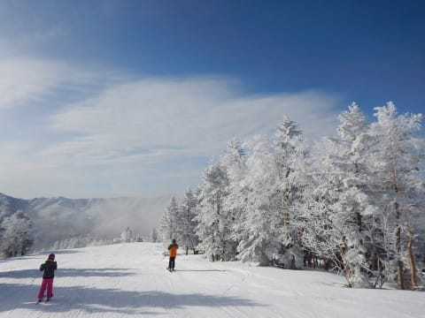
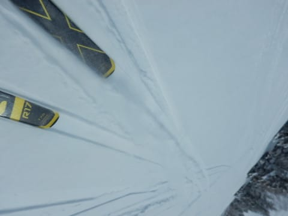
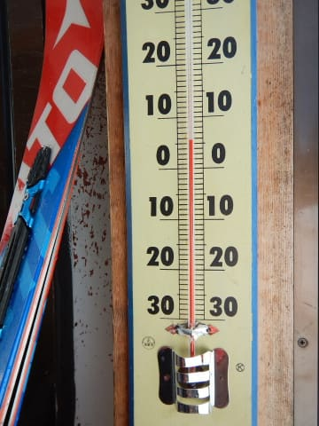

# 2019/4/28(日)，GW10連休2日目の志賀高原スキー場は…朝は晴天最高冷え冷え新雪！でも午後は日差しでしっとり重い春の雪．人は多めだけどゴンドラ待ちはなかったよ

📅 投稿日時: 2019-04-28 23:32:45

🏷️ カテゴリ: [2019スキー滑走日記](c3e4496fc0fb7f9c17ff21214a35b1ace.md)

ってなわけで．

10連休のGWも，2日目となったわけですが．

いやーー．

今日は良かった．

良かったですよ～！

…午前中までは．

午後はちょっと残念な感じでしたが．

まぁ，昨日がGWにしてはぶっ飛び

すぎるほど良くて，

とてもGWと思えない一日だったので，

今日の午後が残念に思えてしまうだけで．

普通のGWと考えれば，

天気も良く，混みもせず，雪もたっぷり

あって．

恵まれた一日だったんですけど…

いや．

昨日と今日の午前中は，良すぎました．

とりあえず．

朝．

昨日積もったやわらか新雪を

楽しむためには，早朝に滑らないと！！！

と，6:30からの早朝営業に並ぶ

わけですが…

営業開始時には，50人弱

並んでいたでしょうか…

天気は，あさイチからもう

すっきり晴天！！

そして，6:30営業開始の

早朝ゴンドラに乗って，山頂に行くと…

なんだ，この冷え冷え新雪は！？？

えーっと．

今日は4月末ですよね！？？

そこに広がっているのは，まるで

2月かと思わせるような．

2か月ほど季節がさかのぼった

冷え冷え新雪が圧雪された，

晴天ピカピカゲレンデ！！

気温も-8℃と，この時期では

ありえあいレベルの冷え冷えっ！！

そして雪は…

昨晩に積もった冷え冷え雪が圧雪され．

朝方にもちょっと降った新雪が

その上にうっすら乗り…

これは…

ホントにGWか？？

GWで，こんなに雪がよくていいんですか！？？？

普通，GWなら．

朝からざぶざぶに緩んでいるのが普通で．

せいぜい冷え込んでガチガチバーンになって

くれれば，御の字といったレベルなのいに．

…こんな超プレミアムグレードの

新雪シマシマを，この時期にいただいて

よろしいのでしょうか！？？

ちょっと一部コロコロが出てるところが

あったものの…

これ，GWのゲレンデじゃないよ！！！

この早朝は…

GWとしてはシアワセすぎる！！

今朝は冷え冷えのいい雪と

予想していたけど…

まさかGWに，こんないい雪質で

滑れるとは思わなかったよ！！！

これは夢か？？

真冬としか思えないこの景色…

ホントにもうすぐ5月なのか？？？

ってな感じで．

とてもGWと思えないシマシマバーンを

いただいて．

そして．

シマシマが崩れても．

トップシーズン並みの冷え冷え雪質！

もう，こんなぴかぴか晴天なのに．

マイナス気温で，最高雪質で滑れるなんて…

これまでのGWでは，経験したことがない

気がするんですが！？？

早朝営業が終了し，通常営業が開始される

8:30になっても全く雪は緩む気配もなく．

通常営業からオープンのパノラマコースに

飛び込みますが…

誰も滑ってないパノラマコース．

まだパフパフ新雪が！！

そして，シマシマっ！！

最高っ！！

最高だよ！！

もう，今ホントにGWか？？

GWの通常営業の時間に．

こんな雪煙が上がる雪で

滑れたこと，これまでの人生に

無かったよ！！！

天気はいいし．

さすがGW2日目の晴天の日，

ちょっとコース上は人が

多くなって来たけど…

朝のうちはリフトもガラガラで．

ゴンドラも，終日それほど混むこともなく．

そして．

10時くらいまでは，いい雪質をキープ！！

…なんて恵まれているんでしょう！！

だけど…

さすがに4月末の晴天なので．

11時近くになると…

うーん．

雪がボソボソした感じになって，

重くなってきました…（涙）

そして．

大変残念なことに．

お昼の12時過ぎには…

気温も+5℃と，かなり上がってしまい…

そのおかげで．

うううううーーーーむ．

かなりしっとりした感じの濡れた

雪の上に…

ボソボソの重い雪が乗った，

残念な感じの雪質になっちゃい

ました…（涙）

ううーーむ．

ちょっと残念…

でも．

普通のGWから考えると，

まだかなりいい雪質なんですけど．

朝が良すぎたために，かなりの残念感…

一の瀬方面はもう少しましかな？

と，覗きに行ってみましたが．

一の瀬も，昼前までは良かったらしいけど．

午後はやっぱり残念な感じですね…

午後の一の瀬正面バーン．

かなりしっとりとした，粘りつくような

重い雪でした…（残念）

ってな感じで．

焼額に戻ってきましたが．

午後の焼額は．

山頂付近はまだまともなものの．

中間より下は，重くて荒れ気味で，

滑りもあまりよくない，かなり

疲れる雪で．

ゴンドラ乗り場前も…

結構雪が解けちゃいましたね（泣）

そして．

焼額から奥志賀へ滑りこめる奥志賀

連絡コースも，知らぬ間にクローズだったようで…

焼額⇔奥志賀は，山頂からしか行き来できなく

なっています．

ってな感じで．

午前中とは打って変わって．

強い日差しで暖かい春スキーの

陽気となった午後．

かなり重い雪で，板の滑りもところどころ

悪くなり．

そして，荒れ荒れになってしまった

ゲレンデを…

さらに．

午後3時を過ぎて日が傾くと．

そのまま固まりだしていくような

手ごわいバーンコンディションの中．

今日も日が傾く，営業終了の16時まで…

ひたすら滑り続けたのでした…

いやー．

今日の午前中は最高だったけど．

午後はちょっと厳しかった…

いや．

普通のGWの，汚れが浮きまくった

板がずぶずぶに埋もれていくような雪と

比べれば，まだ今日の午後のは

GWとしては恵まれたコンディションなんだけど．

午前が良すぎただけに，残念感が強かった…

で

明日は早朝だけちょっと冷え込むけど．

昼間は気温が上がりそう．

30日は南風でかなり気温が上がり，

…もしかしたら夕方にぽつぽつ来る可能性も…

30日夜から1日午前にかけては．

かなりやばい雨になりそうな感じです（泣）

とりあえず．

明日は雨の心配はなさそうなですが．

おそらく，雪が緩まない午前…というより，朝が勝負．

ってなわけで．

また早朝から滑ってきます～！

## 💬 コメント一覧

### 💬 コメント by (いさ)
**タイトル**: Unknown
**投稿日**: 2019-04-29 03:07:36

今日はホント、奇跡のようなコンディションでした。みなさんと気持ちよく滑ることができて楽しかったです。所要あって後ろ髪ひかれながら帰ってきてしまいましたが、この休み中、もう一度くらい参戦したいところ…また奇跡起きないですかね？

### 💬 コメント by (ろーさん)
**タイトル**: Unknown
**投稿日**: 2019-04-29 07:54:40

Sさま。昨日はお札をいただき、また、一緒に滑っていただき、ありがとうございました。少しですが、お供え⁉️を、板のところに置きました。どうか、ご笑納ください。また、ご一緒できることを楽しみにしています。

### 💬 コメント by (ゆうこ)
**タイトル**: Unknown
**投稿日**: 2019-04-29 19:26:51

今日は、ステッカーありがとうございました！

うちの子も、第一ゴンドラ気に入ったようで、明日も滑りたいと言い出しました。

雨じゃなければ参戦しようと思います！

### 💬 コメント by (ほっぽ)
**タイトル**: ４／２９
**投稿日**: 2019-04-29 21:57:41

Ｓさん

今日は団体行動されていたのでご挨拶だけで失礼しました。

一の瀬スタートでヤケビ、奥志賀、午後は気温が下がって

冷えてきたので再びヤケビを回してましたが、午後はお見かけしませんでした。

いよいよ私は明日で今シーズン終了。

天気が気になりますがカッパ準備して滑ります。

今日の滑走日記をアップしておきました。

ＧＷ後半はSUPER　GTのレース任務に就いて終了ですね。

結局、殆ど自宅に居ない意味ではスキーと大差ありません。(^^;

http://www2.tokai.or.jp/nana_hoppo/

### 💬 コメント by (Skier_S)
**タイトル**: 明日は雨（涙）
**投稿日**: 2019-04-30 00:19:16

＞いささま

うーむ．

2，3日あたり，平年より冷えるのですが．

ここまでの奇跡の冷え込みはもうなさそうです…（残念）

ただ，3日以降は雨にはならなさそうです！

＞ろーさんさま

お供え物，ありがとうございます！

ありがたくいただきました…

娘もよろこんでいました！

＞ゆうこさま

今シーズンの私のウェアを知らないはずなのに，

昨日は駐車場でいきなり発見されてびっくりしました．

久しぶりにお会いできて，うれしいです．

お子さんも大きくなって，これからが楽しみですね．

今は信じられないかと思いますが，あっという間に

子供にスキーで抜かれちゃいますよ！（経験者は語る）

明日は残念ながら雨っぽいです…

でも，もしお越しになるようならまたお会いしましょう！

＞ほっぽさま

明日で今シーズンラストですか…

今シーズンもお世話になりました．

また明日，焼額滑っている予定ですので．

ラストにお会いできるといいですね…

