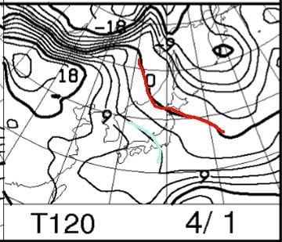

# 3月31日，4月1日の週末の志賀高原スキー場の天気は…またまた晴れの，暖かい春スキーになりそう…

📅 投稿日時: 2018-03-29 07:21:41

🏷️ カテゴリ: [スキー天気予想](c6554f5c3c106093b511a8daae23757e8.md)

えー．

本日も帰宅後倒れたように寝てしまったので．

朝，出かける前の更新っ！

水曜夜…じゃなくて，木曜朝定番，週末の

天気予想です．

うーん．

しかし，もう4月か…

桜も満開になったし，シーズンもラストスパートに

入ってきた感がありますが…

とりあえず，週末の天気図をば．

まずは，土曜31日の850hpa気温ですが．

赤い0℃線はすでに志賀より北．

志賀高原には+3℃線が近づきつつ

あります．

うーむ．

土曜の朝はマイナスに冷え込むでしょうが，

昼間は+5℃以上に気温が上がりますか…

暖かい一日になりそうですね（涙）．

そして，土曜の地上天気図を見ると…

もう，すっぽり高気圧に覆われてますね．

一日中すっきり晴れそうですね．

土曜は，日が射すあったかい春スキーの

一日になりそう…

で．日曜の850hpa気温図は…

うげげげ．水色の+6℃線が志賀に

近づいてます…

早朝は放射冷却でマイナスかもしれないけど，

朝から気温はプラスになり，

最高気温は10℃くらいまで上がるか…？？

かなり気温が上がりそう（泣）．

そして，日曜の地上天気図を見ると．

うむ．この日も高気圧の勢力下で，晴れそうですね．

うーむ．

日が射して+10℃近くまで気温が上がるので…

暑いくらいで．

雪はもうザブザブになりそうな予感…（泣）

まぁ，雨よりマシか…

ってな感じで．

まとめると．

31日土曜：朝から終日晴れ！

　朝イチは締まり気味のハイスピード圧雪．

　朝の気温はマイナスに冷え込み，午前中は

　それほどひどく気温は上がらなさそうだけど，

　昼ごろから気温が上がり，最高は+5℃を超えそう．

　日が当たる斜面は昼ごろには緩み，

　日が当たらない斜面は昼過ぎぐらいに緩み

　始めるか…

　夕方には全面緩んで荒れた斜面になっていく．

1日日曜：この日も朝から終日晴れ！

　早朝はマイナス気温で，かなり固めのバーン．

　ただ，朝のうちから気温はプラスに上がり，

　通常営業開始のころには雪は緩み始めるか…

　昼ごろには気温は+10℃近くにまで上がり，

　暑いくらいの一日．

　雪は午前中にザブザブになり，

　昼には板の滑りが悪くなっていきそう…

　午後のゲレンデはもう荒れ荒れでしょう．

　「あぁ…シーズンも終盤だねぇ…」

　という感じの，暑くて雪がドボドボになっていく

　一日．

ってな感じで．

もう太陽がサンサンと照り付ける，春の気配に

あふれるゲレンデになりそうですが．

…こんな気温が上がる日は．

やたら晴れるよりも，曇り空くらいが

雪が緩まなくていいんだけどなぁ…

しかし，ここ数週間，週末はすっきり晴れに

めぐまれてるので．

まぁ，雨が降るよりマシですかね．

でも．

もう一降りほしい…

さすがに望み薄か…（涙）．

## 💬 コメント一覧

### 💬 コメント by (しんちゃん)
**タイトル**: 早朝に期待
**投稿日**: 2018-03-29 21:30:15

晴れる週末、放射冷却でキリッとしまった早朝営業が楽しみですね。

今週末、参戦予定です。（土曜日の早朝は厳しいかも）

晴れの日のスキーはホントに楽しいですね。

雪は緩んでしまいますけどね(^^;

### 💬 コメント by (Skier_S)
**タイトル**: しんちゃんさま
**投稿日**: 2018-03-30 04:09:17

今週末も，早朝営業狙いが正解です…

私は金曜は深夜までの仕事になりそうで．

土曜早朝参加は諦めてますが…（涙）．

とりあえず，今週末は雨にならず，晴れるだけ

恵まれてます．

春スキーを楽しみましょう！

### 💬 コメント by (さち)
**タイトル**: Unknown
**投稿日**: 2018-03-30 23:01:41

大将、今日は冷えてますぜ。

明日は期待できそうな？？

### 💬 コメント by (Skier_S)
**タイトル**: さちさま
**投稿日**: 2018-03-30 23:50:41

冷えるのは金曜だけです…

本日一日の久しぶりの冷え込みです．

土曜からは平年以上の気温に，

日曜はかなりの高温になります…（涙）

でも，今日の冷え込みのおかげで土曜の昼頃までは

雪は緩まずに済むかな～

