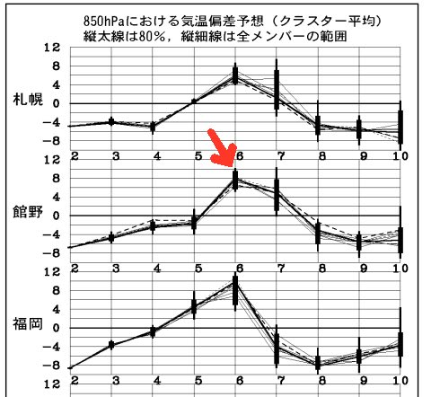
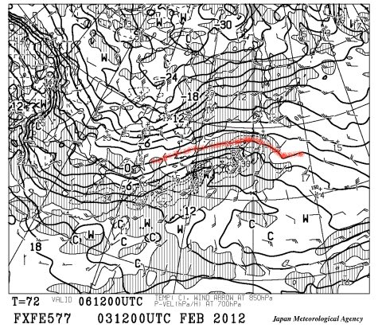
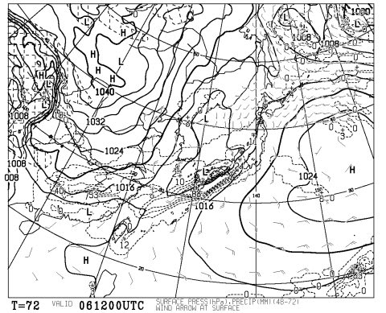

# 5日はスキー日和だけど，6日午後から壊滅的かも

📅 投稿日時: 2012-02-04 01:26:00

あー．

なぜか．

この週末は，土曜にスキーに行けないんですよね…

とりあえず．

この週末ですが．

土曜は…

相変わらず新潟は雪．朝のうち強く，昼から弱まるでしょう．

新潟は，土曜の朝はぱふぱふが楽しめそうですね．

信州は…志賀高原以南では，残念ながらあまりぱふぱふは

期待できそうにありません．

小雪，時々日も射すでしょう．

信州は，今の予想だと，逆に午後に雪雲が入りちょっと降るかも．

日曜は…

新潟は朝のうち多少雪がちらつくかも．でも，昼前から晴れだすでしょう．

＃うす雲は残るかも．

信州は…今のままだと，終日晴れますね．

んで，ちょいと暖まります．これまでの冷え込みがかなり緩みます．

まぁ，この土日もかなりのスキー日和と言えるかと．

と．

ここまではよいのだ．

ここまでは．

明けて月曜．

6日に．

来るのだ．

…そう，雨が．

この，6日の気温を見て分かるように．

標高1500m付近の気温，例年より8度くらい上がるのだ．

そして．

この赤線のように，850hpaの0度線が東北南部まで上がっちゃって，

新潟・信州は標高1500mでも気温がプラスになるのだ．

[前回の予想](eac36857deb087713dac1382418e576d8.md)より，0度線がかなり北にずれたのだ．

さらに…

この図の点線で囲まれた降水域．

これが，本州全域を覆うのだ．

それも，信州あたりも24mmの降水が予測されているという…

降るのだ．

当然，この日は降れば雨なのだ．

雨なのだ…．

それも，6日午後から7日午前にかけて，結構強く降りそうなのだ．

7日夜以降は，また冬型に戻って雪が10日くらいまで降り続けるけど．

一旦雨で固まったアイスバーンは，雪の下に今後も残ってしまうのだ．

みんなでこれから祈れば，低気圧は予想より南にいって，

雨は避けられるかも…

スキーヤーのみんな，祈るのだっ！
