# 2020/1/19(日)の志賀高原スキー場，速報レポート！…朝は曇ってたけど午後は晴れ！冷え冷え最高雪質でそれほど混まず，いい感じの一日！

📅 投稿日時: 2020-01-20 01:35:57

ということで．

本日もしっかりラストリフトまで滑り．

洗車だとかなんだとかやって帰宅すると，

もう11時過ぎ…

そこからいろいろ片づけやら

板の手入れやらをやっていると，

いつもの日付変更線突破コース…（涙）

だもんで．

本日の志賀高原レポート，

日曜深夜恒例，速報モードにて！

えー．

まず．

薄日が差す曇り空で始まった本日朝．

残念ながら，昨日からの積雪の

積み増しは無かったです…（涙）

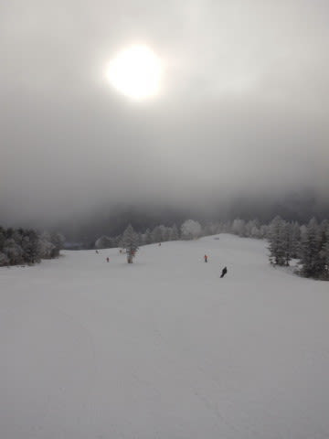

とはいえ．

あさイチのゲレンデは，

-10℃近くまで冷やされた

最高トップシーズンの

シマシマバーン！！

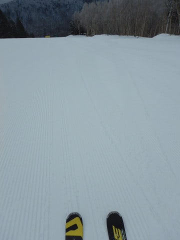

新しい雪が積もってないので，

バーンは柔らかすぎず，

いい感じでエッジがガッツリとらえて

どこまでも横Gを高められるような，

「うひょひょひょひょ」って感じの

コンディションっ！！

なんだけど．

午前中は時折ガスったりして，

視界が悪かったのが残念…

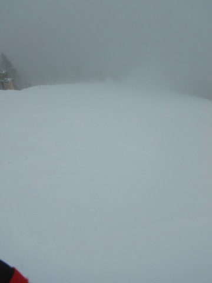

だけど．

このまま曇り空のまま，

一日が終わるのかと思っていたら…

11時ごろには，ちょっと青空が覗きはじめ．

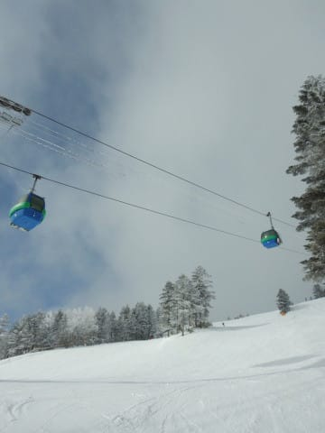

昼ごろには，雲が多いながらも，

ゲレンデに日が射して来ましたよ！！！

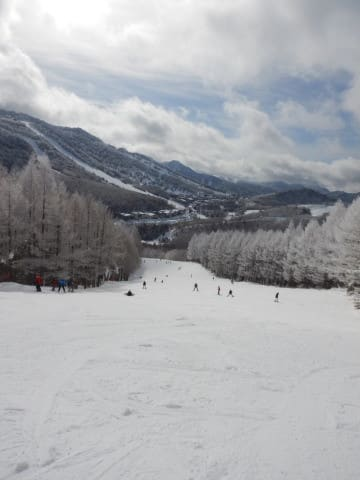

昼前までは，ちょっとゲレンデに

人が多めだったけど．

でも，3連休ほどの混雑ではなく．

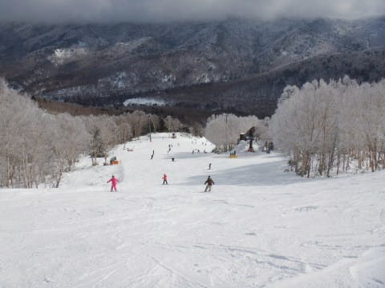

日が射すのに，最高気温は-5℃と

冷え冷えなので．

太陽のもと，冷え冷え雪を滑れるという，

シーズン中いつもこうあってほしいと

思うコンディション！

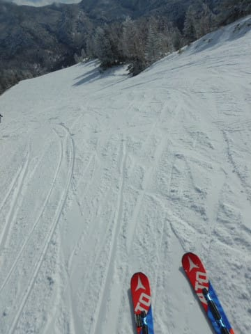

ただ．

積雪が無いので，

白樺コースに浮石が出てたりしましたが．

ほとんどのコースは，ブッシュの心配なく

滑ることができ．

うほーーー！

シアワセ…っ！！

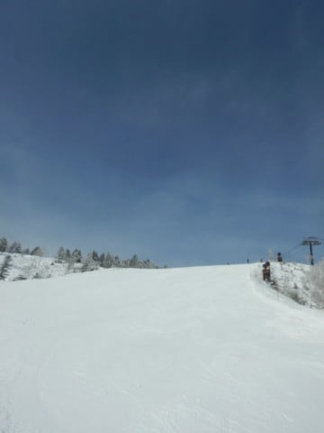

午後遅くには，いつもの日曜のパターンで．

人がいないガラガラになっていき．

ふわふわ積もりたて雪でもないので，

バーンはラストまで凸凹ギャップに

なることなく．

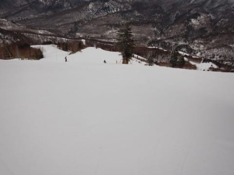

恵まれた一日を過ごすことが

出来たのでした…

いやーー．

今日もいい一日だった…

…そして．

21火曜日の朝の850hpa気温図を見てみると．

をを！！

水色の-9℃線が志賀高原に近づいてますよ！

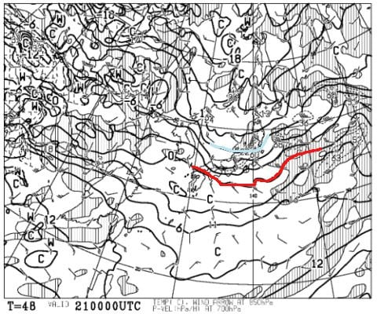

そして，地上天気図でも，水色に塗った

降水域が日本海側に予想されているので．

…20日から21日にかけて，雪が積もりそう！！

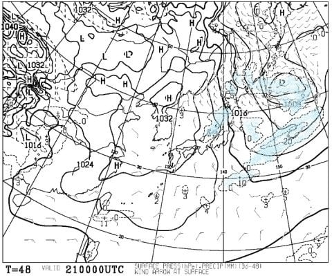

志賀の積雪は，風向きに寄りますが．

20日から21日にかけて，西風なら数cm．

北向きに風が回ってくれれば，

10～20cmは積もってくれそう…！！

…

…

…

…なんだけど．

うむむむむ！？？？

なんだ，これはっ！！？？

23日から26日にかけて…

気温が平年比4℃から8℃ほど

高い日が続きそうなんですが…っ！？？？？

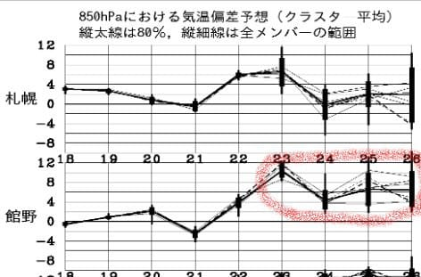

特に．

福岡なんて…

5日連続で，平年比+12℃の日が続くの？？

1月の今の時期，4月のレベルの気温が5日続くって…

…これ，異常気象なんですけどっ！？？（激涙）

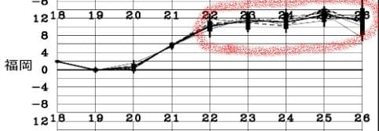

そして，23日～26日の850hpa

気温図を見ても．

赤い0℃線は，この5日間，

志賀高原より北に居続けるんですが…っ！（涙）

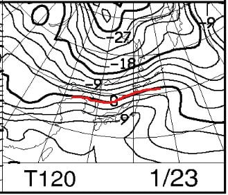

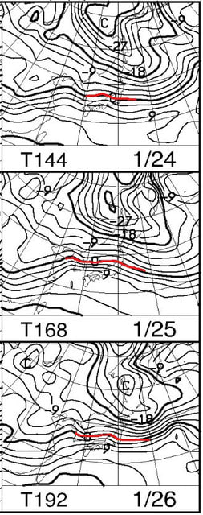

なぜ…

一体なぜ…

これで，せめて降水量が無ければ

なんとかなるか…？？

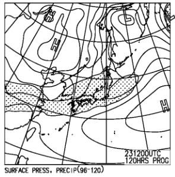

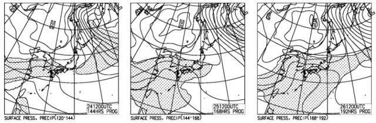

……

…

…（屍）

えー．

皆様へ，大変残念なお知らせです．

この23日以降，週末を含む，26日まで．

志賀高原でも，液体が降り続ける

覚悟をしておいてください．

24日の金曜は降らずに済みそうですし．

運が良ければ，26日は山頂付近は

雪かもしれませんが．

…今週末は，あまり過剰な期待を

しない方がよろしいかと…（あふれ出る涙）

（一部の人には，23日は降らずに24日金曜から雨と

　伝えましたが，最新の天気図では，木曜23日が雨，

　24日は降らずにもちそうです…（私信モード））

明日以降，また引き続き最新予想を

お伝えしていきますが…

あぁ…

来週末，一体どんなことになるのやら…（恐怖）

## 💬 コメント一覧

### 💬 コメント by (ゆーき)
**タイトル**: Unknown
**投稿日**: 2020-01-20 07:44:19

今週末の件は、神様仏様にお祈りをしなければ、、、そんな私は昨日は、浮気せず志賀高原へただ、朝ははやくからやる奥志賀スタートで、11時ころの晴れ始めたあたりに焼額山に移動、気持ち良かったですね、そのあと、一の瀬、高天ヶ原に移動、食事を取り、西館、東館、寺子屋、タンネと周り、リフト最終が遅い一の瀬で終わりました。

西館で閉鎖になったコースを見たら、大陥没してました、経営の効率化と思ってましたが、違いました。

あと、8時の奥志賀を目指して、焼額山を0740くらいに通過しましたけど、既に焼額山第一に並んでた集団が居て、早すぎるやろと思いましたが、まさかあの中にいましたか？

### 💬 コメント by (副院長)
**タイトル**: Unknown
**投稿日**: 2020-01-20 08:13:42

昨日は数本ご一緒できて、ありがとうございました。

京都のシトロエンのりです。

昨日はやっぱりタイヤチェーンは外しました。

残念ながら、本日ヤケビの朝は晴れ。積雪は1センチてとこでしょうか。

また、来週お目にかかるのを楽しみにしております。

### 💬 コメント by (べー)
**タイトル**: Unknown
**投稿日**: 2020-01-20 22:18:53

昨日は１本だけでしたがありがとうございました。

また同行者にお札も頂き、こちらもありがとうございました。

今日はガラガラのフラットバーンを堪能し先ほど帰宅しました。

次は２月の８日から出没しますので宜しくお願いします。

### 💬 コメント by (西館)
**タイトル**: 降雪を願って祈祷中
**投稿日**: 2020-01-21 00:50:29

今朝は東館ゴンドラのスタンプラリーの缶バッジを目当てに東館を降りましたが...悪路過ぎますね、３cm程度の石がコロコロと。

今日中に13種類制覇を目論んでおりましたが、来週に持ち越しとしました。

今週末用天気予報も楽しみにしています。

若干、改善方向なのではないでしょうか。

みんなで祈っていますからね。

踊りは、一度お手本を師匠に踊って見せていただかないと。どんな感じでもよいのでしょうか。

### 💬 コメント by (Skier_S)
**タイトル**: 明日の朝はパウダーデー！？？
**投稿日**: 2020-01-21 03:27:23

＞ゆーきさま

今週末の天気が，冷え冷えの雪になるようにお祈りして，

そして，冷え冷え踊りを踊り続けてください…

ちなみに，7:40くらいに並んでいる人は，7:50からのファーストトラックに

参加する人かと…

そこに並んでいる人の一部には心当たりがありますが，私はさすがにその中にはいません(笑)．

＞副院長さま

日曜はご一緒ありがとうございました～！

最後はちゃんと挨拶できず，すみませんでした．

月曜は西風だったので，やっぱり積もりませんでしたか…

これから北風に回るので，朝までには積もります！

…が，来週までこの雪がもってくれるかどうか…

また，今週末もお会いしましょう！

＞べーさま

日曜はご一緒ありがとうございました．！

月曜はちょっとゲレンデが硬くなってきたみたいですが，ガラガラのフラットバーンで

楽しめたようですね…

うらやましいです…

また2月8日の週末，お会いしましょう！！

＞西館さま

東館はすごいみたいですね…

西館はまだまともみたいですが．

今週末ですが，今の天気図なら25日土曜は降らずにもちます．

26日は微妙…（涙）

とりあえず，ひたすら情熱的に，休むことなく冷え冷え踊りを

踊ってください！

冷え冷え踊りに決まった振り付けは無いので，必死に神にささげる踊りをすれば，

それが冷え冷え踊りです(笑)

