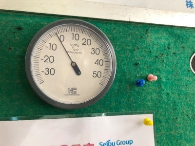
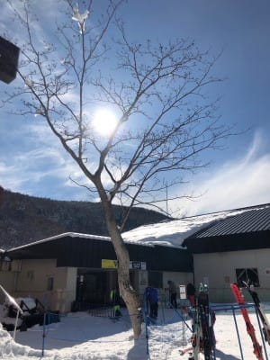
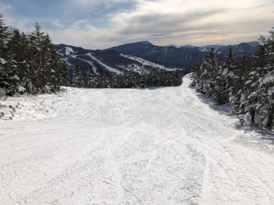

# 明日の志賀高原は晴天！気温はちょっと上がって雪は荒れそう．日曜は曇り後雪，午後に冷えていくよ！

📅 投稿日時: 2021-12-11 00:20:05

えー．

このBlogを読んでいる人の100人中2万人くらいは．

「Skier_Sはまた土曜から志賀高原に行くのね…」

と思っているとお思いでしょうが．

自分も数時間前まで，行く気マンマンで

いたんですが．

体調不良のため，土曜の志賀高原参戦

リタイヤ

ということになりました…（激烈涙）

仕事が休みなのに，スキーに行けないなんて…っ！！

土曜は晴れそうなのに，悔しい…

土曜から，

・奥志賀第2，第3高速ペア

・ダイヤモンドクワッド，ペア

・高天ヶ原クワッド

・焼額第2高速

・横手山第3

・渋峠ペア

が次々オープンし．

コンデションも良さそうなのに．

ちなみに．

今日の志賀高原は．

気温はそれほど低くなかったものの…

昼間は晴天！

バーンは多少硬かったものの，楽しめた

ようです…

あぁ…

シマシマ…

シマシマ滑りたい…

あぁ…

土曜朝は晴天シマシマで．（あさイチはちょっと硬い可能性が高いけど）

一日晴れそうなのに…

あ，土曜の昼間はプラスに気温が

上がって，雪が緩むかな．

午後はバーンが荒れそう．

日曜は朝は曇り．

あさイチは結構締まり気味のシマシマで．

昼に向かって気温が下がり，雪が

降りそうです！

午後は，数cm積もるくらい降るかも？

…ってなことで．

今日はちょっと調子を崩し．

朝から何も食べれずに過ごしました…（泣）

それなのに，朝7時から夜9:30まで

昼休みも無しでWeb会議に出続けてた自分…

ええ．

分かってます．

多分，疲れてるんだと思います…（涙）

ということで．

土曜は一日寝て，体力回復に努めます！

日曜は志賀に復活予定！

## 💬 コメント一覧

### 💬 コメント by (ホンダ)
**タイトル**: Unknown
**投稿日**: 2021-12-11 06:35:03

お大事にしてください。😁

本日ヤケビにて今シーズンスタートします。

今シーズンもよろしくお願いします🙇‍♀️⤵️

また次回お会いしてごあいさつしますね。

12月にこんなに雪があるなんてビックリです。

まだ曇りです。

### 💬 コメント by (カトウ)
**タイトル**: Unknown
**投稿日**: 2021-12-11 12:55:47

いつも楽しくブログを拝見しています。睡眠時間が少なそうで少し心配してました。いくら若くても無理は禁物です。たまにはゆっくり休んで下さいね。

志賀高原の様子を見て懐かしく思い出に浸っています。ありがとうございます！

### 💬 コメント by (レインボー74)
**タイトル**: Unknown
**投稿日**: 2021-12-11 14:27:37

土曜日の志賀高原情報

唐松が新たにオープンor 奥志賀リフトオープン

昨夜は蟹を食べながら選択に悩んで悩んで(？)とうとう寝たのは午前様。

ゴンドラは混むとみて二高へ。

あれっ！ 8時10分なのに誰もいない。奥志賀へ行った友人から送られたエキスパートのガタガタ写真を見て、ガッツ！

唐松ファーストget。

数本滑ってニゴンに行くと7~8分待ち。

パノラマ~サウスは良質な雪。唐松はやや硬め。

しばらく唐松で遊んで、そろそろ空くかなと思ってニゴンへ行くと！！

長蛇の列と人口密度に嫌気がさし、そのまま超早めのリタイアです。エス様からみたら、なんと贅沢な、でしょうね。

### 💬 コメント by (かず)
**タイトル**: Unknown
**投稿日**: 2021-12-11 21:12:07

Sさん体調不良で休むなんてあるんですね…初めて聞いたかも！来週足慣らしに行く予定です 今シーズンもパウダー予報よろしくお願いします！

### 💬 コメント by (Skier_S)
**タイトル**: 明日は志賀復活！
**投稿日**: 2021-12-11 23:00:23

＞ホンダさま

シーズンスタートご一緒できず残念です…

でも明日復活しますのでよろしくです！

＞カトウさま

コメントありがとうございます～！

もう若くないのですが（笑），今日はゆっくり寝ました．

無事復活です！

＞レインボー74さま

唐松今シーズンファーストだったんですね．おめでとうございます！

パノラマ-サウスは良かったんですか．明日が楽しみ！

＞かずさま

体調不良でスキーに行かなかったなんて，何年振りか…

以前に休んだのは，もう忘れるくらい昔の話です…

パウダー予想やっていきますので，お楽しみに！

