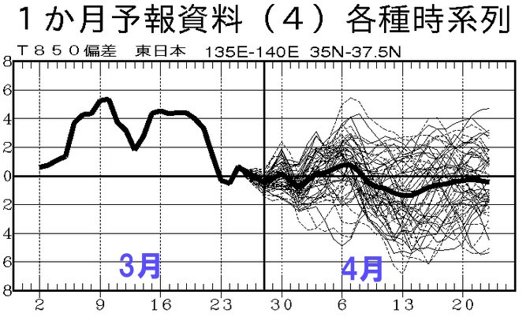
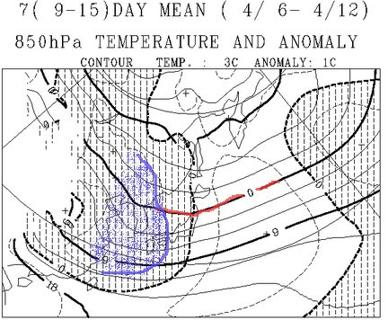
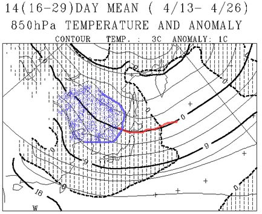

# この4月は冷えるのかっ!?…残念ながら平年並みのようで…

📅 投稿日時: 2013-04-05 00:17:09

あー．

残念ながら[予想が当たって](e454540fe07f4502c25c6020e24078363.md)しまい．

「何じゃこりゃぁ」

っていいたくなるほど暖かくなってしまった3月が過ぎ．

4月に入ったわけですが．

この，

「なめとんのか！」

ってほど暖かかった3月のおかげで，雪がかーなりの勢いで減ってしまい．

『…GWまで雪がもつんかいな？』

って心配になっている今日この頃．

さて．

この4月は例年より暖かいんでしょうか，寒いんでしょうか…

占ってみましょう～．

で．いつもの専門天気図から．

めったに見ない，FCVX14ってやつを見てみましょう…

これは，東日本の850hpa気温の平年比ですが．

3月は例年より4度くらい高い日が続いたことが分かりますね～．

…暑かったわけだ．

で，4月は…

…

…

なんだか，平年並みみたいですね．

で，FCVX12を見てみると…

4月6日～12日は．

赤くマークした850hpaの0度線は大体東北近辺．

んで，網掛け部分が例年より気温が低いところ．

特に，青くマークしたところは1度以上低いところですが…

志賀高原は残念ながら，青いマーク内には入ってませんね…(残念)．

ぎりぎり，例年よりわず～かに低い，ってところでしょうか．

では，4月下旬の13日～26日はと言いますと．

0度線は津軽海峡あたりまで北上しちゃいますね～．

でも，本州は例年より低い温度域にすっぽりと覆われてます．

やったー！

と，思うのはちょいと早い．

志賀高原，ここでも青くマークした，例年より1度以上低いエリアには入ってません．

…要するに．

例年よりゼロコンマ数度低いだけ…ってことですね(涙）．

ってことで．

この4月も．

「超ひえひえになってちょうだい～！！」

っていう，スキーヤーの願いは叶いそうにないです(泣）．

…でも．

例年より暑くなるよりはましかも…

と，自分を慰めてみる(悲）．
