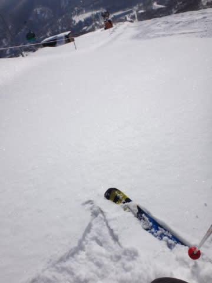
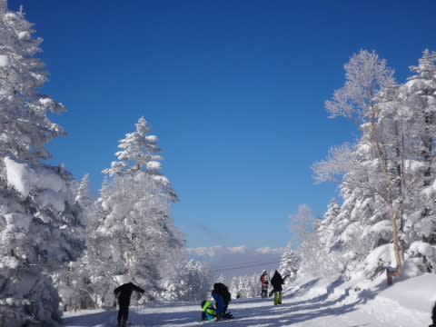

# 2月11日，祭日の志賀高原は…晴天！最高！今シーズン文句なく最高の一日！

📅 投稿日時: 2016-02-11 21:08:55

というわけで．

昨日予告したように．

本日から4連続志賀高原に来ているわけですが．

一日目，本日の焼額山の状況をば…

昨日は一日，けっこう雪が降ったようで．

上林チェーンベースからは本格的な雪道になっていますね～…

で．

本格雪道を登り切ってやってきた，志賀高原．

焼額山頂に出ると…

うぉぉぉぉ！

ををををををを！

すんばらしい晴天っ！！

そして，気温も-9度と冷えていて…

ゲレンデは…

うひょーーーーーっ！！！

プレミアムグレード超冷え冷えフカフカやわらか激烈快適圧雪バーンっ！！！！！

これだーーっ！

志賀高原はやっぱりこうじゃなきゃ！！

今シーズン．

雪不足＆異常高温の今シーズン．

この，最高ぴかぴか晴天の中…

こんな超シアワセシマシマバーンを滑れる日が

やっと来たよ～っ！！！！！

んもう，最高っ！！！

今シーズンぶっちぎりの最高の朝．

ってか，やっと今シーズンが始まった感じ…（感動の嵐）

で．

昨晩はちょっと積雪があったようなので．

オリンピックコースへ出てみると…

ふむ．

足首パフくらいか…

残念ながら，それほど深いパウダーではなかったけど．

朝の1-2本は，おいしくいただきました～っ！

雪も結構軽く，シアワセ．

ああ…なんてシアワセ．

そう，やっぱり普通，1月や2月の志賀高原って，

こうじゃないと…！

＃このシアワセは長く続かないけど…明日以降，気温が…（涙）

で．

平日の谷間の休みってこともあり．

ゲレンデの人は，普通の土日よりは少なく．

コース上の人口密度が高いタイミングでも，

せいぜいこの程度．

かなり快適に飛ばせます！！

ゴンドラも，ガラガラ！

いやーーー！

シアワセ！

こんなシアワセでいいの…

…と，思っていたのだけど．

昼頃になると．

この，ぴかぴか晴天のおかげで．

あれ…

雪が，ちょっと固まり気味に…

そして，

あぁ…

残念なことに．

昼間の気温は，プラスになっちゃいました…

この強烈な日差しと，プラス気温の相乗効果で．

…ちょっと，ゲレンデの雪が，

固く押し固められたみたいな雪質になっちゃって…

手でひっかいてみても，この程度しか

へこまない固さになっちゃったんですけど…？

そのおかげで．

人はそれほど多くないとはいえ．

午後に向かってはちょっとゲレンデが荒れはじめてきました…

…まぁ，人が少ないから，

それでもガンガン滑れるし．

これまでの雪不足に比べれば，

涙が出るほどのいいコンディション！

飛び石4連休で，明日も休みの人が多いのか．

今日は，意外と午後もゴーストタウンになることはなく．

夕方には，雪がしっかり固められた感じの，

かなり凸凹したバーンになっちゃいました…

でも．

ピカピカ晴天の中．

ゲレンデもかなり空いていて．

凸凹していたとはいえ，先週末のように，

下地がアイスバーンになるようなこともなく．

夕方リフトストップまで，快適に楽しめた，

今シーズン文句なく最高にベストな一日でした～！！！！

…

で．

明日以降の天気ですが．

…明日は気温が異常に上がって，春のような雪になりそうですが，

まぁ，晴れるだけましかな…

そして，終末…もとい．週末は．

…なんだか，訂正しなくていい感じ．

やっぱり終末が来そう…（涙）．

13，14日の土日．やっぱり平年比+12度レベル…（泣）

まぁ．

土曜の地上天気図はこんな感じで，

降水域の予想は志賀高原を外れているので．

土曜は今にも降りそうな曇り空ながら，

なんとか降らずにもちそう…

しかし．

しかしだ．

日曜の地上天気図は…

なんだ？？

この，

980hpaクラスの，台風並みの低気圧は！？

そして，降水域は日本全国を覆っているし…

さらに，850hpa気温図はこんな感じで，

志賀高原には水色で描いた+9度線が…

これは…昼間は+10℃くらいまで気温が上がり，雨．

日曜は，朝から雨です（涙）

ってか．

ちょっと待てよ．

この850hpa図を拡大して見ると…

…

…え？

この，赤丸で囲った，これ．

風速60ノット！！！！？？？

風速30m以上なんですが…（激烈な涙）．

…皆さん．

このままの天気図では．

日曜は，激烈強風な雨です．

ゴンドラが動かないどころか，リフトも動かせるのか？？？

という，風速30mクラスの激烈な南風が吹き付け，

さらに雨降りという．

壊滅的な天気です（止まらない涙）

…はい．

そうです．

まだ，踊りの手を緩めてはいけません．

ひたすらひたすら，

気温冷え冷え，雨じゃなく雪になって，さらに風よ収まれ踊り

を踊り続けるしか，救われる道はありません…っ！←なんだか，踊りの要求レベルがすごく上がってないか？

皆さん，ひたすら踊り続けるのだっ！！！！！

## 💬 コメント一覧

### 💬 コメント by (れお)
**タイトル**: 今日は最高でした!!
**投稿日**: 2016-02-11 21:58:20

>プレミアムグレード超冷え冷えフカフカやわら>か激烈快適圧雪バーンっ！！！！！

↑まさに今日はこれでしたね♪

やっぱり志賀高原は、こうでないと!!

週末スキーの予定は未定なのですが、とりあえず、いちスキーヤーとして、全力で踊っておきます～!! 笑

### 💬 コメント by (KENKEN)
**タイトル**: 最高でした2
**投稿日**: 2016-02-12 07:33:58

昨日は最高のコンディションでシマシマバーンを堪能させて頂きました。

あと無事に帰りつきました。

(ご心配お掛けしました)

これから開店休業状態だろう会社に向かいます。

(自分も休みたかった)

会社のトイレで冷え冷え踊りを踊っておきます。

### 💬 コメント by (デーコン)
**タイトル**: Unknown
**投稿日**: 2016-02-12 22:19:18

こんばんわ。

うまそーなパフですね。

ただいま岐阜の恵那に出張中です。

うらやまです。

恵那ルートインより。

### 💬 コメント by (Skier_S)
**タイトル**: 今日も晴天
**投稿日**: 2016-02-12 22:35:21

＞れおさま

昨日はどうもでした～！

木曜は最高でしたね！！

毎日あんな感じだったらいいんですけど…

この週末，日曜はやっぱりダメな感じです（涙）

明日はまだ気温は高いなりになんとか

雨にならずに済みそうですが…

＞KENKENさま

木曜はシアワセな感じでしたね～．

今日，会社に行くのがもったいない感じだったのでは．

このままだと，日曜は壊滅っぽいので

引きつづき冷え冷え踊り，お願いします～．

### 💬 コメント by (Skier_S)
**タイトル**: デーコンさま
**投稿日**: 2016-02-12 22:47:24

あれ？

スキーじゃなく出張なんですね…

パフパフは軽くてよかったです．

もう少し深いとよかったんですけどね～．

今日は重い雪になって残念…

これから日曜にかけて，雪はひどくなる一方です（涙）

