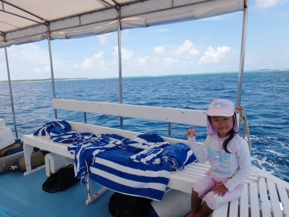
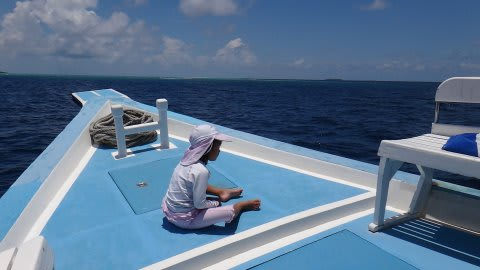
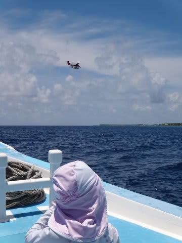
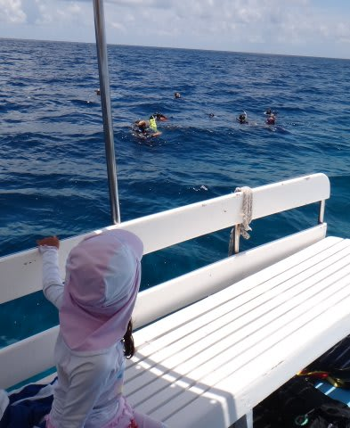
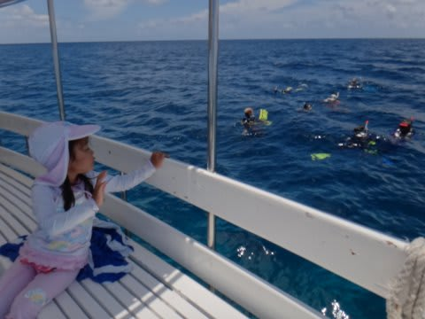
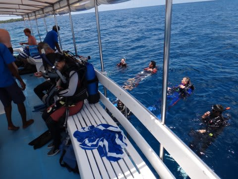
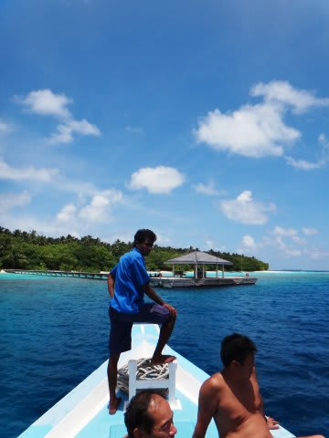

# 2012年　子連れモルジブ　ダイビング旅行記　その20

📅 投稿日時: 2012-11-23 00:22:58

あー．

実は．

実は．

この3連休．

いろいろあって，スキーに行けないのだ…

ということで．

今日はまたダイビングレポートをば．

-----

娘，このままずっと寝たまんまなんじゃないか…？

って思ったころ．

むっくりと娘は起き上がりました．

…ボートのゆれがよっぽど気持ちよかったんでしょうね．

2時間くらいは寝てたかな…

で．

娘はしばし舳先で日向ぼっこ…

モルジブの海の上で．

娘と波の音を聞きつつボーっと過ごすこの時間．

いいもんだねぇ．

＃と，ダイビングにいけなかった悔しさをごまかす

何もすることがないボートの上で，

海をボーっと見つめ(シャレではない)．

かれこれ30分ほど過ごすと…

「なんだか浮かんできた～」

ガイドがあげるフロートが浮き上がり．

ボートはそちらに向かって走り始めます．

「おかえりなさい～！」

そうしてダイバーがボートに上がってきます．

妻にダイビングがどんなだったか聞いたところ…

あー．

そうですか．

マンタ見れましたか．

いっぱいいましたか．

ダイビング中，エントリー直後からエグジットまで，

ずっといましたか．

そうですか．

ああ，よかったねぇ．よかったねぇ．

(かなり口惜しい）

といっていたところ．

ガイド「あ！マンタ！」

ボートの真下をマンタが通過！

私「娘，マンタ見えた？」

娘「見えた．大きかった～！」

ということで．

なんと．今回．娘も初マンタをGet!

＃水族館では見たことあるけど

って感じで．

予想外に娘もマンタを見れたし．

満足のみんなを乗せ，ボートはリゾートに戻ります…

