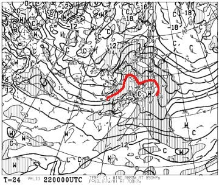
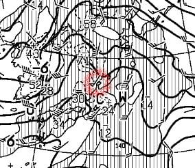
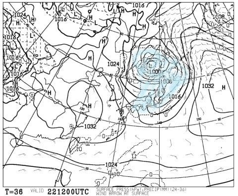
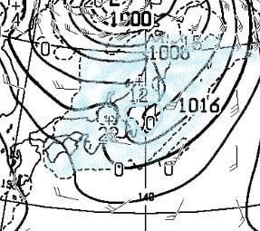
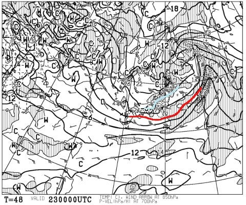
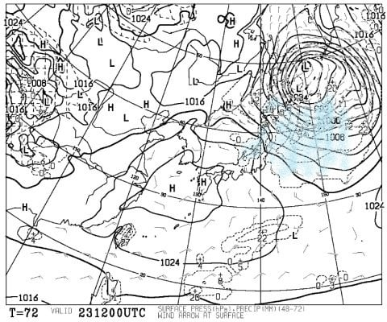
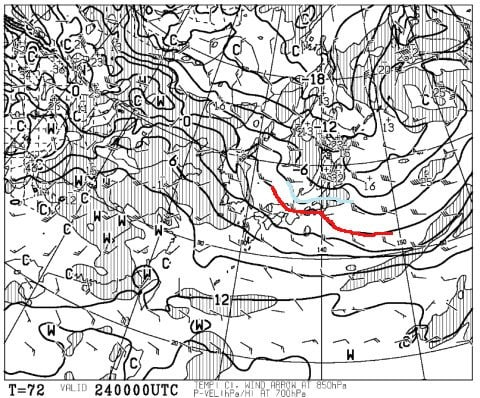
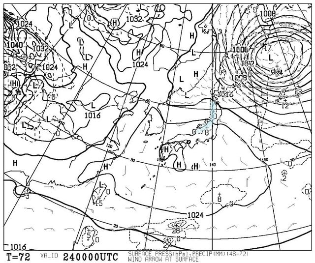

# 22日土曜の志賀高原は，山頂は雨にならずに済むかも？？でも，強風（涙）．23日は冷え冷え雪降り，24日月曜朝は最高！

📅 投稿日時: 2020-02-22 00:01:23

えー．

明日から3連休なわけですが．

気になる志賀高原の天気，直前最終予想っ！！

まずは22日土曜日．

…赤い0℃線，朝からやっぱり

志賀高原より北ですね…（涙）

降れば雨の可能性も高いですが．

0℃線と3℃線の中間くらいなので．

これなら，標高が低いところは

ヤバいけど．

山頂は雪になるくらいの気温だよ！？？

思ったより気温は高くならずに

済みそうな感じ！！

…しかし．

拡大してみてみると…

なんだ！！これは？？

風速50ノット越え！？？

…ヤバい．

これはヤバい．

土曜日，朝からゴンドラが動かない可能性大…（激泣）

南風なので，奥志賀だけじゃなく，焼額も

アウトっぽいです．

1ゴン，2ゴン揃って討ち死にになるかも…（涙）

でも．

22日土曜の地上天気図を見ると，

全国を降水域が覆っているものの…

拡大すると，長野付近のみ降水域がない

エリアがぽっかりとあいてます！

…これ，志賀高原．

ほとんど雨が降らずに済みそう，

ってことですね．

まぁ，山頂は雪になりそうな気温

ってのもあるし．

雨でゲレンデがやられる可能性は

かなり小さくなりました…！！！

（風でゴンドラ動かなさそうだけど（涙））

で．

翌日の23日の日曜日．

気温は，水色の－6℃線が志賀高原に

かかるくらいなので．

朝は－8℃前後まで冷えた冷え冷えになりそう！

…なんですが．

昨日段階での天気図では，

23日はドサドサ降ってくれそうだったところ．

完全な西風パターンで，それほど

大量には降らなさそうな感じに

なってます…（涙）

でも，運が良ければ．

朝までに10cm，昼間も10cmの

計20cmくらい積もってくれるかも…

運が悪ければ，それぞれ1－2cmで

終わっちゃうかも（泣）

で．

3連休最終日，24日ですが．

この朝も，－3℃線が志賀より南なので．

まぁ，朝は－7℃程度かな…

で．

地上天気図は，高気圧に完全に覆われて

いるので．

おそらく，朝から晴れそう！！

24日の月曜は，すっきり晴天，

朝は昨日の雪が圧雪されたシマシマで．

この日は昼間の気温はちょいとあがるものの，

グッドコンディションの一日に

なりそうな感じ！！！

ってことで．

まとめると．

22日(土)：朝の気温は山頂で0℃前後，麓はプラス（涙）

　朝から強い南風で，焼額や奥志賀のゴンドラは

　ヤバいかも．一部リフトも止まりかねない風（泣）

　天気は朝から曇り．昼間はプラス気温で南風が

　吹き付け，雪が緩みそう．

　午後からぽつぽつと降り始める．

　標高が高いところはおそらく雪．

　サンバレーとか，標高が低いところは

　雨っぽいかも…

　でも，リフト営業終了まで，降っても

　せいぜいポツポツ程度．

　ひどい雨にならずに済みそう．

　夕方から夜半にかけ，一気に気温が下がり

　雪が降り始める．

23日（日）：昨晩からの積雪が，運が良ければ10cmほど？

　運が悪ければ2－3cm．

　朝は－8℃程度と冷え冷え！

　あさイチは圧雪の上にうっすら新雪．

　…朝はまだ強い風が残ってるかも…

　奥志賀ゴンドラは朝ヤバいか？？

　でも，昼ごろには風も止む．

　朝から曇ったり雪が時折強く降ったり．

　西風気味なので，時折晴れるかも．

　昼間も雪が数cm積もりそう．

　この日は昼間も気温はそれほど上がらず，

　冷え冷えのいい雪！

　でも，急斜面はガリガリした

　硬い下地が出てきそう

24日（月・祝）：朝は－7℃程度．

　朝から晴天！！

　昨日の雪が圧雪された，冷え冷えの

　いい感じのシマシマバーン！！

　朝は冷えて最高！

　この日は終日晴れ．

　昼間は気温は0℃近くまで上がるけど，

　南向き斜面の一部以外はいい雪質を

　キープ．

　いい感じのスキー日和

…って感じでしょうか…

ってなことで．

明日から3日間，いつも通り

志賀高原で滑ってます～！！

…あと3時間後に出発なので，

2時間半しか寝られない（涙）

## 💬 コメント一覧

### 💬 コメント by (西館)
**タイトル**: 2/21(金)22:00時点は道路は乾燥していました。
**投稿日**: 2020-02-22 00:01:47

毎週末は湯田中で前泊して翌朝志賀高原へ上ってくるのですが、今週は金曜日22:30にお宿に着きました。

道路は完全に乾燥していましたが、蓮池上からトンネル内は凍結しているように見えました。

どうぞ皆様、お気を付けてお越し下さいませ。

### 💬 コメント by (Skier_S)
**タイトル**: ＞西館さま
**投稿日**: 2020-02-22 00:28:24

コメント早！

ありがとうございます．

注意して上がります…

### 💬 コメント by (takaaturyou)
**タイトル**: Unknown
**投稿日**: 2020-02-22 09:34:29

先シーズンは、S様の出張で、運悪くお目にかかれませんでした。

23.24日行きますので、頑張ってお声掛けします！

### 💬 コメント by (いちと)
**タイトル**: Unknown
**投稿日**: 2020-02-22 20:20:14

強風と雨？みぞれで16時前で引退しました

明日、頑張ります！

### 💬 コメント by (m&t)
**タイトル**: Unknown
**投稿日**: 2020-02-22 22:16:43

終礼まで頑張ろうと思っていたら3時過ぎに1ゴン2ゴン3高がやはり運休。4ロマに1回乗ったものの、びしょ濡れになり流石に退散しました。3時まで持っただけラッキーかな!

次は29日1日に出動しますので、また、よろしくお願いします!因みにmが黒の上着tが緑の上着ですよ・・・。

### 💬 コメント by (あつし)
**タイトル**: Unknown
**投稿日**: 2020-02-22 23:46:36

Sさまの天気予想に従い、23日と24日の予定を入れ替えて、24日にヤケビに家族で行きます！やっぱり今季初志賀の妻と子にはサイコーのヤケビブルーを堪能させてあげたいので。

### 💬 コメント by (Skier_S)
**タイトル**: 今日は悲惨な一日
**投稿日**: 2020-02-22 23:55:37

＞takaaturyouさま

明日から参戦ですか！！

おそらく焼額第1ゴンドラグルグルしてると思いますので，

発見してやってください…！

＞いちとさま

16時を過ぎてから，止みましたよ（笑）

明日は営業開始後から雪が降りはじめ，視界が悪化して

ゲレンデがモサモサになっていきそうです…（泣）

＞m&tさま

なぜか，服の色が逆だと思いこんでました…

私の記憶力は結構いい加減なので（笑）．

でも，今日は悲惨な一日でしたね…（涙）

次は来週末ですね．

またお会いしましょう！

