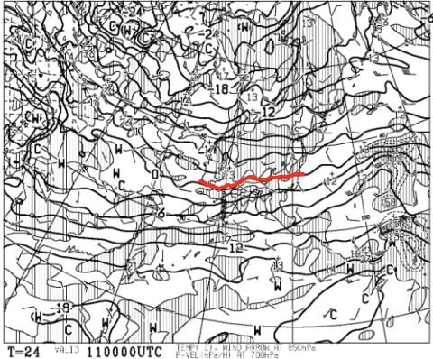
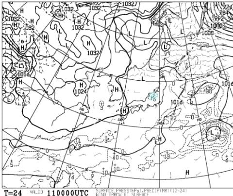
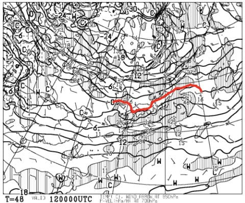
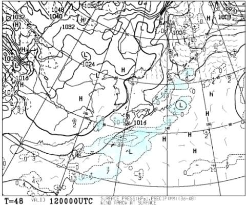
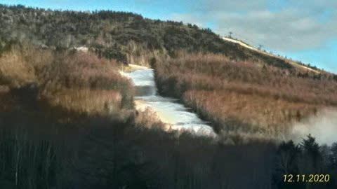
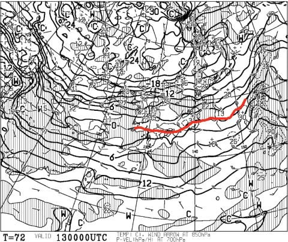
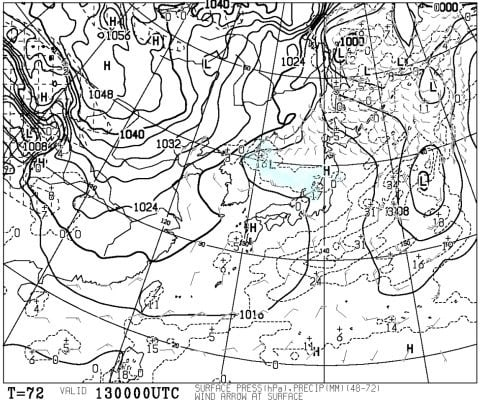
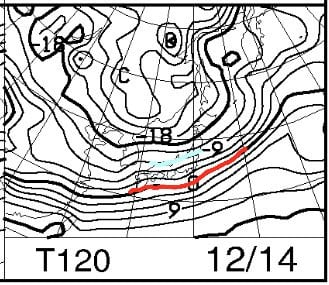
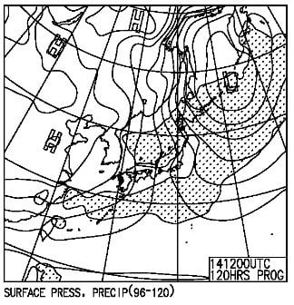

# 12月12，13日の週末の志賀高原スキー場の天気は？…曇り時々雪がちらつくけど，ほとんど積もらなさそう

📅 投稿日時: 2020-12-11 07:59:24

🏷️ カテゴリ: [スキー天気予想](c6554f5c3c106093b511a8daae23757e8.md)

ということで．

昨日も床で寝てしまったSkier_Sです．

だもんで，朝に更新！

今週はいろいろばたばたしており，

本来なら水曜深夜の天気予想金曜の朝に

なっちゃいましたが…（涙）

今週末の予想です！

とりあえず，今日の11日金曜は…

850hpaの赤い0℃線は，ギリギリ志賀高原．

地上天気図は，水色に塗った小さい降水域が

かすかに新潟県日本海側にかかってる

程度なので…

まぁ，志賀は降らないでしょう．

ということで，今日の志賀は，曇り〜晴れ．

天然雪は期待できず（泣）

そして，週末の12日土曜日の850hpa気温図は…

うーーーーーむ．

これも赤い0℃線はギリギリ志賀高原に

かかるかどうか．

この位置だと，早朝は人工降雪機が

動かせるくらいの気温なんだけど…

地上天気図を見ると，これも日本海側に

ギリギリ降水域がかかるくらい．

これだと，志賀高原は曇り空で，

かつ湿度が高そう…

これは，放射冷却もないので

朝はそれほど冷えず．

また，湿度も高いので人工降雪は

それほど打てなさそう…

うーむ．土曜の朝，天然雪もないけど．

人工降雪もあんまり期待できなさそうな感じ…

うーん…

この状態だと．

金曜朝8時の焼額第2高速沿い，

唐松コースの写真を特派員の方から

いただきましたが．

金曜朝がこの状況で，そして今日の

人工降雪もそんなに期待できないとなると．

明日土曜の焼額，第2高速リフトの

オープンはきわどい感じ…（泣）

で．

13日の日曜ですが…

0℃線は12日よりはわずかながら南に

下がってくれてますね…！

そして，地上天気図を見ると．

この日も日本海側に水色の降水域が

かかってますが…

ギリギリ志賀高原は降水域に

かかるかどうか．

そして，ちょい西風気味なので，

志賀はそれほど降らなさそう．

積雪は1cmあるかないかですね…（泣）

でも，1cmでも積もってくれると

雪質はかなり良くなるんですけど…

…しかし，この日も第2高速動かすのは

きわどいかな…

動いて欲しいけど…

…ってことで．

まとめると

12日土曜：朝から終日曇り．

　気温はそれほど冷えない．

　昼間はプラス2-3℃まで上がるか．

　人工降雪は早朝にわずかに動かせる程度で，

　人工降雪の積み増しもあまりない．

　朝イチは人工降雪が圧雪された締まったバーン，

　午後は急斜面は下地のちょっと硬い

　ところが出てくるか…

13日日曜：運がよければ，朝までに

　1cmほど天然雪が積もるか？

　終日曇り，時折積もるほどではない

　雪がぱらつく．

　天然雪が1cmでも積もっていれば，

　朝は柔らかめの最高圧雪！

　天然雪が無ければ締まった圧雪．

　昼間は0℃をわずかに上回る．

　雪は終日締まった状態をキープ．

　でも，天然雪の積み増しは無し…

という感じでしょうか．

うーん．

この週末も天然雪の積み増しは

全く無いです…（激涙）

と，14日の月曜の850hpa気温図を見ると．

ををををを！

やっぱり来週は冷える！

赤い0℃線は太平洋側まで下がり，

志賀高原には水色の-9℃線が！

志賀は朝は-10℃以下まで下がるよ！

そして，月曜の地上天気図を見ると…

うほーーー！

本州上は等圧線が縦縞の

見事な冬型！

これは…降る．

積もるよ！！

来週は14，15，16と，月曜から水曜まで

ずっとこんな感じの天気図なので，

来週前半は冷える！！

そして，積もるよ！！

…もう1-2日早く降ってくれれば，

今週末に間に合ったのに…←かなり多くの人がツッコミたい思い

とりあえず，来週末に期待っ！！

## 💬 コメント一覧

### 💬 コメント by (ゆーき)
**タイトル**: Unknown
**投稿日**: 2020-12-11 23:22:00

正式に第4ペアだけって宣言しましたね

少し前に電話で聞いたので、

更新してくれたのかなｗ

写真がオフィシャルに出ていましたけど、

そりゃ厳しいわってかんじですね

今晩がんばっても無理って言っていましたけど、

まさにそんなかんじでした。

明日も私は焼額山に行きます、

土→日に、奇跡的にふってくれることを祈ります

### 💬 コメント by (Skier_S)
**タイトル**: ＞ゆーきさま
**投稿日**: 2020-12-12 00:05:42

たった今，私の記事も更新しました（笑）．

いや，これはやっぱりオープン無理ですよね…

残念ながら4ロマのみですが，焼額でお会いしましょう！

