# 2022/2/19(土)の志賀高原焼額山スキー場は…晴れのち曇り，気温はそれ程低くなかったけど雪質Good！ゴンドラちょい混み

📅 投稿日時: 2022-02-20 00:46:43

🏷️ カテゴリ: [2022スキー滑走日記](cc9cb73e4320f6a97af6fccc37587a61a.md)

ってなわけで．

本日も志賀高原で滑ってたわけですが…

今日も雪が良くて，いい感じの一日でした～！！

まず．

朝の志賀高原の登り坂は，上林チェーン

チェックから志賀高原定番の本格雪道！

でも，朝に積雪はなく，除雪が行き届いた

しっかり踏まれた雪で安心して登れます．

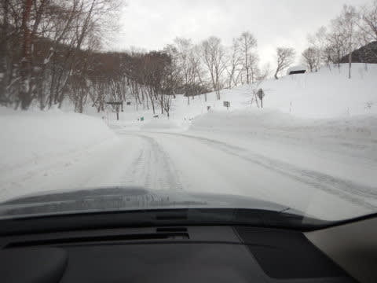

そして

当然ゴンドラ営業開始前に並ぶわけですが…

今日は待ちが少ないですね．

先週に比べれば，そんなに混まなさそう．

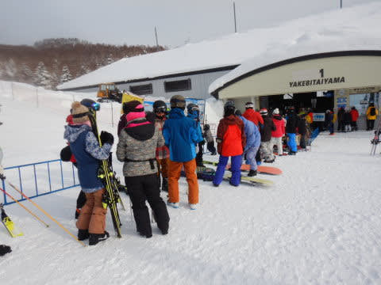

ってなことで．

8:30営業開始の朝イチゴンドラで山頂へ上がると…

うっすら雲が出てるけど，ゲレンデに日が射す，

いい感じの天気！

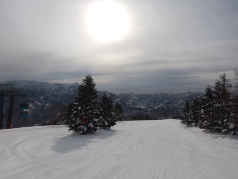

そして，朝イチの気温は－8℃と，

予想の－10℃よりちょっと高め．

晴れの放射冷却でもう少し冷えると踏んだん

だけどな…（ちょい涙）

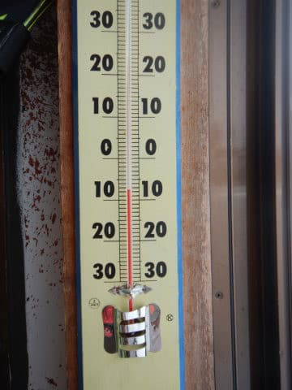

とはいえ，あさイチバーンは冷え冷えの

シマシマ！！

雪質は予想通りの柔らかめの，

トップシーズンならではシマシマですっ！

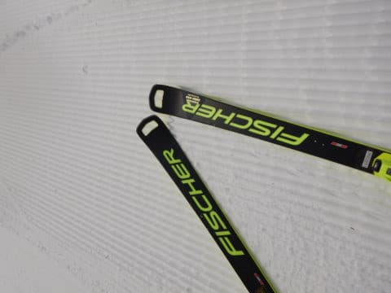

このシマシマをいただくのだ！！

晴天の下の，トップシーズン冷え冷え

やわらか雪質のシマシマ！！

運の悪いシーズンだと，シーズン数回

あるかどうかという，最高グレードの

ごちそう，いただきますっ！！

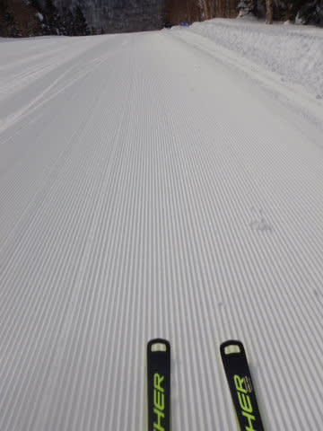

…見よ！！

このヤケビクオリティの段差のない見事な

シマシマを！！

焼額の圧雪のきれいさ，段差のないまっ平らさは，

他のスキー場と比べればよくわかります…

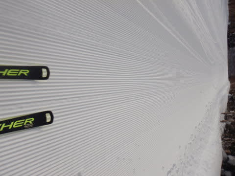

ってなことで，最初の数本は人も少なく，

最高級のシマシマ雪を思う存分堪能…

あぁ…今シーズンは晴れのシマシマを何度も

滑ることができて，恵まれてる…（感動）

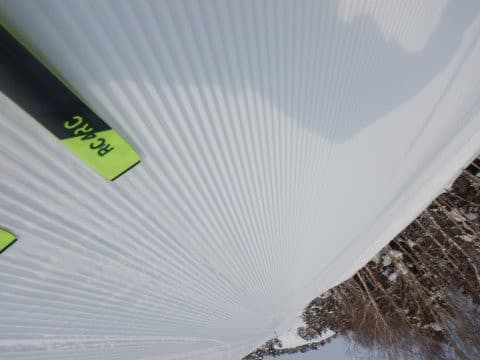

しかし．

朝のうちしばらく，気持ちよく晴れた

ゲレンデを滑っていると…

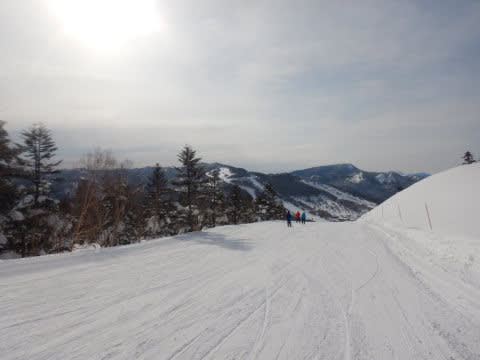

残念ながら，10時ごろには第1ゴンドラの

待ちが10分以上に伸びてきました（涙）

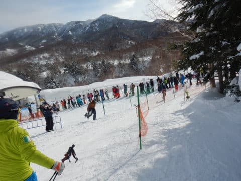

だもんで，第2高速リフト側に逃げますが．

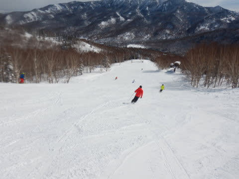

第2高速沿いの唐松コースは混んでおらず，

リフトもガラガラ！

今日はゴンドラが混んでも，リフトは終日

待ちは少なかったので，リフトに逃げれば

快適にリフトグルグルできました！

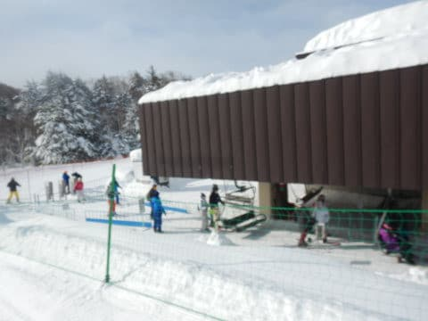

朝10時から混み始めていた第1ゴンドラも，

午前11時にはゲートの外にちょっと列が

伸びるかな？

という程度の待ち時間まで短くなったので．

11時以降は，またひたすら第1ゴンドラ

グルグル！！

第1ゴンドラ沿いのGSコースも，人が少なく

雪が柔らかかったのにコースは荒れず．

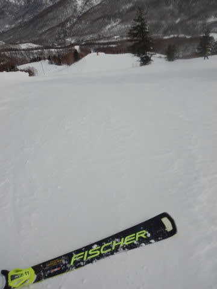

そして，昼間になっても最高気温はせいぜい

－4度程度までしか上がらず．

晴れていたのに，雪質は終日いいまま！！

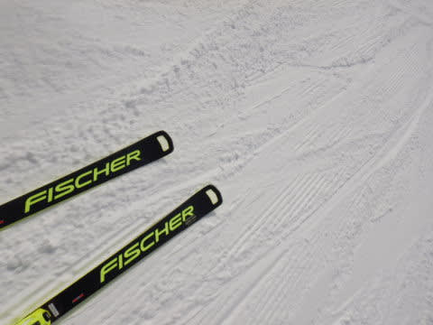

いやー！

今日もこのままガラガラ，最高雪質で

終わってくれるといいなぁ…

と，思っていたところ．

やはり，午後になると予想通り雲が増えて，

曇り空になってしまい…（涙）

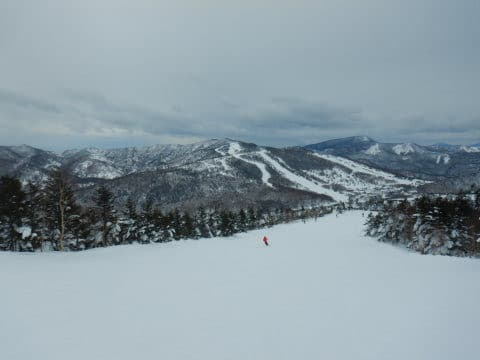

さらに午後2時ごろには，残念なことに

風もちょっと強くなり，ゴンドラが

減速運転に（泣）

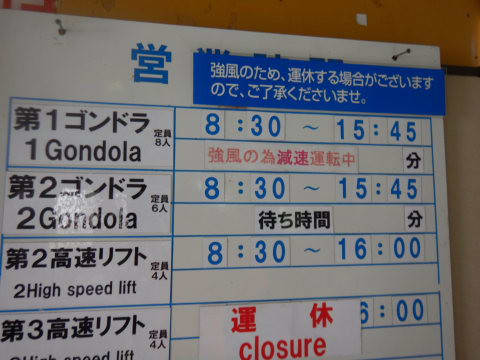

そのため，ゴンドラ輸送力が落ちて，

大変悲しいことに，またゴンドラ待ちが10分

以上に伸びちゃいました（激泣）

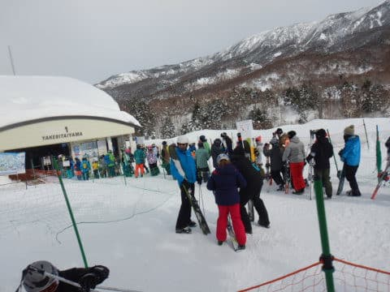

でも．

ゴンドラが混んでる時間も，第2高速リフトは

ほぼ待ちなしで乗れたし．

ゴンドラが混んだのも，午後2時から3時までの

わずか1時間．

3時過ぎにはまた列が短くなり，

相乗りレーンはほぼ待ちなし

にまで戻りました！

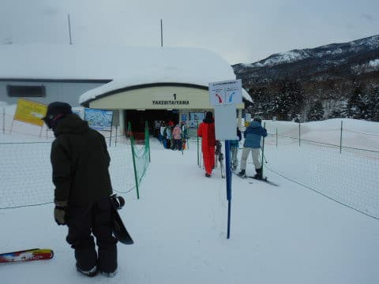

そして，コースもガラガラ！

さらに今日の朝の雪が柔らかったにもかかわらず．

下地がしっかりしていたからか，夕方に

なっても焼額は全く荒れず，快適大回り

フラットバーンのまま！！

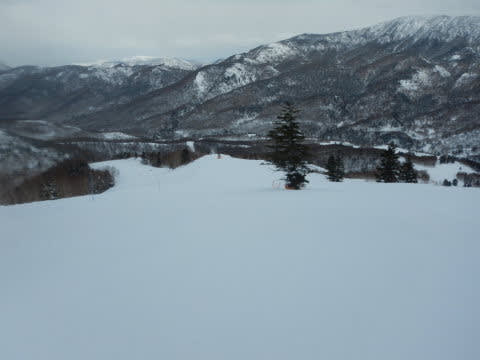

良すぎる！

天気は曇り空になっちゃったけど．

朝から夕方まで，ひたすらいい雪質の

フラットなバーンを大回りし続けられるなんて．

今日は良すぎるよっ！！

で，なんでこんなシアワセなのに，もう日が

暮れちゃうの…？？

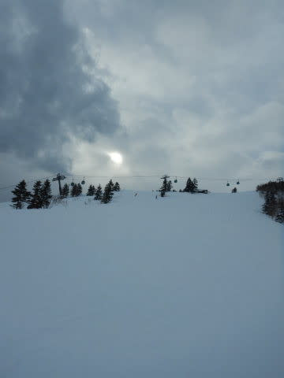

そして…

え？もう営業終了時間？

まだまだ滑りたい！！まだ5時間でも10時間でも

滑りたい！！！

いや，2日でも3日でも滑り続けたい…！！←そんなアホな願いするのはあなただけだから

という願いもむなしく．

無情にも，営業終了時間になってしまったので

した…（泣）

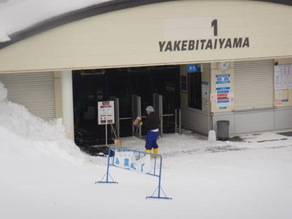

あぁ…

楽しい一日の，なんと早く終わることよ…（涙）

早い．

早すぎる…！！

…

…そんなときには．

はい．

その通り．

ナイター参戦です！！

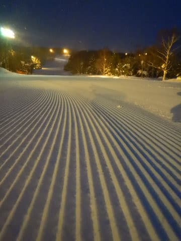

…いや．

せっかくナイターが滑れる焼額2ndシーズン券

買ったんだから，滑らにゃ損…とばかりに

ナイターへ！！

そして，今日2度目のヤケビクオリティーシマシマを

堪能です！！

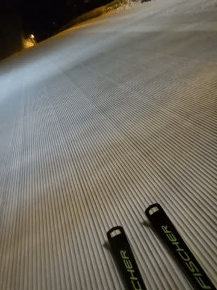

うほーーーー！！

ナイター最高！！

ヤケビナイターシマシマ最高！！

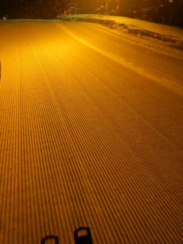

…と，当然のごとくナイターもひたすら

ラストまで滑り続けたのでした…

で．

ナイター営業中は雪が降り続けており．

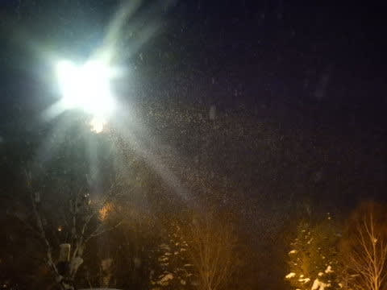

ナイター終了時には，コース脇には結構

雪が積もってたので．

明日の朝には，やっぱり10～20㎝くらいは

積もってくれそうかな！

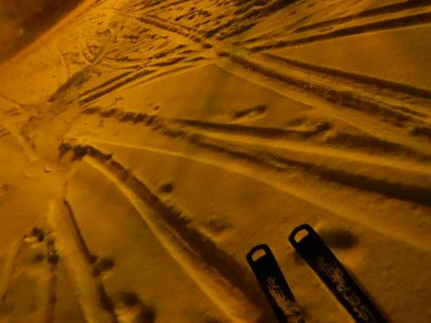

今のところ，降っている雪はそれほど重く

ないです．

予想が外れて，明日の朝はそこまで重くない

雪が積もってくれるといいなぁ…

あとは明日，強風でゴンドラが止まったり

しないことを祈るばかり…

## 💬 コメント一覧

### 💬 コメント by (レインボー74)
**タイトル**: Unknown
**投稿日**: 2022-02-20 15:19:57

日曜日の志賀高原情報

湯田中の朝は、春の重～い雪が8cm。上林0℃　蓮池-4℃　山頂-7℃。

ニゴンスタートで上部はガス。奥志賀はガスの中のようで、すぐにヤケビヘ移動してきた常連さんも。

まずはパノラマからからまつへ。太板なのに綺麗に圧雪された柔らか斜面。チョイスを失敗したけど快適。

やけびをぐるぐるしてから、視界を求めて移動。

ファミリーはまたも非圧雪。コロナの仕業かな？

土日は開くはずの寺子屋も閉鎖。

珍しくタンネが稼働している。一応一本滑ったけど、感動はなし。

西舘は視界良好。雪面は厳しかったけれど、まずまずかな。

高天の銀嶺の味噌ラーメン800円が美味しい。

やけびに戻って少し滑って13時終了。

朝の湯田中の春の雪にがっかりした割には、まずまず楽しめました。明日からはまたパウダーばかり！あーあ！

### 💬 コメント by (Skier_S)
**タイトル**: ＞レインボー74さま
**投稿日**: 2022-02-21 01:40:21

今日は朝はきれいな圧雪でしたね…

予想外しました（涙）

寺小屋はまだしばらく週末も営業しないようです…

23日まではパウダーが続きそうですよ！

