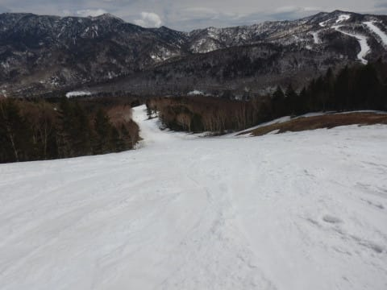

# 2021/4/25(日)の志賀高原スキー場は…概ね曇り空．午前は気温が高かったけど，午後は冷えてこの時期としてはGood！

📅 投稿日時: 2021-04-26 01:28:18

えー．

本日も志賀高原でいつも通りラストまで

滑ってきて．

そして，帰宅後片づけやら板のワクシングやらを

やっているとこんな時間…

今日も6時前に起きて，早朝から滑って

いたのでかなり眠いのですが．

それでも頑張って更新！偉い！←だから，自分で自分を褒めてどうするの？

ってなわけで．

今日も，焼額山の6:30の早朝営業開始前に

並ぶわけですが．

うーん．昨日より営業開始待ちの列は

短いかな？

で．

朝6:30過ぎの山頂での気温が…

なんということか．

すでにプラス5℃(涙）

…ちょっと気温，高すぎない？

でも．

早朝のバーンは…

気温が高い割には，結構固めに締まった，

いい感じのシマシマ！！

これはいい！！

曇り空で日差しが弱まっているので．

昨日みたいに，一瞬で緩み始めることは

なく．

しばらくはいい感じに硬いまま！！

いいぞ…！！！

今日はこのまま晴れないで，

太陽さん，隠れていてくださいね…

…

と，思っていた願いもむなしく．

7時半ごろには一瞬晴れ間が…

この晴れ間の日差しのせいで雪は緩み始め．

晴れたり曇ったりを繰り返していたので，

一気に緩みはしなかったけど．

午前9時前にはかなり緩んだ雪になり…

パノラマコースの廊下は，

かなり滑りが悪い雪に(涙)

だもんで．

久しぶりに焼額の呪いが解けて，

奥志賀へ脱出してみましたが…

(イチゴンは営業してないけど，

イチゴン上の奥志賀連絡通路は

オープンしてます)

奥志賀のエキスパートコース，

かなり重い雪で，人も多く荒れていたので…

速攻で焼額へ復帰！

…焼額へ戻ると．

曇り空で日差しがさえぎられていたので．

雪がかなり滑るようになってました！

うーむ．

日差しが無いと，こんなにも雪が滑って

くれるのか…

そして．

焼額を滑っている人は，奥志賀より

圧倒的に少なかったので…

コースは全く荒れておらず，

いい感じのフラットバーン！

…ゴメン．

焼額，ゴメン．

やっぱり浮気しちゃだめだよね…

と，昼近くまで気持ちよく

滑っていたら．

昼ごろにまた青空が…

いや，青空にならなくていいんだけど．

ってか，青空になってほしくないんですけど…！

おかげで，昼の間また一瞬

板の滑りが悪い雪になっちゃいましたが…(涙）

でも．

私の日ごろの行いが良かったおかげで．

晴れ間はそんなに長く続かず．

1時ごろにはまた曇り空に

戻ってくれて…

それどころか，気温がぐんぐん冷えて，

0℃近くまで下がってくれましたよ！！

雪は重いままながらも，

表面が冷えてくれたので．

かなりいい感じで滑る雪に

なってきましたよ！

と思っていたら．

午後2時ごろに，ちょっとガスが…

でも．

そんなに濃いガスじゃないし．

ガスってるのは山頂付近だけだし．

何よりも，かなり板が滑る雪になり，

そしてガラガラなのでバーンはフラット

ってのがいい感じ！！

コースの下半分は全然ガスってないし．

こんなフラットなバーンを貸し切りで

滑れるとは…！！

…これ，楽しい．

意外と楽しい．

トップシーズンほどではないにしろ．

トップシーズンの天気が悪い日よりは，

ずっと今日の方が楽しいかも？？？

ってなことで．

予想以上に楽しかった今日一日．

やっぱりいつも通り，早朝スタートから

営業終了まで，また昼休みもとらず

ひたすら滑り続けたのでした…

いやー．

楽しかった．

この時期，晴れよりも曇り空の方が，

ずっと楽しい！！

…でも．

今日は楽しかったけど．

コースの一部，ちょっと雪が薄くて

土が見えてきた部分も出てきたので．

GW，雨が降ったり高温になったら，

ちょっとヤバいかも…

…そして．

GWは．

29日は気温が上がって，30日は終日雨(涙）

1日も気温が高そう…

2日は冷えてくれそうだけど…何かが降りそう．

うーん．

このGW，雪が解けそうな天気になりそう(泣）

果たして，GW最後まで無事雪がもって

くれるのか…？？

また後日，GWの詳細天気予想やります！

## 💬 コメント一覧

### 💬 コメント by (ikkun)
**タイトル**: Unknown
**投稿日**: 2021-04-26 03:08:42

お疲れ様でしたm(__)m

日曜日は 地元神社の年一の清掃でしたが……やはり寒かったですよね(・・;)フリース着ながら(笑) 連休は雨予想ですね(泣) 志賀は………ならない様に願います❗

### 💬 コメント by (ikkun)
**タイトル**: Unknown
**投稿日**: 2021-04-26 09:29:25

度々失礼します ゴールデンウィークもお出まし？ スキー学校行っておりましすと他のゲレンデにはなかなかないので( *´艸｀)一度はと(笑)  しかし焼額はヤバいんですか？

### 💬 コメント by (ほっぽ)
**タイトル**: Unknown
**投稿日**: 2021-04-26 18:50:25

Sさん

ケガの方は太もも付けね部分の肉離れでした。

今は内出血がスゴいですが、回復してきている実感があるので、

通院してしっかり治して来シーズンを迎えることにします。

お騒がせしてすみませんでした。

まだまだ続くスキーシーズン、ケガには気をつけて楽しんで下さい。

http://www2.tokai.or.jp/nana_hoppo/

### 💬 コメント by (しんちゃん)
**タイトル**: Unknown
**投稿日**: 2021-04-26 23:35:40

日曜はご一緒出来て楽しかったです！

今シーズンお会いできるのはこの日が最後ですが、今後ともよろしくお願いします。

ほっぽさん、お大事になさって下さいね。

とりあえず、回復の見込みが見えてよかったです。

怪我しないように、私も気をつけますね😌

### 💬 コメント by (ほっぽ)
**タイトル**: Unknown
**投稿日**: 2021-04-27 08:00:44

しんちゃんさん

ご心配おかけして申し訳ありません。

歩き方も大分普通になってきてますので、

しっかり治療して来シーズンに備えます。

しんちゃんさんも昨日でシーズン終了でしょうか。

来シーズンもヤケビでお会いできるのを楽しみにしてます。

### 💬 コメント by (Skier_S)
**タイトル**: コメント回答遅れました…すみません
**投稿日**: 2021-04-28 02:49:57

＞ikkunさま

GWは天気悪そうですね…そして気温も高そうなので．

焼額は，最終日まで雪がもたないかも…

＞ほっぽさま

肉離れですか…大変ですね…

歩けるようになってきたなら良かったです…

しっかり治療して，来シーズンには万全の体調で臨んで下さい！

＞しんちゃんさま

日曜はお世話になりました～！！

月曜は楽しかったようで，良かったですね．

写真使わせてもらいました．ありがとうございます！

### 💬 コメント by (ikkun)
**タイトル**: Unknown
**投稿日**: 2021-04-28 19:26:26

ありがとうございますm(__)m  明日横手とか？しかしマジ雨らしいので……(泣)

### 💬 コメント by (Skier_S)
**タイトル**: ＞ikkunさま
**投稿日**: 2021-04-28 22:56:15

焼額のゴンドラが動いていれば，私は焼額に行っちゃいます…

でも，雨ですから…(涙）

