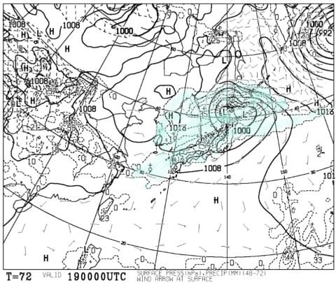
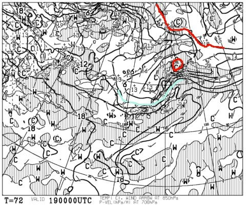
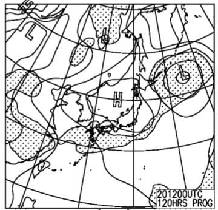
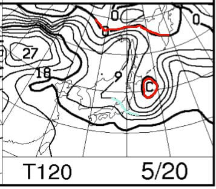

# 5月19，20日の週末のかぐらスキー場の天気は…19日は雨だよ（涙）かなり降るよ…日曜は

📅 投稿日時: 2018-05-17 01:38:26

えー．

かぐらスキー場ですが．

ついに．

みつまた高速リフトを降りてからゴンドラ側に

下りるコースも雪が消えて．

Pislabマットを滑らなくてはならなくなった

ようです…

うーむ．

ここは下りリフトに乗れないから．

Pislabを滑って降りるか，

リフト1本分歩いて降りるかのどっちか

なんだけど…

かぐらに履いていく板は，もう剥離して滑走面が波打ち

まくっている次郎君とはいえ．

[2シーズン前はこんな風になった](e1b4fa147c4a62bf27605f60ff57593b1.md)から．

あんまりPislabマットを滑りたくないんだよなぁ…

みつまたロープウェーからかぐらゴンドラまでの

板のキャリーサービス．

スキーブーツも運んでくれるようだし．

駐車場からスキーブーツは履かず．

歩きやすい靴を履いていって．

みつまたリフトからゴンドラまで歩く

ってのも考えられるかなぁ…

でも．

Pislabマットの下にシートを敷いて，

砂が浮かないようになったから．

ちょっとはマシになったのかなぁ…

ゆっくり滑れば大丈夫かなぁ…

などと，いろいろ考えているSkier_Sです．

ってな感じで．

スキー場もほぼ終わっているこの時期．

滑りに行こうというスキーヤーも，

もういろんな意味で終わっている人たち

だけかと思いますが．

終わっている人向けに，水曜恒例，スキー場の天気予想です！

…でも．

いつもこの時期になると言ってることですが．

この時期，雪が降る可能性は0だし．

雪質も，朝からザブザブの雪なのは決まってて，

このBlog独特の「雪質予想」の出番は全くないから．

…この時期の天気予想は．

雨が降るか降らないかの1ビット情報のみ

を伝えればよいという，

非常に単純な予想なので．

その気になれば，2行で終わっちゃうんですけど…

…とりあえず，いつもの感じで天気予想に

行ってみましょう．

えー．

まず．

19日土曜の地上天気図を見ると…

どどーーーん！！

ダメです．

水色に塗った降水域，日本全国を覆ってます．

ってか，これ，かなりの降りですよ！？？？

新潟県内，土曜一日で30～40mmくらいの

豪雨になりそう…（涙）

どうせ降るのは雨と決まっているから，

いまさら見る意味もなさそうな850hpa気温図も

見てみると…

うーむ．

赤い0℃線がはるか北にあるのは，この時期として

当たり前として．

水色の9℃線が新潟より南にかかっている

くらいなので…

この時期としては，比較的気温が冷えて．

ちょっと肌寒く感じるくらいの気温かも…

あと，風もちょっと出てきそうです．

そして．

日曜20日の地上天気図は…

おっと．

この日は高気圧に覆われて，晴れそうですね！

で．

850hpa気温を見てみると．

この日も，新潟には水色の9℃線が掛かる程度で．

この時期としては気温は低めですね～．

かぐらでも，最高気温は10℃をちょっと上回る程度かも．

ここしばらくの，夏のような暑さは

ひと休みの感じです．

ってな感じで．

まとめると．

土曜19日：朝から雨．どしゃ降り．どうしようもなく終日降る．

　ゴンドラやリフトが止まるほどではないけど，

　風も強めで，荒れ気味の一日．

　気温もこの時期としては低く，冷たい雨に

　打たれ続ける寒い一日．

日曜20日：朝から晴れ！終日晴れそう．

　この日も気温は平年より低め．

　昼間の気温も15度を超えなさそう．

ってな感じでしょうか…

うーむ．

今週末は．

自ら好んで悪天候の雨の中滑りたいという

特殊な性癖を持っていない，

一般的かつ常識的な感覚の人なら，

土曜に滑りに行かない方が幸せになれそうです…
