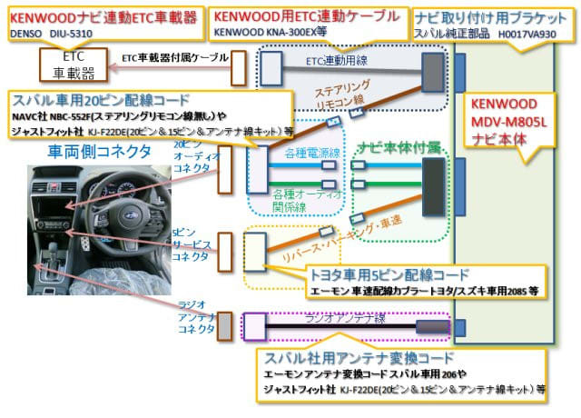

# プロジェクトX2第2章…LEVORG E型にKENWOODナビ取り付け…ナビ取り付けに必要な部品一覧

📅 投稿日時: 2018-09-02 03:49:07

ってなわけで．

長きに渡った，LEVORG E型へのナビ取り付けの連載ですが．

とりあえず，私が人柱（？）となって得た情報を

まとめておきます…

LEVORG C型以前→D型以降で変わった点

・ナビ取り付け用ブラケット

　A～C型：車両に付属　

　D，E型：別途購入

・純正リアカメラ用先行配線のリアゲート側コネクタ形状変更

　A～C型：GJ/GPインプレッサと同じ

　D，E型：SJフォレスタ・WRXと同じ

・車速・リバース・パーキング線取り出し線の仕様変更

　A～C型：ステアリングシャフト横の15ピンコネクタ

　D，E型：ナビスペースの5ピンコネクタ

というあたりで．

こいつに悩まされました…

ってなことなので．

LEVORG D型，E型にナビをDIYで取り付ける際に必要な部品一覧

を書き出してみました．

・ナビ本体

　8インチナビがそのままつきます．

　7インチナビはそのままでは取り付けられないので

　注意！

・ナビ取り付け用ブラケット

　スバル純正を買うしかありません．

　品番：H0017VA930　

　2500円

・20ピンオーディオコネクタ用ケーブル

　これはC型以前と同じものでOK.

　単体だと，[エーモン](https://www.amazon.co.jp/dp/B0044KJKOO/ref=sxbs_sxwds-stvp_1?pf_rd_m=AN1VRQENFRJN5&pf_rd_p=14895845-6b63-47e2-b967-96bf0ca66fcb&pd_rd_wg=KIN1d&pf_rd_r=SPR9K6AR3V6JDKK9H7HP&pf_rd_s=desktop-sx-bottom-slot&pf_rd_t=301&pd_rd_i=B000M3P6AO&pd_rd_w=gjuJW&pf_rd_i=%E3%82%A8%E3%83%BC%E3%83%A2%E3%83%B3%E3%80%802085&pd_rd_r=cc73db37-ddf5-4fe3-8f40-cb36631ea434&ie=UTF8&qid=1534665917&sr=1&th=1)　のモノが，1000円ほどでAmazonで買えますが…

　単体で売っているものは，どうもステアリングリモコン線の

　配線がなされておらず，アースを除くと12本しか線がありません．

　ステアリングリモコン線が配線されている（線が15本つながっている）ものは…

　[カナック企画のNKK-F31P](https://www.amazon.co.jp/%E3%82%AB%E3%83%8A%E3%83%83%E3%82%AF%E4%BC%81%E7%94%BB-NKK-F31P-KANACK-%E3%82%B9%E3%83%90%E3%83%AB%E6%B1%8E%E7%94%A8%E3%82%AB%E3%83%BC%EF%BC%A1%EF%BC%B6%E9%85%8D%E7%B7%9A%E3%82%AD%E3%83%83%E3%83%88/dp/B00XHOCXA6/ref=sr_1_1?s=automotive&ie=UTF8&qid=1535046169&sr=1-1&keywords=NKK-F31P)，あるいは私が購入した

　[ジャストフィット社製のKJ-F22DE](https://www.amazon.co.jp/%E3%82%AB%E3%83%AD%E3%83%83%E3%83%84%E3%82%A7%E3%83%AA%E3%82%A2-%E3%83%91%E3%82%A4%E3%82%AA%E3%83%8B%E3%82%A2-%E5%8F%96%E4%BB%98%E3%82%AD%E3%83%83%E3%83%88-%E3%82%B9%E3%83%90%E3%83%AB2D%E7%AA%93%E5%8F%A3%E8%BB%8A%E7%94%A8-KJ-F22DE/dp/B00N9RNT2C/ref=sr_1_1?s=automotive&ie=UTF8&qid=1535045335&sr=1-1&keywords=KJ-F22DE)などの，

　20ピンコネクタ＋15ピンコネクタ+アンテナ線の三つが

　セットになったキットに含まれるものなら，ステアリング

　リモコン線が配線されています…

　D型から標準装備になった，純正のステアリングリモコンを

　使いたい人は，このキットを買って，15ピンコネクタを

　使わずに捨てるしかないでしょう…

　

・5ピンサービスコネクタ用ケーブル

　これがC型と違うので，注意．

　トヨタ・スズキ・ダイハツ車用の5ピンコネクタと同じものです．

　[エーモンの製品](https://www.amazon.co.jp/%E3%82%A8%E3%83%BC%E3%83%A2%E3%83%B3-AODEA-%E3%82%AA%E3%83%BC%E3%83%87%E3%82%A3%E3%82%A2-%E8%BB%8A%E9%80%9F%E9%85%8D%E7%B7%9A%E3%82%AB%E3%83%97%E3%83%A9%E3%83%BC-2085/dp/B004510FZK/ref=pd_sim_263_7?_encoding=UTF8&pd_rd_i=B004510FZK&pd_rd_r=cda1b713-a387-11e8-88fd-59ccc6f09d99&pd_rd_w=z02Tw&pd_rd_wg=B0P6N&pf_rd_i=desktop-dp-sims&pf_rd_m=AN1VRQENFRJN5&pf_rd_p=053a78c4-e34f-47d4-9426-4d23f47a211d&pf_rd_r=H03PD0G0D8BBCETSHMP4&pf_rd_s=desktop-dp-sims&pf_rd_t=40701&psc=1&refRID=H03PD0G0D8BBCETSHMP4)が，Amazonから買えます．

　500円ほど．

・ラジオアンテナ線接続ケーブル

　これがなかなか単体で売ってないのですが．

　おそらく[エーモンのこいつ](https://www.amazon.co.jp/%E3%82%A8%E3%83%BC%E3%83%A2%E3%83%B3-AODEA-%E3%82%AA%E3%83%BC%E3%83%87%E3%82%A3%E3%82%A2-%E3%82%A2%E3%83%B3%E3%83%86%E3%83%8A%E5%A4%89%E6%8F%9B%E3%82%B3%E3%83%BC%E3%83%89-2066/dp/B001JC22J0/ref=pd_sbs_263_1?_encoding=UTF8&pd_rd_i=B001JC22J0&pd_rd_r=a33ac456-a387-11e8-891c-4b4ffb0a7bc7&pd_rd_w=eh5ol&pd_rd_wg=VuI0y&pf_rd_i=desktop-dp-sims&pf_rd_m=AN1VRQENFRJN5&pf_rd_p=cda7018a-662b-401f-9c16-bd4ec317039e&pf_rd_r=54BD3E7HVNS77D6RJ495&pf_rd_s=desktop-dp-sims&pf_rd_t=40701&psc=1&refRID=54BD3E7HVNS77D6RJ495)が使えるかな．1本しかいらないアンテナ線のケーブルが，

　2本でてるのが気になりますが…どっちかにだけつなげば使えるのかと．

　Amazonで1000円ほど．

　純正品（品番：H5311AJ900)がスバルで買えますが．

　純正は1500円もします…

・KENWOOD用ステアリングリモコン・ETC連動用ケーブル

　KENWOODの場合，ステアリングリモコンを使おうと思うとこいつが

　必要です．

　KENWOOD純正はオプションは，KNA-300EXというのが2000円ほどで

　売っていますが．

　これは安いコンパチ品が大量に出回ってます．

　例えば，[UBSERV_JPのKNA-300コンパチ品](https://www.amazon.co.jp/KNA-300EX-%E3%82%B1%E3%83%B3%E3%82%A6%E3%83%83%E3%83%89%E7%94%A8-KENWOOD-%E3%82%B9%E3%83%86%E3%82%A2%E3%83%AA%E3%83%B3%E3%82%B0%E3%83%AA%E3%83%A2%E3%82%B3%E3%83%B3%E5%AF%BE%E5%BF%9C%E3%82%B1%E3%83%BC%E3%83%96%E3%83%AB-ISO9001%E8%AA%8D%E8%A8%BC%E5%B7%A5%E5%A0%B4/dp/B0711KB7X6/ref=sr_1_1?s=automotive&ie=UTF8&qid=1534668057&sr=1-1&keywords=KNA-300)．

　Amazonで1000円ほどです．

これを図示するとこんな感じになります．

赤字で書いたものが，KENWOODナビ専用．

それ以外のモノは，どこのメーカーのナビでも

共通の部品です．

で．

このほかに，リアカメラを取り付ける場合ですが．

自分でリアゲートからナビまで配線するつもりなら，

今回のKENWOODのナビなら，KENWOODナビ対応の

CMOS-C230のカメラ単体のみ買えばいいのですが．

もし，純正リアカメラ用先行配線を使うなら，

以下3点

・汎用のRCAコネクタのカメラ

　いろんなメーカーから，ナンボでも売ってます…

　例えばKENWOODなら，CMOS-230とか．

　KENWOOD製であろうがどこ製であろうが，RCAコネクタが

　ささるナビならなんにでも使えます．

・純正リアカメラ用ハーネス利用コネクタ

　[データシステム製のRCH055F](https://www.amazon.co.jp/%E3%83%87%E3%83%BC%E3%82%BF%E3%82%B7%E3%82%B9%E3%83%86%E3%83%A0-%E3%83%AA%E3%82%A2%E3%82%AB%E3%83%A1%E3%83%A9%E5%85%A5%E5%8A%9B%E3%83%8F%E3%83%BC%E3%83%8D%E3%82%B9-RCH055F/dp/B01NAWRNC1/ref=sr_1_2?s=automotive&ie=UTF8&qid=1534666993&sr=1-2&keywords=RCH055F)とか，[ブルコンのAV-C37](https://www.amazon.co.jp/Bullcon-%E3%83%96%E3%83%AB%E3%82%B3%E3%83%B3-%E3%83%90%E3%83%83%E3%82%AF%E3%82%AB%E3%83%A1%E3%83%A9%E6%8E%A5%E7%B6%9A%E3%83%8F%E3%83%BC%E3%83%8D%E3%82%B9-VAB%E3%80%81%E3%83%95%E3%82%A9%E3%83%AC%E3%82%B9%E3%82%BF%E3%83%BC-AV-C37/dp/B0753DN4RH/ref=sr_1_1?s=automotive&ie=UTF8&qid=1534667443&sr=1-1&keywords=AV-C37)とかが使えそうです．

　お値段激高の5000円ほど…（涙）

・汎用リアカメラ接続ケーブル

　ナビにRCAコネクタのカメラを繋ぐためのケーブル．

　KENWOODなら，CA-C100．2000円ほどですが．

　コンパチ品が安くいろんなところから出てます．

　例えば[サウンドオフのKCI-01-8P](https://www.amazon.co.jp/KCI-01-8P-MDV-L403-CA-C100-%E4%BA%92%E6%8F%9B-%E3%83%AA%E3%82%A2%E3%82%AB%E3%83%A1%E3%83%A9%E6%8E%A5%E7%B6%9A%E3%82%B1%E3%83%BC%E3%83%96%E3%83%AB/dp/B01EBSYDKE/ref=sr_1_4?s=automotive&ie=UTF8&qid=1534667594&sr=1-4&keywords=CA-C100)．

　Amazonで1000円ほど．

という感じでしょうか…

これだけ揃っていれば．

あとはETC本体があれば，私のように苦労せずとも，

D型LEVORG・E型LEVORGにナビとリアカメラが取り付けられます…

取り付け方法の詳細については，長い長い連載(笑)をご覧下さい…
