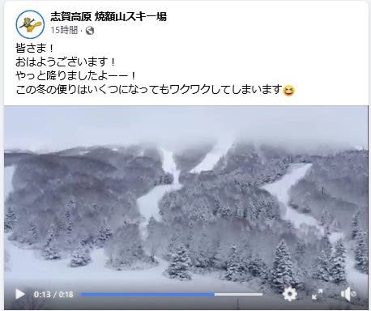
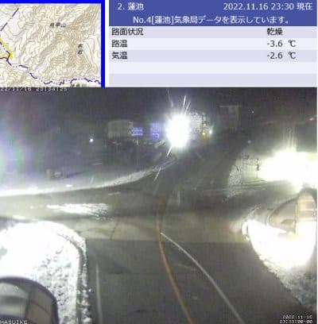
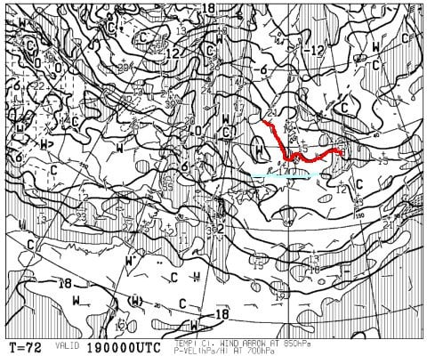
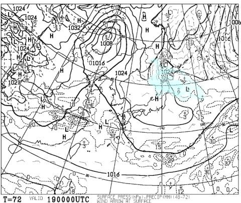
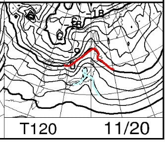
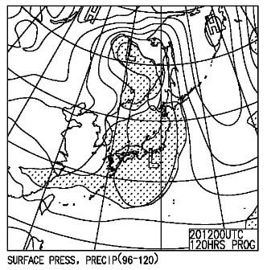
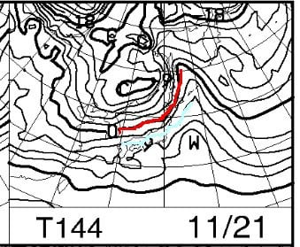
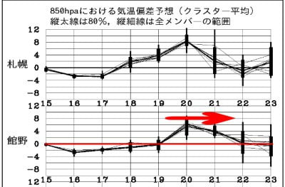

# 11月19・20日の週末の志賀高原スキー場の天気は…？19日朝までは人工降雪打てそうだけど，20日からは気温が上がって雨（涙）

📅 投稿日時: 2022-11-17 02:11:17

🏷️ カテゴリ: [スキー天気予想](c6554f5c3c106093b511a8daae23757e8.md)

えー．

今日，2泊3日の出張から家に帰ってきて．

帰宅後今まで仕事をやっつけていて．

明日も朝早くから出張に出ねば

ならず．

眠たいので，短めに更新しようとしたけど…

いつも通りの長さの記事を書いている

自分を発見した今日この頃．

皆様いかがお過ごしでしょうか（時候の挨拶）

ってなことで．

本日…というか．日付が変わって昨日．

16日の朝の志賀高原は，10cmくらい

雪が積もったようです！！

焼額も真っ白になってます！！

（[焼額山スキー場Facebook](https://www.facebook.com/yakebitaiyama/videos/618668636720709/)より）

16日夜になっても，

蓮池の道路わきにまだ雪が残って

いるので…

そこそこ積もったみたいですね．

そして，気温もマイナスまで冷えてます！

（[北信建設事務所道路気象情報カメラ](http://hokushin.pref-nagano-roadcamera.jp/)より）

とりあえず，今晩．

横手山や熊の湯は，全力で人工雪を

打っていると思いますが…

天気図を見ると，何とか木，金の

2日間は冷えてくれて．

今晩から土曜19日の朝くらいまで，

人工降雪機が動かせそうな感じ…

…ただ．

天然雪は降らなさそうなので．

今の10cmの天然雪と

あと2日間の人工降雪だけじゃ，

19日の熊の湯オープンは厳しいか…

とりあえず．

土曜19日の850hpa気温図を見ると．

水色の+3℃線が志賀にかかる程度．

きわどい…

おそらく，昼間は標高が高い横手でも

プラス気温に上がっちゃいそうですね．

地上天気図は，降水域が長野には

かかってないので．

曇り時々晴れ間も…って程度かな．

まぁ，土曜はまだマシな天気だけど．

日曜20日の850hpa図を見ると…

なんじゃこりゃーー！！！！

赤い0℃線は，北海道まで上がり

志賀には水色の+9℃線が…（涙）

そして，地上天気図を見ると…

日本はすっぽり降水域に覆われて

いるので…

これは，志賀高原．

かなり高温の液体が降り注ぎますね（激涙）

解ける…雪が解けるよ（泣）

そして，さらに．

月曜22日の天気図を見ても…

志賀には水色の+6℃線がかかる

レベルなので，人工降雪機は動かせず．

850hpa気温の1週間予想を見ると．

赤矢印の高温期間が終わるのは，21日．

冷えるのは22日の火曜からなので．

人工降雪機が次に動かせるのは，

22日の夜以降．

20日の雨で解けた雪の回復は，

23日以降になりそうです…

つまり．

熊の湯は23日のオープンも厳しそうな

予感…（泣）（泣）（泣）

とりあえず．

まとめると．

19日(土)：志賀高原は，曇り時々晴れ．

　気温は朝のうちは氷点下だけど，

　昼間はプラス気温に振れそう…

　この日の昼以降，人工降雪機は

　動かせず

20日(日)：朝から気温は高め．

　朝のうちは晴れ間もあるかも

　しれないけど，すぐに雲が増えて…

　午後には高温の液体が

　ゲレンデに降り注ぐ（涙）

21日（月）：気温高め．曇り．

　降雪無し，高温で人工降雪は困難

22日（火）：気温が冷え始め，

　この日の夜から人工降雪が

　打てるようになるか？

23日（水）：そこそこ冷える．

　でも天然雪は積もらない．

　ガンバレ！

　人工降雪機ガンバレ！

ってな感じでしょうか…

…うーん．

天気図を見ると，熊の湯のオープンが

23日以降になりそうな気配がだんだん

増してきてます…

果たして．

長期予想の通り，12月に入る頃には

冷えてくれるのか？？？

12月第1週の焼額オープンの日に，

ゴンドラで滑れるのか？？？

皆さん．

そうです．

ここでやることといえば…

日ごろの行いを鬼のように良くして．←鬼って日ごろの行い良いのか？

そして，天気の神様に捧げるべく．

冷え冷え踊りを一心不乱に

踊り続けましょう…
