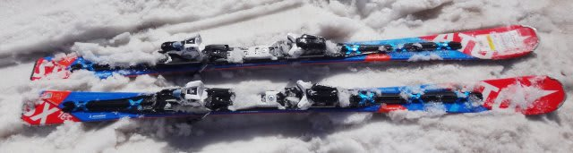
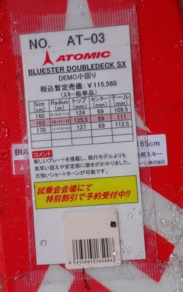
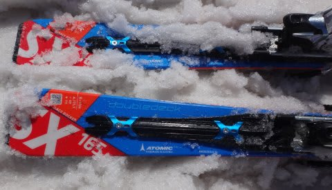
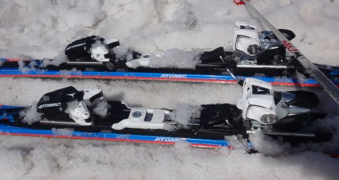
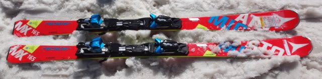
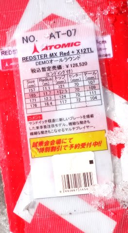
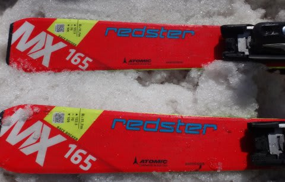
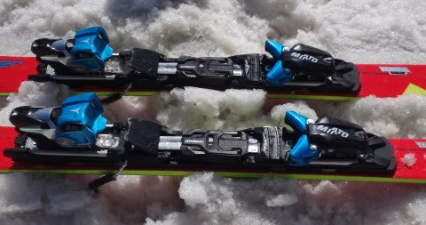

# 2017シーズンモデル，スキー試乗レポート第3回…ATOMIC編その１

📅 投稿日時: 2016-05-14 22:44:14

🏷️ カテゴリ: [スキー板試乗](c0bd8048615710cee890e403a36cc9a2b.md)

ということで．

明日はかぐらで滑る予定ですが，

かぐらスキー場．

コース幅が多少狭くなったものの，

[まだメインゲレンデは大丈夫そう](https://www.facebook.com/snowkagura/photos/a.307362099391117.1073741825.241102069350454/878036362323685/?type=3&theater)ですね～．

明日はすごく気温が上がりそうですが．

終日天気もよさそうだし．

…まぁ，典型的な5月のスキーですかね～．

とりあえず，戻ってきたらまたレポートします…

ってことで．

今日も続く，2017シーズンモデルのスキー試乗レポート．

本日は，アトミック編です…

では，どうぞ～！

---

○ATOMIC BLUESTER DoubleDeck SX + X12VAR 165cm

基礎小回り用．

私が普段履いているSXの後継機ですが…

板のデザインはほとんど変わっておらず．

プレートが多少変わったようです．

今年の目玉だった，ターン後半に前傾量が変わるという

触れ込みの「ランプテック」をあっさりと捨て，

普通のSALOMONのRACE PLATEと全く同じような，

普通の平プレートに変わりました…

＃1年で捨てられてしまったランプテックは何だったんだろう…？？

　

来シーズンも，ビンディングは優し目のX12TLと，

前後がタイトなバーで連結されてフレックスが強くなる

X12VARの2種類のビンディングが選べます．

今回試乗したのは，VARビンディング付きモデルです．

プレートが多少変わったものの，板は全く変わっていないので．

乗ってみたところ．

「あー．SXだ．変わらん．SXだ」

と思いました．

今年のSXを毎日履いている私が，履き替えてみても

違いが分からないレベルです．

とりあえず．

荷重ポイントは明確にかかと側．

けっこうしっかりした張り．

特に，VARビンディング特有のテールの張りがしっかりしていて．

テール荷重で抜いていくとすっと抜けてオートマチックに次の

ターンが始まります．

それも，ホントに良く回る．

板が雪面を捉えると，しっかりエッジグリップが強い，

きれいにエッジの線に乗ったカービングの感じで

気持ちよくくるっと回ります．

そして，雪面とブーツの間にクッションが挟まったような，

不思議な振動吸収感があり，荒れた斜面でも

足元にバタバタが伝わってこず，かなり安定して

スピードを上げて行けます．

いや．

やっぱり，SXはいい板ですね～．

…しかし．

普段履いている人間が，今シーズンモデルとほとんど違いが

分からないレベルだったので．

無理して来シーズンモデルを買わなくても，安くなった

今シーズンモデルを買えばいいかな…

という気になりました（笑）．

○ATOMIC REDSTER MX +X12TL 165cm

基礎小回り用．

ATOMICの来シーズンのエキスパート小回り用として

追加されたモデルなんですが…REDSTERです．

他のデモモデルはBLUESTERラインなので，

これはどちらかというと，REDSTER XTiとかの

一般スキーヤー向けラインのトップモデルという

位置づけなのかな…？？

サンドイッチ＆Doubledeckなし平板ということで，

SL PROと同じ構造．

ただ，ビンディングは優し目のX12TLビンディングのみで，

X12VARビンディングは選べないようです．

履いてみた感じは，やっぱりATOMIC,

全体がきれいにたわみ，エッジグリップも強く，

エッジが線で捉えていく感じで回ります．

ガッツリテール荷重で，かかとよりも後ろを抑えながら

切りかえていく感じの板です．

ただ，テールの張り・返りはSXよりはぐっとマイルド．

SXのように，早い返りは無いです．

また，たわみの出方も，SXよりは簡単にたわむ感じ．

ただ，SCよりはフレックスは強いのかな？

雪の少ない一の瀬ファミリーだったので，スピードを

出した時どうなるか…というトップスピード耐性は

分からなかったけど．

エッジグリップは強めで，ずらすより切っていく方が

楽しい板だけど，SXよりはたわませやすく．

扱いやすい感じ．

うーむ．

位置づけ的には，SXとSCの中間くらいなのかなぁ…

ちょっとキャラクターが捉えにくい板でした．
