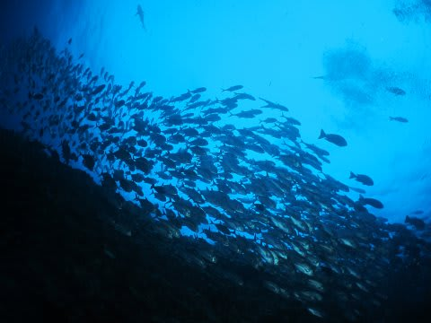

# 2014年10月，小学生の子連れでパラオへダイビングに行ってみた，プロローグ3…旅行直前，緊急事態っ！

📅 投稿日時: 2015-07-15 01:05:16

🏷️ カテゴリ: [ダイビング日記](ce3a7a8d424d112fce83ee85c81a0e344.md)

そう．

パラオ出発を翌日に控えた，木曜日．

職場の私に，妻から携帯メールが…

「娘が学校で怪我したらしい．

　病院につれて行く必要があるとのことで，

　ただちに学校に来てくださいと

　学校より連絡あり」

…は？？

え？？

なに？？

怪我？？

病院？

どゆこと？？

…保健室でどうこうできるレベルじゃないってことっ！？？？

「とりあえず，これから急ぎ学校へ行って，

　そのまま病院へ連れて行きます」

おーーーーい！

どんな怪我したんだ～っ！！！

骨折か？？？

一体，何があったんだっ！！？？？

…と．

「？」だらけの状況の中．

いろいろ悪い想像ばかりが膨らんでいく…

しばらく待っていると，

学校についたらしい妻から，娘の状態を伝える電話が…

「走っていてコンクリートのところで転んだらしく，

　顔面半分かなり広い範囲でひどく擦りむいてて…

　跡が残るかもしれないから，病院に連れて行った

　方がいいということで，

　これから急ぎ病院に向かいますね」

…この電話の背景音に，娘のぎゃん泣きの声が…

骨折とかじゃなくて，

単なる擦り傷ってことなのね…？

…でも，顔面に跡が残るかもって…

女の子には致命的ではないか！！？？

急ぎ病院に行かなきゃならんレベルって…

どんくらいひどい怪我なんだ…！？？？

…さらに，しばらく後．

メール着信．

「病院で診てもらいました．

　単なる擦り傷．治るまで時間がかかりそうだけど，

　時間がたてば，跡もほとんど残らないだろうとのこと．

　治療は湿潤絆創膏貼っただけでした…

　でも，かなり痛いようです」

…

ああ，よかった．

単なる擦り傷だったか…

痛いのはかわいそうだけど．

跡が残らないってなら，まぁ一安心．

…

…だけど．

あれ？

ちょいと待てよ．

パラオ，明日出発だけど…？？？

パラオ，行けるのか？？

「パラオは行けると思いますが…

　娘が泳ぐのは無理でしょう」

ああああああぁああ～っ！！！

なんてことだっ！

娘が最大に楽しみにしている，

海でのシュノーケリングができないとはっ！！！

娘に海で遊んでもらうのが，旅行の

目的の半分なので．

…行く意味は半減っ！！！（涙，涙，涙）

…なのだが．

まぁ．

前日キャンセルはすごいキャンセル料がかかるし．

行かないより，行った方がマシだよな…

という判断で．

娘が泳ぐことはほぼ不可能だろうなぁ…（激烈涙）

と，思いつつ．

予定通り，翌日からのパラオツアーは決行したのでした…

その日．

帰宅してみると．

娘はもう寝ていたけど．

顔面半分に，かなり痛々しい感じで，

広範囲でテープが貼られており．

…今回のパラオ旅行，かなり残念なことに

なりそうな予感…

娘よ．

よりによって．

出発のちょうど前日に怪我するか…っ！！？（泣）．
