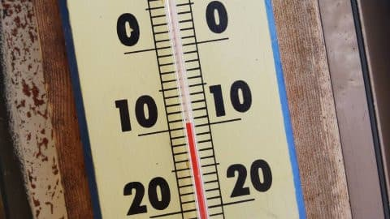
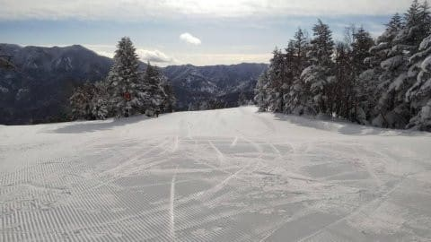
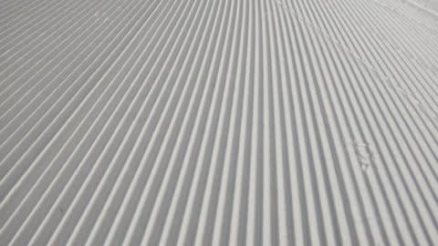
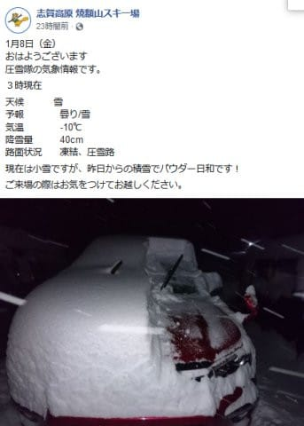

# 本日の志賀高原スキー場は朝40~50cm激烈サラサラ粉雪で．明日も積もりそうだけど…私はスキーに行かない週末（涙）

📅 投稿日時: 2021-01-09 04:28:13

🏷️ カテゴリ: [日記](cc4b5682fb7b8b144980957a978653fb0.md)

ということで．

緊急事態宣言が出てしまった現在．

今週末はスキーに行かず，Stay homeで

じっとしていることになるわけですが…（涙）

だもんで，週末前にもかかわらず，

こんな時間に更新！

（いつもならもうスキーへ出発してる時間…）

…あぁ．寂しい…

で．

前回更新で，1月6日は晴天最高だったという

特派員からの写真を載せましたが．

特派員情報によれば，1月7日の木曜の

志賀高原も最高だったようです…！

1月7日の朝も-10℃と冷え冷えで．

それなのに天気は晴れ間もあり．

あさイチは最高シマシマだったようです…（涙）

…ぐはぁーーー！！

滑りたいーーーっ！！

…そして，本日．

というか，もう昨日か…

金曜朝は，焼額山は積雪40cm．

一日雪降りで．

特派員曰く今シーズン最高の

激軽パウダーデーだったらしく…

（焼額山Facebookより）

そして，明日土曜の朝にかけて．昨日の予想通り，

30cmは積もりそうで．

また，冷え冷えパウダーデーになりそうです…！

なのに，スキーに行けないとは…（激泣）

それも，トップシーズンの一番いい時期に…（止まらない涙）

昨シーズンも，3月まで雪不足で．

4月になってからなぜか3月より

雪が良くなっんだけど．

…その時にちょうど第1波でスキーどころじゃ

無くなったんだよな…

去年も今年も，2シーズン続けて，

雪が良くなった時期に合わせて

ピークが来るコロナなんて，

嫌いだ～っ！！！

ってなことで．

明日以降，長野地元民で志賀高原に行く

焼額常連の皆様．

また写真をいっぱい送ってくれると嬉しいです…

あと，スキーに行けない私を気遣って，

コメントの遠慮は不要です！

スキー場情報のコメントも歓迎ですので，

ガンガン送ってください…

あぁ…

（自宅の窓から，遠く長野の方を見やりつつ）

この3連休，志賀高原は最高の

コンディションなんだろうなぁ…

## 💬 コメント一覧

### 💬 コメント by (改心した男)
**タイトル**: Unknown
**投稿日**: 2021-01-09 06:08:36

土曜日なのにエス様にお会いできないなんて、困ったコロナですが、スキー場では閑古鳥が鳴いています。

色々な名前で投稿して、エス様の仕事を増やしてあげようと思ったのですが、気の毒すぎるので、今後は心を改めることにします。

私は老人なのでスマホの扱いが今三つ。今後はできる限り写真を撮るよう努めます。

あ、また名前が、、、

### 💬 コメント by (ヒロ)
**タイトル**: 経済との両立・・・
**投稿日**: 2021-01-09 09:23:50

緊急事態宣言中ですが、「コロナ対策と経済の両立」が政府の基本方針であり、今回は県跨り移動制限は特に謡われていないので、志賀高原スキーに行かない理由は特にないのでは？　逆に行くことで地域社会・経済への貢献につながるものと考えます。　一方で20時以降の不要不急の外出は控えるよう言われてますので、ナイター終了の20時以降は速やかに宿へ戻り、静かに自粛しましょう。

（長野県も志賀高原も県外の方の来訪お断り、なーんて言ってないですよね・・・　昨年春の宣言時は言われてましたけど）

家でストレス溜めて、地方経済への貢献もしない、かといって家族サービスをするわけでもない？、の悪いことづくめの週末は心身とも不健康です。

なので、明日からは志賀で地方経済に貢献するsさんを見たいです！　変な雑音コメントが入るかもしれませんが一部のヘンテコ野郎のボヤキはスルーしましょう。

### 💬 コメント by (マルハバ)
**タイトル**: ご無沙汰しております
**投稿日**: 2021-01-09 10:45:01

Sさんのお役に立てる情報かどうかは分かりませんが。

東京都内発のスキーバスツアーは緊急事態宣言中も通常通り催行されるようです。

昨日、私も予約出来ました。

都内にはスキー場が存在しませんので当然他県への越境ということになります。

旅行会社もお上にお伺いを立てての催行継続のはずですから、

これは事実上公認されているということだと思います。

### 💬 コメント by (かず)
**タイトル**: Unknown
**投稿日**: 2021-01-09 11:36:39

自分も来週Sさんにお会いしたいですが  なかなか難しいですかね 行くのは簡単ですが仕事 家族  周りの目 Sさんの環境次第ですよね…

### 💬 コメント by (ゆーき)
**タイトル**: Unknown
**投稿日**: 2021-01-09 11:53:38

私もこの三連休は行かないですね。

ってのも、子供の塾のテストとか、学校のテストとかで、行かないからですが。

私の住んでいるところも、

おそらく緊急事態宣言が出らことになりそうですが、

どうしたものか、考え中です。

今日現在は知りませんが、

1ゴンで相乗りレーンが復活したり(相乗り拒否は可能らしい？)、

ランチの時間も、

あまり気にせず、マスクなしで、

喋っている人も、いますしね。

### 💬 コメント by (レインボー73)
**タイトル**: Unknown
**投稿日**: 2021-01-09 12:09:46

土曜日の志賀高原情報

朝の上林マイナス8℃、蓮池マイナス13℃

ちらちら小雪が舞うなか、薄日も差し、今日も絶好かと飛び込んだオリンピックですが、新雪はたっぷりなのに、早朝ファーストのあとで、ふわっと浮く感触もなく、贅沢に慣れすぎた私にはがっかり感のみが残りました。

１ゴン下の非圧雪は新雪が50cmはあろうかのふかふか!

ＳＧＳもミドルもまさに天国！

でも、ロード　to 西館様　が本日のテーマなので、涙を飲んで一本ずつのみ。

ところが、です。高天から西館様への橋を越えるのに、板をかつぐという重労働を余儀なくされ、へとへと、乳酸がご挨拶、足が売り切れ。

昨日はさっさと滑れたのに、今日は途中休憩各駅停車。

ジャイアントのベルクでかつ重をいただいてますが、美味しい。渓谷なき今、ここはいいなとかんじています。go to eat 適用なのも、地元民には嬉しい。

### 💬 コメント by (レインボー73)
**タイトル**: Unknown
**投稿日**: 2021-01-09 14:35:44

土曜日の志賀高原情報

昨日お勧めしたダイヤモンドは、ポールのため、本日は不完全燃焼。

圧巻だったのは、寺子屋リフト下。キメの細かい、孫の肌のような、超極上さらさら。今シーズン36日目でベストでした。

### 💬 コメント by (アリス)
**タイトル**: 志賀高原で昇天
**投稿日**: 2021-01-09 21:23:13

Skier_S様

申し訳ありません、Sさんが自粛している間に志賀高原を楽しんでいました。

7日～9日は気温、バーンの変化はあれど素晴らしいコンディションでした。これが本来の志賀高原なのですね・・・

ヤケビ、奥志賀も素晴らしかったのですが、8日のダイヤモンドに驚きです。人が全然居なく膝上までのパフパフ・・・これいただいていいの？と思いながら数回粉雪三昧です。

それと、ヒロ様のコメントに共感します。

### 💬 コメント by (西舘)
**タイトル**: ヒロさんに諸手を挙げて賛同します！
**投稿日**: 2021-01-10 08:14:13

お宿のご迷惑になるのであれば断念しようと思いましたが、ヒロさまおっしゃるとおりで、長野県では昨年春の宣言時は言われていたけど、今回は宣言県からの受け入れを拒絶していないし、今後もしないであろうとのことでしたので、私たちは今後も通い続けます。

ストレスためると免疫が下がるので、かえって身体に悪いのでは？『白い粉』を見ないと死んじゃう病を発病しているのだから大変なことになっちゃいますよ。私も志賀で地方経済に貢献するＳさんを見たいです！東京都も『外での運動は推奨』しているようですし！

### 💬 コメント by (西舘)
**タイトル**: 北西の風なので本日は新雪供給機能フル回転でしょう
**投稿日**: 2021-01-10 08:17:55

1月10日am7:30志賀高原はふわふわの新雪供給継続中、本日も根性の無いスキーヤー振り落とし機能が働きそうです。私たちには根性が無いので、なかなかゲレンデへ行かないかも。

昨日は、レインボーさまが絶賛してくださった『西舘』スタート、レインボーさまが蹴散らしたぱふぱふゾーンは健在でした。うっすらですが晴れ間も覗き、なかなかのスキー日和なのでは。

今期の『中央』は頑張っている。昨シーズンは2回しか踏んでくれなかったWCコースも、今期は毎夕リフトストップ後にゲレンデ幅2/3を踏み、1/3を残す整備をしていて、これこそがナチュラル！という気持ちの良いゲレンデに仕上がっている。残念なのは、休憩場所が無いこと。『銀嶺』かジャイアントへ降りるか。

『東館ゴンドラ』で『寺子屋』へ。今期、大幅に売り上げが減少したら、既に削れるところなど残っていない志賀高原で削るとしたら、高天原のリフト1本か寺子屋しかない。一の瀬は削らないであろう。と、考えるとサヨナラしといた方が良いかもなと出掛けました。（それくらい空いていて、危機感を抱かざるを得ないのです。）

『焼額』は寒い。新雪供給機能も働き、根性の無いスキーヤーを振り落としに掛かっている。Ｓさんが来ていないから熱量が足りないんでないの？1ゴン降りて温度計を確認したら正午で-15℃！私たちには根性が無いので、さっさとダイヤモンドへ撤退。ダイヤモンドは小雪に戻り、時々うっすら晴れ間も覗くように。（お宿仲間に聞いたところ、高天原も正午頃には激しく降雪したそうです。）

『西舘』に戻って終了致しました。

### 💬 コメント by (Skier_S)
**タイトル**: 本日は一日仕事予定
**投稿日**: 2021-01-10 13:03:04

＞改心した男さま

相変わらず名前が…(笑)．

昨日は写真いっぱいありがとうございます．

今日も写真お待ちしています～！

あと，渓谷じゃなく，ベルグにもかつ重あったんですね…

食べたことなかったです．

＞ヒロさま

私も地方経済に貢献したいのですが，仕事もデンジャラスな状況だし，

今回は感染拡大防止の方に貢献しておきます…

…しかし，私も湯田中に引っ越したい…

＞マルハバさま

そうなんですね…

スキーバスは運行しているんですね…

お客さんがいないだろうから，激烈な大赤字になりそうですね…

