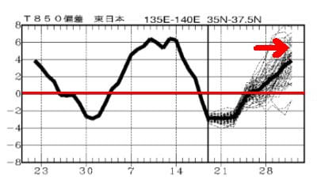

# 12月23，24日の志賀高原スキー場の天気は…土日とも激冷え！土曜は晴れ間もあるかもしれないけど終日雪，日曜は積雪の後の冷え冷え晴れの最高になりそう…！

📅 投稿日時: 2023-12-21 02:58:57

🏷️ カテゴリ: [日記](cc4b5682fb7b8b144980957a978653fb0.md)

なんだか．

仕事から帰宅して次に出社するまでの

家の滞在時間が7時間を切るようになると，

やっぱりいろいろキツイ…（涙）

家で仕事の宿題1時間，Blogを1時間

書いていると，残り5時間しかなくなるん

ですが？？

お風呂入ったりなんだりしていたら，

どれだけ頑張っても4時間寝られないん

ですが？？←それならBlog書かなきゃいいじゃん

…ってなことで．

なるべく睡眠時間を取らないと死ぬので，

今日は手短に，週末に向けての天気予想の

まとめだけを…

21日（木）：曇り時々小雪．冷え冷え．

　朝の積雪は2-3cm程度？

　昼間も雪が降ったりやんだりだけど，

　そんなに積もらない．

22日（金）：朝は晴れ間もでるくらいだけど，

　昼には降りはじめ，結構強い雪に

　なっていく．激冷え．寒いよ！！

　午後には雪が強くなり，

　夜は結構降る．積もってほしい．

23日（土）：朝から雪．朝までの積雪は

　20cmはあると信じたい．

　できれば30cm欲しい（願望）

　あさイチは-10℃以下．冷え冷え．

　ブーツ～脛パフ．

　昼間も-5℃を上回らず寒い．

　一日中雪が降り続ける．

　時折雪が弱くなったり晴れ間も．

　寒いよ！！

24日（日）：残念ながら朝の積雪は

　それほどなし．数cm，運が悪ければ

　積雪0．

　でも，あさイチは昨日降った雪が

　圧雪された最高シマシマバーン！

　朝は雲が残るかの世があるけど，

　一日天気がよさそう．

　昼間も0℃を越えないけど，23日ほど

　寒くない．

　積雪の後のいい天気の最高雪質で

　楽しめそうな一日

という感じで．

22日から23日朝の積雪が十分あって，

ゴンドラが動いてくれれば…

24日は晴れそうなので，すごいいい週末に

なるかも．

…ただ，23日までの積雪が足りないと，

最悪，ゴンドラが動かない可能性もあるし．

ゴンドラが動いてもすぐブッシュが

出てくる可能性も…

とりあえず，22日から23日にかけて，

ドサドサ積もることに期待！！！

…だって．

23日までに降らないと…

…25日以降，ヤバそうなんですもん（泣）

なんだよ，31日ごろの平年比+4℃ってのは…（涙）

とりあえず．

このクリスマス寒波に期待！！！

## 💬 コメント一覧

### 💬 コメント by (レインボー76)
**タイトル**: Unknown
**投稿日**: 2023-12-21 13:32:46

木曜日の志賀高原情報

朝の蓮池-6℃。四ロマパークの朝の積雪は3cm。ずっと粉雪小雪吹雪の午前中。

四ロマはバーンは100点だけど、リフトが最遅で凍結寸前。カラマツは下地にコロコロを感じるけど、なんとか気持ちよく走れます。難点は、狭いので追い越しが難しいこと。ましてや某スクールのトレインに出会ったときには、、、

11時、サウス(四ロマ)に戻ったら、なんと気持ちのいいことか！でも密度が高すぎるので終了。幸せでございました。

四ロマパークには更に3cmの積雪がありました。

今夜はどれだけ降ってくれるのでしょう？

でもそれが圧雪されるので、明日も普通の板の予定です。

### 💬 コメント by (Skier_S)
**タイトル**: ＞レインボー76さま
**投稿日**: 2023-12-22 01:26:00

このあと冷え込みが続くのですが，24日まで…

今晩は10cmくらい積もってくれれば上出来ですが，金曜の夜から土曜にかけて期待…！

でも，そのあとまた降らなさそうなんですよね（涙）

一体，いつ大雪になってくれるのか…

